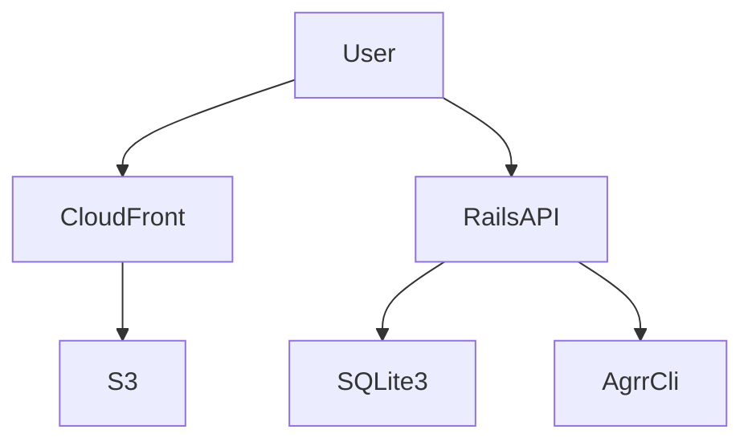
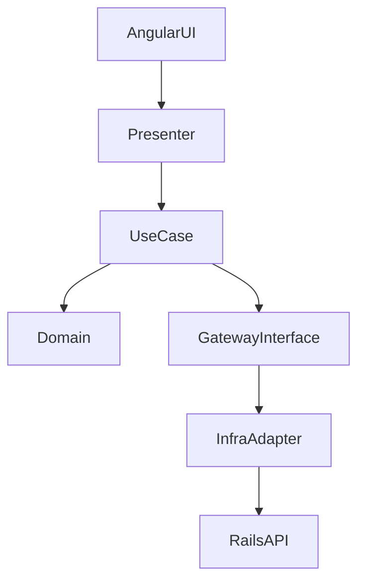

# AGRR Architecture Documentation

## 🏗️ System Overview

AGRR is an agricultural planning and optimization system with a decoupled frontend and backend.

**Technology Stack:**
- Frontend: Angular SPA (Clean Architecture)
- Frontend Hosting: S3 + CloudFront
- Backend: Ruby on Rails 8 (API)
- Database: SQLite3 (development/test), with Litestream backup
- Architecture: **Decoupled SPA + Rails API** (primary architecture)
- External Services: Python-based AGRR CLI for advanced predictions

## 🎯 Architecture Pattern

### Primary: Angular SPA + Rails API

**Main Architecture Pattern:** Decoupled frontend and backend with a JSON API.

- **Frontend**: Angular SPA served from S3 + CloudFront
- **Backend API Controllers**: Rails API endpoints returning JSON
- **Models**: ActiveRecord ORM with validations and business rules

**Note:** Server-rendered Rails Views are legacy and will be phased out.

### Frontend: Clean Architecture (Angular)

- **Domain**: Pure entities and business rules (framework-agnostic)
- **UseCase**: Interactors + Ports + Gateway interfaces
- **Adapters**: Presenters, Views, API gateway implementations
- **Infrastructure**: Angular components, services, guards, interceptors

**Dependency Direction (Frontend):**
- UI components depend on Presenters/Views
- Presenters depend on UseCase Ports
- UseCase depends on Domain and Gateway interfaces
- Adapter Gateways implement UseCase Gateway interfaces

### Additional: Clean Architecture (AI Features Only)

Clean Architecture is used **only** for 3 AI-powered API endpoints:

- `/api/v1/crops/ai_create` → Uses `CropCreateInteractor` + `CropMemoryGateway`
- `/api/v1/fertilizes/ai_create` → Uses `FertilizeCreateInteractor` + `FertilizeMemoryGateway`
- `/api/v1/fertilizes/:id/ai_update` → Uses `FertilizeUpdateInteractor` + `FertilizeMemoryGateway`

**Note:** All other API controllers use traditional Rails MVC; HTML controllers are legacy.

## 🧩 System Flow (SPA + API)


## 🧩 Frontend Layer Dependencies (Angular Clean Architecture)


## 📊 Core Business Rules

### Resource Limits
- **Farm Limit**: Maximum 4 farms per user (`is_reference: false`)
- **Crop Limit**: Maximum 20 crops per user (`is_reference: false`)
- **Reference Records**: Always excluded from limits (`is_reference: true`)

**Implementation:** Resource limits are enforced at the Model level using ActiveRecord validations.

## 📁 Directory Structure

### Main Structure (Rails API + Angular)
```
app/
├── controllers/          # Rails controllers
│   ├── <model>s_controller.rb    # Legacy HTML controllers (to be removed)
│   └── api/v1/          # API controllers (JSON)
│       ├── crops_controller.rb      # AI feature (Clean Architecture)
│       ├── fertilizes_controller.rb # AI feature (Clean Architecture)
│       ├── plans/                   # Rails MVC (API)
│       ├── public_plans/           # Rails MVC (API)
│       └── ...                      # Other API controllers
├── models/              # ActiveRecord models
├── services/            # Application services
├── gateways/agrr/       # External API gateways
└── jobs/                # Background jobs
frontend/                # Angular app (SPA)
└── src/app/              # Angular Clean Architecture layers
    ├── domain/           # Entities
    ├── usecase/          # Interactors, ports, gateway interfaces, DTOs
    ├── adapters/         # Presenters, views, API gateways, helpers
    └── infrastructure/   # Components, pages, services, guards, interceptors
```

### Clean Architecture (AI Features Only)
```
lib/domain/              # Clean Architecture layers (3 endpoints only)
├── crop/
│   ├── entities/
│   ├── gateways/
│   └── interactors/
├── fertilize/
│   ├── entities/
│   ├── gateways/
│   └── interactors/
└── shared/
    └── result.rb

lib/adapters/            # Gateway implementations (AI features only)
├── crop/gateways/
└── fertilize/gateways/
```

## 🎯 Backend API Pattern (Primary)

### Standard API Controller Pattern
```ruby
# app/controllers/api/v1/plans/cultivation_plans_controller.rb
class Api::V1::Plans::CultivationPlansController < Api::V1::BaseController
  def create
    @plan = CultivationPlan.new(plan_params)
    @plan.user = current_user
    
    if @plan.save
      render json: @plan, status: :created
    else
      render json: { errors: @plan.errors }, status: :unprocessable_entity
    end
  end

  private

  def plan_params
    params.require(:cultivation_plan).permit(:name, :planning_start_date, ...)
  end
end
```

### Standard Model Pattern
```ruby
# app/models/farm.rb
class Farm < ApplicationRecord
  belongs_to :user
  has_many :fields, dependent: :destroy

  validates :user, presence: true
  validates :name, presence: true
  validate :user_farm_count_limit, unless: :is_reference?

  private

  def user_farm_count_limit
    return if user.nil? || is_reference?
    
    existing_farms_count = user.farms.where(is_reference: false).count
    current_count = new_record? ? existing_farms_count : existing_farms_count - 1
    
    if current_count >= 4
      errors.add(:user, :farm_limit_exceeded)
    end
  end
end
```

## 🧭 Frontend Hosting (Angular SPA)

- Build output is deployed to S3 and served via CloudFront (HTTPS, caching, custom domain).
- SPA routing uses CloudFront/S3 fallback to `index.html`.
- Environment configuration is provided at build time (e.g., `environment.prod.ts`).

## 🎯 Clean Architecture Pattern (AI Features Only)

### Controller Pattern (AI Features)
```ruby
# app/controllers/api/v1/crops_controller.rb
class Api::V1::CropsController < Api::V1::BaseController
  before_action :set_interactors, only: [:ai_create]

  def ai_create
    # ... parameter validation and AI data fetching ...
    result = @create_interactor.call(attributes)
    
    if result.success?
      render json: { success: true, crop_id: result.data.id }
    else
      render json: { error: result.error }, status: :unprocessable_entity
    end
  end

  private

  def set_interactors
    gateway = Adapters::Crop::Gateways::CropMemoryGateway.new
    @create_interactor = Domain::Crop::Interactors::CropCreateInteractor.new(gateway)
  end
end
```

### Interactor Pattern
```ruby
# lib/domain/crop/interactors/crop_create_interactor.rb
module Domain
  module Crop
    module Interactors
      class CropCreateInteractor
        def initialize(gateway)
          @gateway = gateway
        end

        def call(attributes)
          crop = @gateway.create(attributes)
          Domain::Shared::Result.success(crop)
        rescue StandardError => e
          Domain::Shared::Result.failure(e.message)
        end
      end
    end
  end
end
```

### Gateway Implementation Pattern
```ruby
# lib/adapters/crop/gateways/crop_memory_gateway.rb
module Adapters
  module Crop
    module Gateways
      class CropMemoryGateway < Domain::Crop::Gateways::CropGateway
        def create(crop_data)
          record = ::Crop.create!(crop_data)
          entity_from_record(record)
        end

        private

        def entity_from_record(record)
          Domain::Crop::Entities::CropEntity.new(
            id: record.id,
            user_id: record.user_id,
            name: record.name,
            # ... other attributes
          )
        end
      end
    end
  end
end
```

## 🎯 Validation Architecture

### Resource Limit Implementation (Rails MVC)
Resource limits are enforced at the Model level using ActiveRecord validations:

```ruby
# app/models/farm.rb
class Farm < ApplicationRecord
  validates :user, presence: true
  validate :user_farm_count_limit, unless: :is_reference?

  private

  def user_farm_count_limit
    return if user.nil? || is_reference?
    
    existing_farms_count = user.farms.where(is_reference: false).count
    current_count = new_record? ? existing_farms_count : existing_farms_count - 1
    
    if current_count >= 4
      errors.add(:user, :farm_limit_exceeded)
    end
  end
end
```

### Domain Entity Validation (Clean Architecture - AI Features Only)
```ruby
# lib/domain/crop/entities/crop_entity.rb
module Domain
  module Crop
    module Entities
      class CropEntity
        def initialize(attributes)
          # ... set attributes ...
          validate!
        end

        private

        def validate!
          raise ArgumentError, "Name is required" if name.blank?
        end
      end
    end
  end
end
```

## 🧪 Testing Architecture

### Test Structure
```
test/
├── controllers/         # Controller tests (Rails MVC)
├── models/              # Model tests (Rails MVC)
├── services/            # Service tests
├── integration/         # Integration tests
├── system/              # System tests
├── domain/              # Domain layer tests (AI features only)
│   ├── crop/
│   └── fertilize/
└── adapters/            # Adapter layer tests (AI features only)
    ├── crop/gateways/
    └── fertilize/gateways/
```

### Test Pyramid
- **Unit Tests (70%)**: Models, Services, Domain entities (AI), Interactors (AI), Gateways (AI)
- **Integration Tests (20%)**: Controller tests, Service integration, Gateway-model integration
- **System Tests (10%)**: User flows, UI interactions, End-to-end scenarios

## 📚 Implementation Guidelines

### For Most Features (Rails MVC)

1. **Create Model** with validations and business rules
2. **Create Controller** with standard CRUD actions
3. **Create Views** (HTML or JSON)
4. **Define Routes**
5. **Write Tests**: Model tests, Controller tests, Integration tests

### For AI Features (Clean Architecture)

Only use Clean Architecture when implementing AI-powered features. For those cases:

1. **Create Domain Entity** with business logic
2. **Create Gateway Interface**
3. **Create Interactor** (one action per interactor)
4. **Create Gateway Implementation**
5. **Update Controller** to instantiate and use Interactor
6. **Write Tests**: Entity tests, Interactor tests, Gateway tests, Controller tests

## 🚫 Anti-Patterns

### ❌ FORBIDDEN: Resource Limit Validation at Controller Only
```ruby
def create
  return if user.farms.count >= 4  # Can be bypassed!
  # ...
end
```

### ✅ CORRECT: Model-Level Validation
```ruby
# Model validation ensures limits are enforced regardless of entry point
validate :user_farm_count_limit, unless: :is_reference?
```

## 🔍 Quality Assurance

### Code Review Checklist

**For Rails MVC Features:**
- [ ] Models validated properly
- [ ] Controllers are thin (business logic in Models/Services)
- [ ] Proper error handling
- [ ] Tests cover models and controllers

**For Clean Architecture Features (AI only):**
- [ ] Entities contain business logic
- [ ] Interactors are single-purpose
- [ ] Gateways properly abstracted
- [ ] Tests cover all layers

## 📖 Key Principles

1. **Rails MVC First**: Use traditional Rails MVC for all features unless specifically implementing AI features
2. **Model-Level Validation**: Business rules (like resource limits) must be enforced at the Model level
3. **Thin Controllers**: Controllers should be thin; business logic belongs in Models or Services
4. **Clean Architecture for AI**: Only use Clean Architecture for AI-powered features
5. **One UseCase per Interactor**: Each interactor handles one action (when using Clean Architecture)
6. **Testability**: All code should be easily testable

## 📚 Additional Resources

- [DEVELOPMENT_RULES.md](docs/DEVELOPMENT_RULES.md): Development conventions
- [TESTING_GUIDELINES.md](docs/TESTING_GUIDELINES.md): Testing standards
- [RESOURCE_LIMIT_TEMPLATE.md](docs/RESOURCE_LIMIT_TEMPLATE.md): Resource limit pattern
