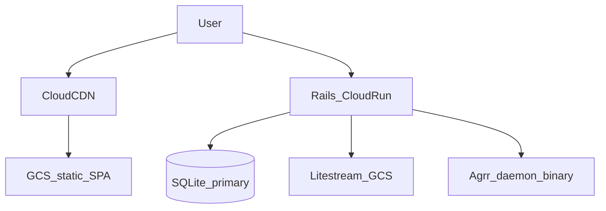
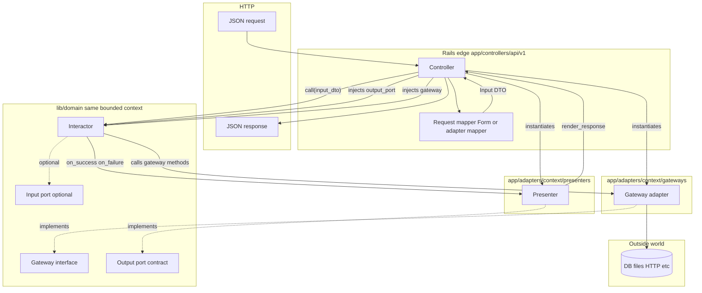
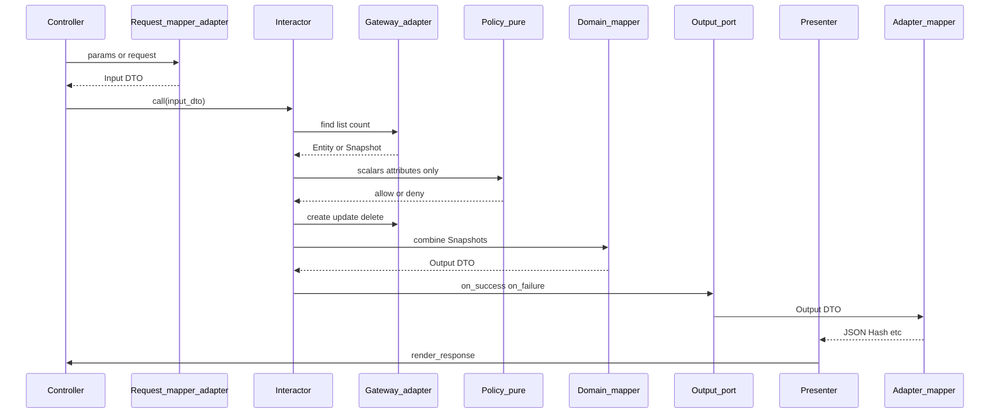
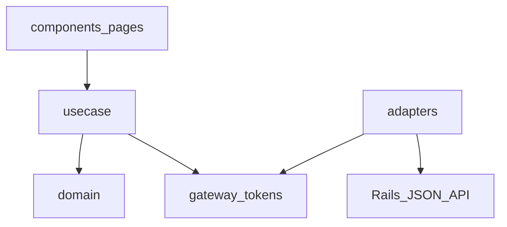

# AGRR Architecture Documentation

## System Overview
Rails is deprecated in this project. Adapter should be thin, domain should be pure and fat, so that this  project can move to Rust. 
AGRR is an agricultural planning and optimization system with a decoupled Angular SPA and a Ruby on Rails 8 JSON API.

**Technology stack**


| Layer               | Technology                                                                                     |
| ------------------- | ---------------------------------------------------------------------------------------------- |
| Frontend            | Angular 21 SPA (Clean Architecture-oriented layers under `frontend/src/app/`)                  |
| Frontend hosting    | Google Cloud Storage + Cloud CDN (see `.cursor/skills/deploy-frontend/scripts/gcp-frontend-deploy.sh`) |
| Backend             | Ruby on Rails 8 on **Google Cloud Run** (see `.cursor/skills/deploy-server/scripts/gcp-deploy.sh`)     |
| Database            | SQLite3 (Solid Cache / Solid Cable / Solid Queue as applicable), **Litestream** replica to GCS |
| Primary integration | **agrr** Python binary / daemon for optimization and weather-related workloads                 |
| Contract-first API  | `lib/domain` ports/DTOs plus integration and domain tests encoding observable API behavior   |


**Architecture (primary):** Decoupled **Angular SPA + Rails JSON API** for business features. Remaining server-rendered HTML is limited to **OAuth login**, **health**, **deletion undo**, **ActionCable**, **API docs**, and **dev/test** helpers—not master CRUD or planning UI. Domain logic lives in `lib/domain`; HTTP adapters use API presenters (`*_api_presenter.rb`). Legacy `*_html_presenter.rb` files may remain only where they still serve JSON-shaped responses (e.g. task schedule timeline) or auth/undo edges until renamed.


## System Flow


```mermaid
flowchart TD
  User[User] --> CDN[CloudCDN]
  CDN --> GCS[GCS_static_SPA]
  User --> CloudRun[Rails_CloudRun]
  CloudRun --> SQLite[(SQLite_primary)]
  CloudRun --> Litestream[Litestream_GCS]
  CloudRun --> AgrrDaemon[Agrr_daemon_binary]
```


## Backend

Business logic lives under `lib/domain/`. `lib/core/` holds external binaries and native code.

### API Layer

One JSON action = **one or more interactor calls**, each with **its own presenter** as `output_port`.

#### Roles and Dependencies

1. **Controller** — HTTP entry point. Uses a **request mapper** (Form or adapter mapper) to build input DTOs from `params`, instantiates Presenter and Interactor, injects gateways from `CompositionRoot`, then `interactor.call(input_dto)`.
2. **Presenter** (`app/adapters/<context>/presenters/...`) — Output port implementation. Receives `on_success(dto)` / `on_failure(dto)` and maps to HTTP responses.
3. **Output port** (`lib/domain/.../ports/...`) — Callback contract (`on_success` / `on_failure`) that Interactors call; Presenters implement it.
4. **Input port** (`lib/domain/.../ports/...`, optional) — Defines the shape of `call`. When absent, `call(input_dto)` applies.
5. **Interactor** (`lib/domain/.../interactors/...`) — Use case. Calls injected Gateway interfaces, decides success/failure, calls `output_port.on_success` / `on_failure`.
6. **Gateway interface** (`lib/domain/.../gateways/...`) — Domain-side contract for retrieval, persistence, etc.
7. **Gateway implementation** (`app/adapters/<context>/gateways/...`) — Implements Gateway interfaces using SQLite / ActiveRecord / HTTP. Injected by `CompositionRoot`.


```mermaid
flowchart TB
  subgraph http["HTTP"]
    REQ[JSON request]
    RES[JSON response]
  end
  subgraph app_edge["Rails edge app/controllers/api/v1"]
    CTRL[Controller]
    REQMAP[Request mapper Form or adapter mapper]
  end
  subgraph domain_core["lib/domain same bounded context"]
    IP[Input port optional]
    IU[Interactor]
    GIF[Gateway interface]
    OPORT[Output port contract]
  end
  subgraph presentation["app/adapters/context/presenters"]
    PRES[Presenter]
  end
  subgraph adapters["app/adapters/context/gateways"]
    GADP[Gateway adapter]
  end
  subgraph io["Outside world"]
    DB[(DB files HTTP etc)]
  end

  REQ --> CTRL
  CTRL --> REQMAP
  REQMAP -->|"Input DTO"| CTRL
  CTRL -->|"call(input_dto)"| IU
  CTRL -->|"instantiates"| PRES
  CTRL -->|"instantiates"| GADP
  CTRL -->|"injects output_port"| IU
  CTRL -->|"injects gateway"| IU
  IU -.->|optional| IP
  PRES -.->|implements| OPORT
  GADP -.->|implements| GIF
  IU -->|"calls gateway methods"| GADP
  GADP --> DB
  IU -->|"on_success on_failure"| PRES
  PRES -->|"render_response"| CTRL
  CTRL --> RES
```


#### Checklist

1. Strong-params → **request mapper or Form** → **input DTO** (see [Canonical use-case responsibility split](#canonical-use-case-responsibility-split); keep `ActionController` types out of Interactors).
2. Instantiate API presenter (output port implementation): `presenter = PresenterClass.new(view: self)`.
3. Instantiate gateway(s) from `CompositionRoot`.
4. `InteractorClass.new(output_port: presenter, gateway: gw, ...).call(input_dto)`.
5. Let the interactor finish through the **output port** for both success and modeled failures-do not wrap `interactor.call` in `rescue` for those paths.


AI-specific endpoints (`ai_create`, etc.) follow this checklist; they are not special cases for layering.

#### Canonical use-case responsibility split

Normative end-to-end flow for JSON and HTML actions. Extends the [Checklist](#checklist) with **where mapping happens** at each boundary (including **Controller → Interactor**).


```mermaid
sequenceDiagram
  participant Ctrl as Controller
  participant ReqMap as Request_mapper_adapter
  participant Int as Interactor
  participant Gw as Gateway_adapter
  participant Pol as Policy_pure
  participant DMap as Domain_mapper
  participant Port as Output_port
  participant Pres as Presenter
  participant AMap as Adapter_mapper

  Ctrl->>ReqMap: params or request
  ReqMap-->>Ctrl: Input DTO
  Ctrl->>Int: call(input_dto)
  Int->>Gw: find list count
  Gw-->>Int: Entity or Snapshot
  Int->>Pol: scalars attributes only
  Pol-->>Int: allow or deny
  Int->>Gw: create update delete
  Int->>DMap: combine Snapshots
  DMap-->>Int: Output DTO
  Int->>Port: on_success on_failure
  Port->>AMap: Output DTO
  AMap-->>Pres: JSON Hash etc
  Pres->>Ctrl: render_response
```

| Layer | Does | Does not |
|---|---|---|
| **Controller** | Wire presenter and gateways from `CompositionRoot`; invoke request mapper; `interactor.call(input_dto)` | Business rules; gateway I/O; `{ kind: }` outcome branching; AR queries for use-case data |
| **Request mapper** (adapter) | `params` / `ActionController::Parameters` → `<Usecase>Input` (types, coercion, nesting). See placement below | Policy; gateway; authorization; business rules; I/O |
| **Interactor** | Gateway order: read → Policy → write → domain mapper → output port | Pass gateway into Policy; read raw `params`; ActiveRecord; `{ kind: }` switches for modeled outcomes |
| **Policy** | Decide from passed values only | Gateway; `find` / `count`; ActiveRecord ([R0](#r0-authorization-and-validation)) |
| **Gateway** | Five-verb I/O; map AR → Entity/Snapshot in the adapter ([Gateway Boundary](#gateway-boundary)) | Authorization; rules; `{ kind: }`; presenter-shaped composites; JSON keyed for one screen |
| **Domain mapper** | Combine snapshots → output DTO / port payload ([Mappers](#mappers)) | I/O |
| **Presenter + adapter mapper** | Output DTO → HTTP status / JSON / view shape | Gateway calls; load data for the use case |

**Request mapper placement (Controller → Interactor):**

- Prefer `app/adapters/<context>/presenters/forms/<usecase>_form.rb` for typical CRUD `params` → `<Usecase>Input` ([Presenter-side helpers](#presenter-side-helpers-forms--view-models) — Form row).
- Use `app/adapters/<context>/mappers/` modules (e.g. `AdjustMovesFromRequest`) when normalization is shared, not form-shaped, or reused across controllers.
- Inline `Input.new(...)` in the controller is acceptable only for **trivial** mapping (no coercion, no nested structure, no duplication). Extract to Form or request mapper when types, nesting, or reuse appear.

**Reference implementations:**

| Step | Example |
|---|---|
| Request mapper | `Adapters::CultivationPlan::AdjustMovesFromRequest` → `PlanAllocationAdjustInput` in `CultivationPlanRestBaseController#adjust` |
| Orchestration + pure Policy | `CropCreateInteractor` + `CropCreateLimitPolicy` (Interactor calls `gateway.count`; Policy receives counts only) |
| PlanSave persist step (farm) | `PlanSaveEnsureUserFarmInteractor` + `FarmCreateLimitPolicy` + `PlanSaveFarmGateway` (`find_owned_private_plan_record` — not `find_private_*` in the method name) |
| Domain combine | `CultivationPlanWorkbenchSnapshotMapper` (read snapshots → `CultivationPlanWorkbenchSnapshot`) |
| Response shape | `RetrieveCultivationPlanApiPresenter` + `CultivationPlanWorkbenchPayloadMapper` (adapter mapper only) |

#### Layout example (reference implementation)

**DTO (input)** → **gateway interface** → **interactor** → **output port** (implemented by Presenter) → **adapter gateway** → `CompositionRoot`. **Example:** CRUD under `app/controllers/api/v1/masters/farms_controller.rb` (e.g. `create`) with `lib/domain/farm/interactors/farm_create_interactor.rb`, `app/adapters/farm/presenters/farm_create_api_presenter.rb`, `app/adapters/farm/gateways/farm_active_record_gateway.rb`, and `CompositionRoot.farm_gateway`.


### Domain Modules

Domain modules live under `lib/domain/`.

Each bounded context typically has: `entities/`, `dtos/`, `gateways/` (interfaces), `interactors/`, `policies/` (intrinsic validation rules; extrinsic validation rules **are defined here**, Interactors fetch data via gateways and pass to Policies for validation), `ports/` (output ports for interactors), and `mappers/` (**domain mappers** — pure DTO/Entity transformations; created as needed). Infrastructure ports (logger, clock, translator, etc.) live under `lib/domain/shared/ports/`. Cross-context gateways that exchange entities/DTOs (e.g. `UserLookupGateway`) live under `lib/domain/shared/gateways/`.

Source of truth: the directory listing of `lib/domain/`. When adding a new bounded context, create the standard subdirectory structure under `lib/domain/<context>/` as described in [Domain Modules](#domain-modules).

### Adapters

Adapters live under `app/adapters/<context>/`.

Framework-dependent adapter code (gateway implementations, presenters, and presenter-side helpers) lives under **`app/adapters/<context>/`**, autoloaded by Zeitwerk. The pure domain in `lib/domain/<context>/` stays Rails-agnostic.

- `app/adapters/<context>/gateways/` - gateway interface implementations (ActiveRecord, in-memory for tests, HTTP, CLI, ActionCable, ActiveJob, ...).
- `app/adapters/<context>/presenters/` - output port implementations; see [Presenters](#presenters) for the full subtree (forms / view_models).
- `app/adapters/<context>/mappers/` - Domain output → JSON Hash / display shape. See [Mappers](#mappers).
- `app/adapters/agrr/gateways/` - external agrr daemon clients (cross-context infrastructure).
- `app/adapters/shared/ports/` - infrastructure port adapters (logger, clock, translator, mailer transport, etc.).

Legacy locations (`lib/adapters/<context>/`, `lib/presenters/`, `app/gateways/agrr/`) have been migrated to the layout above. **New code uses the canonical paths only.**

File-name and method-name rules are in [Naming and placement conventions](#naming-and-placement-conventions) below.

### Gateway Boundary

Gateways **must not** depend on HTTP or incidental UI conventions: shapes named for a specific template/partials; Hash layouts driven by `data-`* attributes or route-helper-only keying; or return types / method naming that encode a **screen identifier** (`*_page`, `*_html`, etc.) when the real intent is **view/SPA-specific key arrangement** assembled inside the persistence adapter.

**Heuristic:** If the gateway's job is effectively "produce the blob this one HTML partial or Angular screen expects," the boundary is wrong-lift assembly to the **Interactor** or to a domain **mapper** under `lib/domain/<context>/mappers/` (read snapshots → **output-port DTOs** / use-case payloads; **not** HTTP-aware types).

**Allowed:** Persistence operations and **domain-meaningful read snapshots** as DTOs or value objects (IDs, dates, counts, cultivated rows, etc.). Gateways may accept identity-bound filters as input parameters (e.g. `find_by_user_id(user_id)`), but do not make authorization or validation decisions. See [R0](#r0-authorization-and-validation). **Presenter-shaped** composites required by an output port (for example `PrivatePlanShowOutput`) are composed **outside** the gateway adapter — in the **Interactor** or a domain **mapper** under `lib/domain/<context>/mappers/`.

**Decision boundary:** Gateway methods are narrow persistence / HTTP / process I/O. Cross-context orchestration, multi-step business flow, authorization and validation decisions follow [R0](#r0-authorization-and-validation). Examples on the wrong side of the boundary include authorization encoded as a scope chooser (`scope_for_admin_or_user`, `is_admin ? A.where(...) : B.where(...)`), role-aware visibility filters, conditional dispatch across multiple I/O calls, uniqueness checks, resource limit checks, and methods that bundle several persistence operations into a single use-case-encoding entry point. A gateway that returns different domain shapes depending on caller identity has crossed the boundary.

### Gateway injection

Gateways are constructor-injected into Interactors from `CompositionRoot`. The keyword argument name reflects the gateway's role in the interactor (e.g. `farm_gateway:`, `deletion_undo_gateway:`). Interactors receive gateway instances — they never instantiate or locate gateways internally. When a use case requires multiple gateways, all are passed at construction time; interactors do not call other interactors (composition is gateway-level).

Interactor constructor signatures **must** explicitly list all required gateways as keyword arguments, mirroring the `output_port:` convention already established for Presenters. This makes the dependency graph visible at the call site and simplifies test wiring ([Testing](#testing)).

### Presenters

Presenters live under `app/adapters/<context>/presenters/`.

- **API JSON:** `app/adapters/<context>/presenters/<usecase>_api_presenter.rb` - implements the domain output port and calls `view.render_response(json:, status:)`.
- **HTML (Rails views):** `app/adapters/<context>/presenters/<usecase>_html_presenter.rb` - same output port; performs `redirect_to` / `render` instead of JSON.

**Rule:** New presenters belong under `app/adapters/<context>/presenters/`. The legacy locations (`app/presenters/`, `lib/presenters/`) are retired.

#### Presenter-side helpers (forms / view models)

The Presenter itself stays thin: it implements the output port (`on_success` / `on_failure`) and delegates shape work to the helpers below. Each helper is a **Plain Ruby object** - no `ActiveModel::Model`, no callbacks, no Rails magic, no I/O of its own.

| Helper | Path | Direction | Mutability | Responsibility |
|---|---|---|---|---|
| **Form** | `app/adapters/<context>/presenters/forms/<usecase>_form.rb` | params → `<Usecase>Input` (write) | mutable (survives `on_failure` re-render) | **Request mapper** at the HTTP edge: params → Input DTO (type coercion, defaults). No validation, no authorization, no business rules, no gateway calls. See [Canonical use-case responsibility split](#canonical-use-case-responsibility-split) |
| **ViewModel** | `app/adapters/<context>/presenters/view_models/<usecase>_view_model.rb` | `<Usecase>Output` → display (read) | immutable | formatted dates, derived labels, URLs, CSS classes; nothing that needs a gateway |

**Why this split:** domain output DTOs are use-case-neutral - they encode *what the use case produced*, not *what the screen needs*. Form / ViewModel are where screen / API shape lives, so that `lib/domain/` does not grow per-screen variants like `*_read_model.rb` or `*_payload_dto.rb`.

**Boundary:** Presenters implement output ports only (shape HTTP from success/failure payloads). For JSON actions, **modeled outcomes** follow the [Checklist](#checklist). No presenter fetch via `CompositionRoot` / `find_model` / gateways; no business rules in presenters. Load in the **Interactor** via gateways; pass **DTOs/entities** on the port. Do not hide `find_model` or gateway calls in **controller-local procs/lambdas** passed into the presenter. `lib/domain` does not reference `Rails.`*; inject from the **composition root at the app edge** (controller/job), not framework singletons.

#### Output Port Contract

The output port is the contract for transmitting use-case success/failure via DTOs. See [R5](#r5-output-port-contract), [R6](#r6-display-only), [R10](#r10-implementation-order-and-definition-of-done) for details.

**Refactoring summary:**

- **Before:** "Remove presenter service location and push load toward the Interactor."
- **After:** "Fix the **output port contract** on **DTOs/entities**; the **Interactor** satisfies it using **gateways only**. Presenters **map for display only**; where templates assumed AR, update templates to **DTO-first** in the same scope - **do not reintroduce AR via presenters or controller-embedded fetch procs.**"

### Mappers

Mappers are **Plain Ruby objects** that perform pure type transformations. They are used in **three** roles along the use-case path ([Canonical use-case responsibility split](#canonical-use-case-responsibility-split)):

- **Request mappers** (`app/adapters/<context>/mappers/` or `app/adapters/<context>/presenters/forms/`) — Called by **Controllers** at the HTTP edge. `params` / request → `<Usecase>Input`. **No I/O**, no Policy, no gateway. Keeps `ActionController::Parameters` and strong-params details out of Interactors. Forms are the default request mapper for write flows; standalone mapper modules suit shared or non-form normalization (e.g. `AdjustMovesFromRequest`).
- **Domain mappers** (`lib/domain/<context>/mappers/`) — Called by **Interactors**. Entity ↔ DTO, snapshot ↔ DTO, DTO ↔ DTO. **No I/O**, no Gateway/Policy calls. Extract to mapper even for simple field copying; do not inline conversion inside Interactors.
- **Adapter mappers** (`app/adapters/<context>/mappers/`) — Called by **Presenters** (response path). Domain output → JSON Hash / HTML display shape.

**Rule:** `lib/domain/<context>/assemblers/` is not allowed. Composition must be handled within Interactors or through domain mappers.

**Naming:**
- **Request mapper (module)**: `app/adapters/<context>/mappers/<name>_from_request.rb` or descriptive module name — e.g. `Adapters::CultivationPlan::AdjustMovesFromRequest`
- **Request mapper (Form)**: `app/adapters/<context>/presenters/forms/<usecase>_form.rb` — `Adapters::<Context>::Presenters::Forms::<Usecase>Form`
- **Domain mapper**: `lib/domain/<context>/mappers/<name>_mapper.rb` — `Domain::<Context>::Mappers::<Name>Mapper`
- **Adapter mapper (response)**: `app/adapters/<context>/mappers/<name>_mapper.rb` — `Adapters::<Context>::Mappers::<Name>Mapper`

**Boundary:** Mappers perform pure transformations only. No business rules, authorization decisions, or I/O. Request mappers: HTTP-shaped input → Input DTO. Domain mappers: DTOs, Entities, Snapshots only. Adapter mappers: domain port payloads → wire/view shape.

### Naming and placement conventions

These conventions apply to all new code.

#### Port or Gateway?

The framework-dependent layer distinguishes two roles:

- **Gateway** (`<context>/gateways/`) - operations that take input **and** return *domain entities / DTOs / snapshots*, mediating persistence or external systems (DB, HTTP, daemon, ActionCable, ActiveJob). Bound to a domain context.
- **Infrastructure Port** (interface in `lib/domain/shared/ports/`, impl in `app/adapters/shared/ports/<name>_<tech>_adapter.rb`) - one-way framework / driver outputs that do **not** exchange entities: logger, translator, clock, mailer transport, metrics sink. Typically cross-cutting; the "context" name is synthetic (e.g. `shared`).

- **Output port** (interface in `lib/domain/<context>/ports/`, impl in `app/adapters/<context>/presenters/`) - defines the callback shape (`on_success` / `on_failure` and DTOs) for a use case. Presenters implement this contract. Bound to a domain context.

**Rule of thumb**: if the abstraction is **bidirectional** (takes input AND returns entities/DTOs) → Gateway. If it is **one-way** (callback or driver output) → Port. New cross-cutting framework abstractions (clock, mailer transport, metrics sink) follow the port convention, not the gateway convention.

#### Gateway file naming

| File | Path | Class |
|---|---|---|
| Interface | `lib/domain/<context>/gateways/<name>_gateway.rb` | `Domain::<Context>::Gateways::<Name>Gateway` |
| ActiveRecord impl. | `app/adapters/<context>/gateways/<name>_active_record_gateway.rb` | `Adapters::<Context>::Gateways::<Name>ActiveRecordGateway` |
| In-memory impl. | `app/adapters/<context>/gateways/<name>_memory_gateway.rb` | `...<Name>MemoryGateway` |
| HTTP impl. | `app/adapters/<context>/gateways/<name>_http_gateway.rb` | `...<Name>HttpGateway` |
| CLI / process impl. | `app/adapters/<context>/gateways/<name>_cli_gateway.rb` | `...<Name>CliGateway` |
| ActionCable impl. | `app/adapters/<context>/gateways/<name>_action_cable_gateway.rb` | `...<Name>ActionCableGateway` |
| ActiveJob impl. | `app/adapters/<context>/gateways/<name>_active_job_gateway.rb` | `...<Name>ActiveJobGateway` |
| agrr daemon impl. | `app/adapters/agrr/gateways/<name>_daemon_gateway.rb` | `Adapters::Agrr::Gateways::<Name>DaemonGateway` |

**Allowed adapter-type suffixes are fixed at seven** - `_active_record_gateway`, `_http_gateway`, `_cli_gateway`, `_daemon_gateway`, `_memory_gateway`, `_action_cable_gateway`, `_active_job_gateway`. Object-storage backends (GCS / S3) are treated as `_http_gateway` (the I/O category); the specific SDK / bucket is an implementation detail injected into the adapter, not encoded in the file name. Do not add new adapter-type suffixes without an ADR.

**Disallowed suffixes**: `_gateway_adapter`, `_active_gateway` (always spell out `_active_record_gateway`), `_through_host_gateway` as the adapter type (it names a workflow - rename to the actual adapter), and unqualified `*_gateway.rb` inside `app/adapters/<context>/gateways/` without an adapter type.

**Disallowed infixes**: presentation channel names like `*_rest_*_gateway.rb`, `*_html_*_gateway.rb`, `*_json_*_gateway.rb`. Gateways are presentation-agnostic; an "adjust" gateway is the same whether the request arrives via REST, HTML form, or background job.

#### Port file naming

| File | Path | Class |
|---|---|---|
| Interface | `lib/domain/shared/ports/<name>_port.rb` | `Domain::Shared::Ports::<Name>Port` |
| Adapter impl. | `app/adapters/shared/ports/<name>_<tech>_adapter.rb` | `Adapters::Shared::Ports::<Name><Tech>Adapter` |

Example: `Domain::Shared::Ports::LoggerPort` (interface) ↔ `Adapters::Shared::Ports::RailsLoggerAdapter` at `app/adapters/shared/ports/rails_logger_adapter.rb`. Ports are file-named with the `_adapter` suffix - distinct from gateways - because they emit one-way to a framework driver rather than mediating entity I/O.

**`ClockPort`** (`lib/domain/shared/ports/clock_port.rb`) — inject from the edge; Interactors must not call `Date.current` / `Time.current` / `Time.zone` directly ([R1](#r1-framework-free)).

| Method | Use |
|---|---|
| `today` | Calendar date in the app time zone (e.g. planning windows, `as_of`) |
| `now` | Current time for timestamps (e.g. copy suffixes, `rescheduled_at`, performance markers) |

Implementation: `Adapters::Shared::Ports::RailsClockAdapter` (`Time.zone.today` / `Time.zone.now`).

#### Gateway method naming (the five verbs)

| Verb | Return | Use |
|---|---|---|
| `find_by_*(criteria)` | `Entity \| nil` | Read one entity. Criteria must be a scalar or identity **field** (e.g. `find_by_id`, `find_by_token`, `find_by_user_id`). Entity name is never encoded in the method name |
| `list_by_*(criteria)` | `Array<Entity>` | Read multiple entities. Criteria must be a scalar or identity **field** (e.g. `list_by_user_id`, `list_by_status`). Entity name is never encoded in the method name |
| `create(...)` | persisted entity | Insert a new entity. `save` is deprecated; unify to `create`/`update` within the bounded context. |
| `update(...)` | persisted entity | Modify an existing entity. `save` is deprecated; unify to `create`/`update` within the bounded context. |
| `delete(id)` | result | Permanent delete. `destroy` is deprecated; unify to `delete` within the bounded context. |

**The gateway only filters by the given criteria**; authorization and validation follow [R0](#r0-authorization-and-validation). Soft delete is the dedicated method `soft_delete_with_undo(id, user)`.

**Allowed exceptions:**
- `get_<state>` - *narrow, non-entity* scalar getter (progress percentage, fetched-year list). Never for entities.
- `fetch_*` - only for external HTTP / process I/O (e.g. `fetch_historical_weather_data` from a remote API). Not for DB reads.
- `upsert_*` - when both insert and update are explicit semantics for one operation.
- `soft_delete_with_undo(id, user)` - dedicated soft-delete method. Not a replacement for `delete(id)`.
- `count_by_*(criteria)` → `Integer` — identity-scoped **row count** for Interactor → Policy scalar pass-through (resource limits). Prefer `count_by_user_id(user_id:)` over loading rows. Existing gateways may use `count_<description>` (e.g. `count_user_owned_non_reference_farms`); new methods follow `count_by_*`.
- **Related entity retrieval** — The five verbs (`find_by_*`, `list_by_*`, `create`, `update`, `delete`) may be used to load entities associated with another entity, as long as the entity name is not encoded in the method. The criteria expresses the relationship, not the target entity type.

  | ✅ Allowed | ❌ Disallowed | Reason |
  |---|---|---|
  | `list_by_farm_id(farm_id)` → crops | `list_crops_by_farm_id(farm_id)` | Entity name (`crops`) must not appear in method |
  | `find_by_crop_id(crop_id)` → crop's farm | `find_farm_by_crop_id(crop_id)` | Entity name (`farm`) must not appear in method |
  | `list_by_user_id(user_id)` → user's farms | `list_farms_by_user_id(user_id)` | Entity name (`farms`) must not appear in method |

  The gateway returns its own entity type; the Interactor decides what the result represents in the use-case context.

**Disallowed**: `get_<entity>(id)`, `load_<entity>(id)`, `find_<entity>_by_<criteria>`, `list_<entity>_by_<criteria>`, `query_*`, `by_*` as the whole method name, DB reads under `fetch_*`, using both `save` and `create`/`update` for the same write operation. Use-case-encoding names such as `create_user_farm_from_reference` — prefer `create(...)` with explicit keyword arguments.

#### Disallowed gateway public method name patterns

Normative list for **new** adapter gateway public methods. [`test/architecture/gateway_public_method_naming_test.rb`](../test/architecture/gateway_public_method_naming_test.rb) enforces the same patterns (do not maintain a second list elsewhere).

| Pattern (regex) | Why |
|---|---|
| `\Ainitialize_plan` | Use-case initialization belongs in Interactor |
| `\Afind_private_` | Encodes authorization path; Interactor chooses `find_by_*` + criteria (e.g. `plan_type` in SQL), not method name |
| `\Afind_.*_bundle` | Presenter-shaped / multi-entity bundle |
| `\Afind_or_create_` | Orchestration in Interactor |
| `\Asave_adjust_result!` | Use-case save in Interactor |
| `\Aapply_field_cultivations` | Use-case mutation in Interactor |
| `\Acopy_for_user_crops` / `\Acopy_reference_stages` | Multi-step copy in Interactor |
| `\Aagrr_rules_for_cultivation_plan_id` | Rule assembly in domain |
| `\Aoptimization_plan_snapshot` / `\Atask_schedule_timeline_snapshot` / `\Aprivate_plan_index_plan_rows` | Screen/use-case snapshot in Interactor + domain mapper |
| `\Alink_pest_to_crop` / `\Aupdate_pest_crop_associations` | Association rules in Interactor |

**Policy / domain** methods (e.g. `PlanAccess.find_private_owned!`) are not gateway methods and are out of scope for this table.

#### Interactor naming

- **File**: `lib/domain/<context>/interactors/<entity>_<action>_interactor.rb` (e.g. `crop_create_interactor.rb`, `farm_detail_interactor.rb`).
- **Execution method**: **`call(input)`** only. `execute` and `perform` are forbidden. Jobs that wrap an interactor translate `perform` → `interactor.call`. **`output_port` is passed via constructor keyword argument.**
- **One use case ⇒ one interactor**: HTML and API share the same interactor - see [Output Port Contract](#output-port-contract) §1. No `*HtmlInteractor` / `*ApiInteractor` split.
- **Interactor responsibilities**: Orchestrates validation and business logic. Fetches data via Gateways, passes results to Policies for validation, then executes business rules. Extrinsic validation (uniqueness, resource limits) is the Interactor's responsibility.

#### Domain DTO naming

Domain DTOs encode **use-case semantics only** - what the use case takes in, what it produces, and how it fails. Display shape is **not** a domain concern.

**Validation boundary:** **Intrinsic validation** (pure, no I/O - e.g. `start_date < end_date`, `name.length <= 100`, regex) belongs in **Policies** under `lib/domain/<context>/policies/`. **Extrinsic validation** (needs existing data - e.g. uniqueness, resource limits) is performed by **Policies** (Interactors fetch data via Gateways and pass to Policies). **DB constraints** (UNIQUE INDEX, CHECK) are the final safety net against race conditions.

| Role | File | Class |
|---|---|---|
| Input to interactor | `lib/domain/<context>/dtos/<usecase>_input.rb` | `<Usecase>Input` |
| Success output | `lib/domain/<context>/dtos/<usecase>_output.rb` | `<Usecase>Output` |
| Modeled failure | `lib/domain/<context>/dtos/<usecase>_failure.rb` | `<Usecase>Failure` |
| Persisted read-only snapshot | `lib/domain/<context>/dtos/<name>_snapshot.rb` | `<Name>Snapshot` |

**Disallowed in `lib/domain/`**:
- `*_dto.rb` suffix - `Input` / `Output` / `Failure` / `Snapshot` already encode the role; the redundant `_dto` tail is forbidden in new code.
- `persisted_*` prefix - predates the `Snapshot` suffix; rename to `<Name>Snapshot`.
- `*_read_model.rb`, `*_payload_dto.rb` - these are presenter-side ViewModels in disguise. Move to `app/adapters/<context>/presenters/view_models/`.

### Rails Application Layer

The Rails application layer lives under `app/`.

- `**ActiveSupport::Concern`** - **Do not add** new concern modules under `app/controllers/concerns/`, `app/models/concerns/`, or elsewhere to share **domain-shaped or use-case** logic. Express reuse in `lib/domain` as **Plain Ruby**, wire it with **explicit injection** at the edge.
- `**app/controllers/api/v1/`** - JSON API; request mapper / Form → input DTO → interactors + API presenters. Flow: [API Layer](#api-layer), [Canonical use-case responsibility split](#canonical-use-case-responsibility-split).
- `**app/controllers/*_controller.rb`** - HTML controllers for legacy/admin-style flows; increasingly delegate to interactors + HTML presenters.
- `**app/models/`** - ActiveRecord; **DB-level constraints only** (UNIQUE INDEX, NOT NULL, CHECK). Business validations follow [R0](#r0-authorization-and-validation). Model validations are **safety net only**.
- `**app/services/`** - Orchestration and legacy services; **prefer** moving durable rules into `lib/domain/.../interactors` and `lib/domain/.../policies` (see roadmap).
- `**app/adapters/agrr/gateways/`** - HTTP/process integration with the **agrr** daemon (optimization, weather, progress, etc.). These are infrastructure adapters, not domain entities.

### External agrr integration

- Gateways under `app/adapters/agrr/gateways/` encapsulate the agrr CLI/daemon protocol.
- Tests: `test/adapters/agrr/`.

## Rules

This section defines the normative rules for new code. Positive rules are stated first; prohibited patterns (**❌**) show common violations. Where common community patterns, prevailing pragmatism, or existing project conventions conflict with the rules below, this file takes precedence. "Existing code already does this" or "tests pass" does not override a rule — treat such mismatches as debt to fix, not a template to copy. Refactors must not **relocate** a smell (e.g. push the same coupling to a fat controller) or **reintroduce** the same dependency shape under a different name.

### R0. Authorization and Validation

**Policies define and evaluate rules. Interactors orchestrate: they fetch data via Gateways, pass it to Policies, and act on the results. Gateways never make authorization or validation decisions.**

This rule is the single source of truth for authorization and validation responsibilities across all layers. Other sections reference `[R0](#r0-authorization-and-validation)` instead of restating this relationship.

### Domain Layer

**R1. Framework-free** — Plain Ruby only. No `Rails.*`, no `ActiveRecord`, no framework mixins. Shared behavior and use-case judgment belong under `lib/domain` as ordinary classes/modules (policies, interactors, value objects).

- ❌ `Rails.logger`, `Rails.env`, `Rails.application` etc. from domain code
- ❌ `ActiveRecord::`* types in domain flow — map persistence failures to `Domain::Shared::Exceptions::`* in adapters only
- ❌ ActiveRecord APIs on objects in interactors (`record.association.where`, `pluck`, `includes`); passing AR models inward through gateways — map to **DTOs/entities** at the use-case boundary
- ❌ `Date.current`, `Time.current`, `Time.zone`, `n.days`/`n.months`/`n.years` without injected [`ClockPort`](#port-file-naming) (`today` / `now`) or explicit date/time arguments
- ❌ `SomeAdapter.new` or `Adapters::...` inside `lib/domain` — construct at the edge (`lib/composition_root.rb`, controllers, jobs) and inject **interfaces** only
- ❌ `*Port.default`, `*Gateway.default` or other hidden globals — dependencies must be **constructor-injected** from the edge
- ❌ Hiding Rails/AR in a base interactor, mixin, or shared superclass
- ❌ Injecting only some ports while `Date.current`, I18n, or config stay implicit
- ❌ Raw SQL, Arel, or HTTP/SDK clients used inside `lib/domain` without going through a gateway/port
- ❌ Durable logic expressed **only** through `app/models` callbacks/validations without equivalent policy/interactor path and tests

**R2. Constructor injection** — All dependencies passed explicitly via constructor keyword arguments. No hidden globals, grab-bag context objects, or `proc`/callable arguments that perform I/O. Tests must exercise the same constructor contract as production.

- ❌ `Current`, generic `context`/`deps` hashes, `ApplicationRecord` as grab bag
- ❌ Over-mocking so unit tests never exercise real constructor arity and types; relying on integration tests alone while production wiring still uses hidden globals

**R3. Gateway boundary** — Gateways are narrow persistence/HTTP/process I/O only. See [Gateway Boundary](#gateway-boundary) for details.

- ❌ Authorization, validation, use-case branching, or multi-step orchestration in gateways
- ❌ Presenter-shaped composites assembled inside gateway — compose in Interactor or output-port DTO
- ❌ "Nominal interfaces" — gateways that return AR types, expose query chains, or are single monolithic adapters
- ✅ Identity-scoped reads (`find_by_user_id(user_id)` etc.) — gateway only filters by given identity; **authorization and validation follow [R0](#r0-authorization-and-validation)**. Method naming follows [Gateway method naming](#gateway-method-naming-the-five-verbs)

### Use Cases

**R4. Use-case ownership** — Interactors orchestrate validation (via Policies per [R0](#r0-authorization-and-validation)), business rules, and gateway orchestration. One use case ⇒ one interactor; HTML and API share the same interactor. `call(input)` is the only execution method. `output_port` passed via constructor keyword argument.

- ❌ Raw `params`, `redirect_to`, `render`, HTTP status codes, flash
- ❌ View-only shaping — logic for specific layout/field order belongs in presenters; do not bloat DTOs to "align HTML and JSON"
- ❌ `CompositionRoot.*` calls from interactors — wiring stays at the application edge (controllers, jobs) using `CompositionRoot`
- ❌ Delivery channel or screen shape in names (`*HtmlInteractor`, `*_html_success`, `*JsonBundle*`)
- ❌ `execute` or `perform` as execution method — use `call(input)` only
- ❌ Interactors that only reshuffle what a controller previously did (trivial interactors)

**R5. Output port contract** — Success and modeled failures go through `output_port.on_success` / `on_failure` with explicit DTOs. The interactor decides outcomes; the presenter shapes HTTP.

- Unit of work is **one `Interactor#call` = one use case**. Same business use case ⇒ same interactor for HTML and API; format differences belong in **presenters only**. Multiple concerns composed into one response (e.g. farm detail + weather) become a single interactor calling multiple gateways.
- The output port lists what **the use case produces** as DTOs/entities. Anything missing is **filled by the Interactor calling gateway methods, or by a domain mapper** — **no fetch/load in the presenter**.
- ❌ `on_failure` then `raise` for the controller to rescue (second HTTP path)
- ❌ Presenter or view re-validates or recomputes outcomes instead of consuming interactor output DTO

### Output Ports

**R6. Display-only** — Presenters implement output ports and shape HTTP/view only. No data loading, no business rules, no side effects.

- ❌ `CompositionRoot.*` calls to load data for the response
- ❌ `*Gateway.default` or gateways used for `find_model` — loaded data belongs in Interactor output, carried as DTOs/entities on the port; not via controller-defined lambdas
- ❌ Authorization outcomes, validation rules, or "can this happen?" decisions
- ❌ Side effects from `on_success`/`on_failure`: `perform_later`, job dispatchers, external services, cache writes, date/cache branching
- ❌ **Calling another interactor** — single-context composition uses a **single interactor** calling multiple gateways; cross-context orchestration is done by the **Controller** calling multiple interactors
- ❌ Forms performing authorization, uniqueness checks, or cross-record validation
- ❌ ViewModels calling gateways, `find_model`, or any I/O
- ❌ Mappers branching on business rules

### Application Edge

**R7. Thin controllers** — Controllers use a **request mapper or Form** for `params` → input DTO, instantiate presenter + interactor + gateways, and `interactor.call(input_dto)`. See [Checklist](#checklist) and [Canonical use-case responsibility split](#canonical-use-case-responsibility-split).

- ❌ `rescue StandardError`, `rescue ActiveRecord::RecordNotFound`, or `rescue_from` as the **primary** mapper for anticipated domain outcomes — use output port instead
- ❌ Business behavior inside action methods, private helpers, `before_action`, or controller-only `app/services/` adapters
- ❌ Passing raw `params` or `ActionController::Parameters` into Interactors — map to `<Usecase>Input` at the controller edge first
- ❌ ActiveRecord/ActiveStorage reads/writes for the use case (`current_user.farms.where(...)`, `Model.find`, `Blob.create_and_upload!`)
- ❌ Third-party SDK/process clients, retry loops, JSON parsing as control flow, cross-record aggregation, authorization branches, conditional `*Job.perform_later`, `Rails.cache.fetch` whose result selects domain output
- ❌ New CRUD or integration endpoints that don't route through an interactor
- ❌ Coupled orchestration left in `app/services/` or `lib/` outside `lib/domain/<context>/` — renaming the folder does not change the layer

### Refactor Hygiene

**R8. Complete refactors** — Moving code without fixing dependency direction and types is **relocation**, not completion. Convenience is not an exemption — skipping layering because it is faster, when it commits us to wholesale rework afterward, **is rejected**.

- ❌ Moving coupled logic into a fat controller or fat `app/services/` without DTOs, ports, and constructor injection
- ❌ Tests that green-wrap a different graph than production (global stubs, implicit time) — fix production wiring first, then tests
- ❌ `# TODO: move to domain`, feature flags, or `legacy_path`/`new_path` branches without a plan and deadline to collapse them
- ✅ Deliberate interim steps belong in the **same PR or adjacent commits** with repayment, or their **lifetime and replacement** must be spelled out in the PR / goal statement and tests bound to that behavior — see `.cursor/rules/no-convenience-tech-debt.mdc`

### View Templates

- ❌ Duplicating or inventing business rules in ERB/partials/helpers instead of `lib/domain/`

### Contract-first Documentation

**R9. Contract-first** — Behavior is defined by **`ARCHITECTURE.md`**, **port/DTO contracts in `lib/domain`**, and **tests that encode observable behavior**, not by "matching whatever the legacy stack does."

- ❌ Treating the Rails/HTML implementation snapshot alone as the source of truth without ports, DTOs, and tests

### R10. Implementation order and Definition of done

**Safe implementation sequence** — Define the output port contract first, then implement in this order:

1. **Interactor (+ tests)** — gateway-only data load; port arguments match the new contract
2. **Gateway impl.** — implement the adapter the Interactor depends on
3. **Presenter** — HTTP/view mapping only; remove `CompositionRoot` / `find_model` / gateway injection from presenters (including via callables)
4. **Controller** — `CompositionRoot` injection into the interactor and presenter construction only; do not pass gateways into presenters
5. **Views** — if `@model` assumed AR, replace with **DTO attributes and helpers** in the **same PR or the commit immediately before/after** — do **not** bring AR back through the presenter for convenience

**Definition of done** — `app/adapters/<context>/presenters/**/*.rb` contains **no** `CompositionRoot` and **no** `find_model`. Each target use case has an **Interactor test** that fixes **types and required fields** reaching the port. **System/controller tests** (where needed) prove HTML/JSON behavior is unchanged.

### Naming and Placement

Naming and placement conventions are defined in [Naming and placement conventions](#naming-and-placement-conventions) under Backend.


## Frontend

### Layer Structure

**Intended dependency direction**


```mermaid
flowchart TB
  Components[components_pages] --> UseCase[usecase]
  UseCase --> DomainFE[domain]
  UseCase --> GatewayIF[gateway_tokens]
  Adapters[adapters] --> GatewayIF
  Adapters --> RailsAPI[Rails_JSON_API]
```


- `**domain/**` - Types and pure rules (framework-agnostic where possible).
- `**usecase/**` - Use cases, gateway interfaces (injection tokens), ports.
- `**adapters/**` - API gateway implementations, presenters that map DTOs to view state.
- `**components/**` - Standalone components, routes, templates.
- `**services/**` - Cross-cutting and feature-specific helpers (authentication, list refresh, master API clients, etc.). HTTP and environment-dependent implementations belong in `adapters/` (T-053: empty `infrastructure/` layer is not adopted).
- `**core/**` - Cross-cutting utilities including i18n loader, API base URL, browser region, cookie consent helpers, `ListRefreshBus`, etc.
- `**guards/**` - e.g. `authGuard`.
- `**routes/**` - Per-feature route definitions composed by `app.routes.ts` (T-054).

### i18n

`@ngx-translate` with `frontend/src/assets/i18n/ja.json` and `en.json`.

### Routing

Production uses `PathLocationStrategy` (`app.config.ts`). The CDN routes SPA fallbacks to `index.html` via URL map (`scripts/agrr-frontend-url-map-simple.yaml`).

## Resource Limits

- **Farm limit:** max 4 non-reference farms per user (`is_reference: false`).
- **Crop limit:** max 20 non-reference crops per user.
- **Reference data:** `is_reference: true` records do not count toward limits.

Enforced in **domain Policies**. ActiveRecord validations and DB constraints are **safety net only** (last line of defense against corrupted data).

## Testing

Placement follows two rules.

1. **Runtime** - `test/domain/` is the only Rails-free suite (`run-test-domain-lib.sh`); everything else runs on the Rails stack (`run-test-rails.sh`). Two kinds of test doubles serve different purposes:
   - **Ad-hoc mocks** (`Object.new`, `mock`, `Minitest::Mock`) — used in `test/domain/` unit tests. Lightweight, Rails-free, satisfy only the gateway interface contract for the specific scenario being tested.
   - **Memory gateways** (`app/adapters/<context>/gateways/*_memory_gateway.rb`) — full adapter implementations that store data in memory. Rails-dependent (Zeitwerk autoloaded). Used in `test/adapters/` adapter tests, `test/integration/`, `test/system/`, and other Rails-stack tests that need a working gateway without a real database.
   Concrete adapter implementations (ActiveRecord gateways, memory gateways, HTTP gateways, etc. under `app/adapters/`) are tested under `test/adapters/` on the Rails stack.
2. **Layer mirror** - `test/<X>/` mirrors the target production path with the source root (`app/` / `lib/`) dropped. **Condition**: place mirror tests only when *testable logic exists*. The following do not require mirror tests — domain contexts with no interactors (interface / DTO only, e.g. `logger`), **domain policies** (tested under `test/domain/<context>/` on the Rails-free runner), static/development controllers (`pages` / `dev/*` / `sitemaps` / `spa` / `demo` / `api_docs`), and adapters composed solely of presenters that are indirectly covered by controller / edge tests.

```
test/
├── domain/       # ⇔ lib/domain/  pure Interactor / entity / DTO / policy units; abstractions only
├── adapters/     # ⇔ app/adapters/<context>/  gateway (AR, memory, HTTP, ...) / presenter / mapper implementation tests
├── controllers/  # HTTP edge (JSON / HTML) - the only place the real graph is exercised
├── models/       # AR validations / persistence invariants
├── jobs/         # ⇔ app/jobs/
├── channels/     # ⇔ app/channels/
├── mailers/      # ⇔ app/mailers/
├── helpers/      # ⇔ app/helpers/
├── views/        # ⇔ app/views/  (view-level units)
├── migrations/   # data migration tests
├── tasks/        # ⇔ lib/tasks/  (rake task tests)
├── integration/  # multi-request flows only (ActionDispatch::IntegrationTest)
├── system/       # browser E2E
├── javascript/   # JS unit tests for app/javascript/ (Stimulus). Excluded from Ruby runner; executed separately.
└── support/ factories/ fixtures/ domain_stubs/   # shared, non-test files
```

**Granularity** - three tiers per use case:
   1. **Unit test** (`test/domain/`) — interactor + ad-hoc mocks injected. Rails-free. Verifies interactor logic, entity/DTO invariants, and policy rules against gateway interface contracts.
   2. **Adapter test** (`test/adapters/`) — gateway implementation (ActiveRecord, memory, HTTP, …) tested in isolation on the Rails stack.
   3. **Edge test** (`test/controllers/`) — HTTP through the controller with real gateways. The only place the full wired graph is exercised.
   Policy unit tests are covered by tier 1 (`test/domain/`). Do not create a separate `test/policies/` directory; place policy tests under `test/domain/<context>/`.
   Do not instantiate an interactor directly with real gateway implementations in a test (Controller-mediated indirect instantiation in edge tests is fine). **Exclusions**: contexts without interactors (interface / DTO only, e.g. `logger`), and static/development controllers (`pages`, `dev/*`, `sitemaps`, `spa`, `demo`, `api_docs`) do not require this test pattern.

**Rules**

- Use the runner scripts, not raw `rails test` (protects the development database). Orchestration: `[.cursor/rules/rails-testing-workflow.mdc](.cursor/rules/rails-testing-workflow.mdc)`, `[.cursor/skills/test-common/SKILL.md](.cursor/skills/test-common/SKILL.md)`.
- Processes with non-obvious termination (`agrr` daemon, long-running jobs, etc.) must be executed through the `process-monitor` skill, and success/failure determined only after obtaining the exit code (do not declare "complete" during execution).
- Do not create a new Ruby test directory that belongs to neither Ruby runner. `test/javascript/` is an exception: it is an existing directory for JS unit tests of `app/javascript/` (Stimulus). It is not executed by Ruby runners (`run-test-rails.sh` / `run-test-domain-lib.sh`), but by JS tooling. Angular SPA tests live under `frontend/` (separate from this `test/javascript/`).
- Frontend: `cd frontend && npm test`, `npm run build`, i18n check scripts (`frontend/package.json`).

## Additional Resources

### Agent Workflow

The **Rules** section is the **primary specification**. **Execution procedures** for editor assistance and violation reduction tasks (discovery, ARCHITECTURE gate, full test suite, cross-repository scan) are defined in the following references. Boundary deviations for convenience must align with `[.cursor/rules/no-convenience-tech-debt.mdc](.cursor/rules/no-convenience-tech-debt.mdc)`.


| Reference                                                                                                                                                                                                  | Role                                                                                                                     |
| -------------------------------------------------------------------------------------------------------------------------------------------------------------------------------------------------------- | ------------------------------------------------------------------------------------------------------------------------ |
| `[.cursor/rules/agent-conventions.mdc](.cursor/rules/agent-conventions.mdc)`                                                                                                                               | Terminology (**post-implementation Clean Architecture checks**: parent must not skip gate / test-common, etc.), workflow **section numbers**, and user-facing labels |
| `[.cursor/skills/clean-architecture-violation-fix-workflow/SKILL.md](.cursor/skills/clean-architecture-violation-fix-workflow/SKILL.md)`                                                                   | Outer and inner loops (**section 0** through **section 6**). Same procedure for new code, modifications, and reductions.  |
| `[.cursor/rules/ca-violation-fix-architecture-gate.mdc](.cursor/rules/ca-violation-fix-architecture-gate.mdc)`                                                                                             | Defines the ARCHITECTURE.md gate for **section 4** (**1st pass**, **2nd pass**, cross-check against Rules, mandatory output). Same procedure and format for Rails-only or `frontend/`-only diffs. |
| `[.cursor/skills/clean-architecture-violation-fix-workflow/references/agent-operational-canonical.md](.cursor/skills/clean-architecture-violation-fix-workflow/references/agent-operational-canonical.md)` | Backlog synchronization (no skipping of full scan), production confirmation, and shell completion procedure consolidation. |
| `[.cursor/rules/rails-testing-workflow.mdc](.cursor/rules/rails-testing-workflow.mdc)`                                                                                                                     | **test-common**-based testing for backend/frontend changes (do not run `rails test` directly on local machine)            |

### Related Documentation

- [docs/README.md](docs/README.md) (supplementary docs index)
- [.cursor/rules/rails-testing-workflow.mdc](.cursor/rules/rails-testing-workflow.mdc) (testing workflow rules)
- [.cursor/skills/test-common/SKILL.md](.cursor/skills/test-common/SKILL.md) (test execution scripts)

