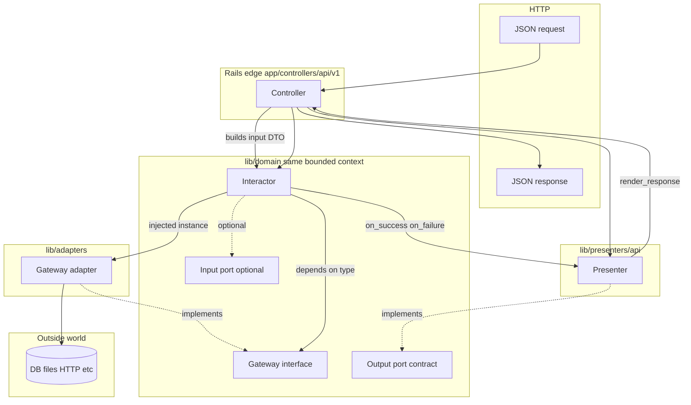
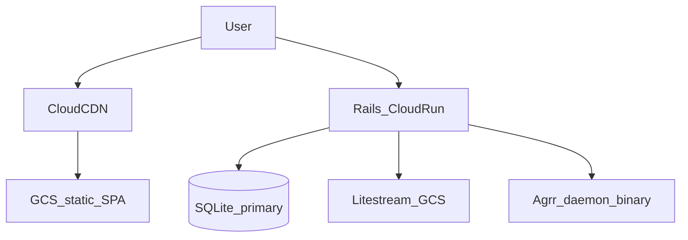
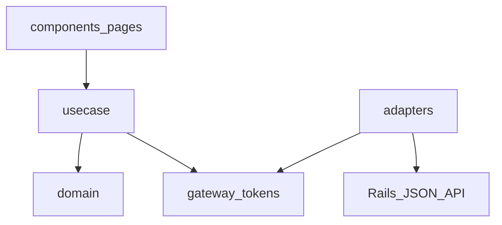

# AGRR Architecture Documentation

## System Overview

AGRR is an agricultural planning and optimization system with a decoupled Angular SPA and a Ruby on Rails 8 JSON API.

**Technology stack**


| Layer               | Technology                                                                                     |
| ------------------- | ---------------------------------------------------------------------------------------------- |
| Frontend            | Angular 21 SPA (Clean Architecture–oriented layers under `frontend/src/app/`)                  |
| Frontend hosting    | Google Cloud Storage + Cloud CDN (see `scripts/gcp-frontend-deploy.sh`)                        |
| Backend             | Ruby on Rails 8 on **Google Cloud Run** (see `scripts/gcp-deploy.sh`)                          |
| Database            | SQLite3 (Solid Cache / Solid Cable / Solid Queue as applicable), **Litestream** replica to GCS |
| Primary integration | **agrr** Python binary / daemon for optimization and weather-related workloads                 |
| Contract-first API  | `docs/contracts/*.md` describe Angular ↔ Rails JSON contracts                                  |


**Architecture (primary):** Decoupled **Angular SPA + Rails API**. Server-rendered Rails HTML exists for some master CRUD flows and delegates to the same domain layer (`lib/domain`) via HTML presenters (`lib/presenters/html/`).

## Rails JSON API: canonical vertical slice

One JSON action = **one interactor call** with **one presenter** as `output_port`.

### JSON API: 役割と依存

1. **Controller** — HTTP の入口。`params` を **入力 DTO** にする。Presenter と Interactor を生成し、Interactor に `output_port:` で Presenter を渡し、`CompositionRoot` 等で組み立てた **gateway 実装**（および logger 等）を渡す。モデル化された失敗の振り分けを、広い `rescue` / `rescue_from` で Controller に持ち込まない。
2. **Presenter**（`lib/presenters/api/...`）— そのユースケースの **Output port の実装**。`on_success(dto)` / `on_failure(dto)` を受け取り、`view.render_response(json:, status:)`（HTML なら `render` / `redirect_to`）に写す。Gateway や `CompositionRoot` でデータを取らない。
3. **Output port**（`lib/domain/.../ports/...`）— Interactor が呼ぶ **コールバックの型**（`on_success` / `on_failure` と DTO）。Presenter がこの契約を実装する。
4. **Input port**（`lib/domain/.../ports/...`、任意）— Interactor が `include` / 継承して `call` の形を型にする場合がある。無い場合は `call(input_dto, output_port:)` のみ。入力の形は Controller が組み立てた DTO。
5. **Interactor**（`lib/domain/.../interactors/...`）— **ユースケース**。注入された **Gateway interface** 等のみを呼び、成功またはモデル化された失敗を決めて `output_port.on_success` / `on_failure` を呼ぶ。`render`、生 `params`、Gateway を経ない ActiveRecord 直叩きは書かない。
6. **Gateway interface**（gateway port、`lib/domain/.../gateways/...`）— **ドメイン側の契約**（取得・永続化などの操作）。Interactor はこの型に依存し、ActiveRecord に直接依存しない。
7. **Gateway 実装**（`lib/adapters/.../gateways/...`）— Gateway interface を SQLite / ActiveRecord / HTTP 等で実現するクラス。`CompositionRoot` または Controller でインスタンス化し Interactor に注入する。


```mermaid
flowchart TB
  subgraph http["HTTP"]
    REQ[JSON request]
    RES[JSON response]
  end
  subgraph app_edge["Rails edge app/controllers/api/v1"]
    CTRL[Controller]
  end
  subgraph domain_core["lib/domain same bounded context"]
    IP[Input port optional]
    IU[Interactor]
    GIF[Gateway interface]
    OPORT[Output port contract]
  end
  subgraph presentation["lib/presenters/api"]
    PRES[Presenter]
  end
  subgraph adapters["lib/adapters"]
    GADP[Gateway adapter]
  end
  subgraph io["Outside world"]
    DB[(DB files HTTP etc)]
  end

  REQ --> CTRL
  CTRL -->|"builds input DTO"| IU
  CTRL --> PRES
  CTRL --> IU
  IU -.->|optional| IP
  PRES -.->|implements| OPORT
  GADP -.->|implements| GIF
  IU -->|"depends on type"| GIF
  IU -->|"injected instance"| GADP
  GADP --> DB
  IU -->|"on_success on_failure"| PRES
  PRES -->|"render_response"| CTRL
  CTRL --> RES
```

### Modeled HTTP outcomes (one path)

- **Interactor** decides success vs modeled failure and calls `output_port.on_success` / `on_failure` with explicit DTOs. **Presenter** owns HTTP shape (`view.render_response` / HTML `render` / `redirect_to`). **Controller** maps strong params to input DTOs, constructs presenter + interactor, injects gateways from `CompositionRoot` (or equivalent)—it is **not** the main `rescue` / `rescue_from` switch for anticipated domain outcomes (validation, not found, conflict, auth, etc.). **Do not** call `on_failure` then `raise` the same case for the controller to rescue (second HTTP path). Guard-only early returns before a DTO exists (e.g. malformed request) are fine; they must not replace the output-port contract for domain results. Negative wording: **Prohibited practices → Application edge and tests → 3**.

### API action checklist

1. Strong-params → **input DTO**.
2. Instantiate gateway(s) (e.g. `Adapters::Farm::Gateways::FarmActiveRecordGateway.new(deletion_undo_gateway: …)`) and API presenter (output port implementation).
3. `InteractorClass.new(output_port: presenter, …).call(input_dto)` (some interactors take `output_port` on `call`).
4. Let the interactor finish through the **output port** for both success and modeled failures—do not wrap `interactor.call` in `rescue` for those paths.

Per layer (detail in **Prohibited practices** → Interactors / Presenters / Application edge where relevant):

| Layer | Do | Do not |
| ----- | -- | ------ |
| **Controller** | `presenter = PresenterClass.new(view: self)` → `InteractorClass.new(output_port: presenter, gateway: CompositionRoot.…_gateway, …).call(dto)` | `rescue StandardError`, `rescue ActiveRecord::RecordNotFound`, or `rescue_from` as the **main** mapper for use-case outcomes |
| **Interactor** | Every client-visible failure path: `output_port.on_failure(failure_dto)` | `render` / raw `params` / AR without gateways; `on_failure` then `raise` for controller rescue |
| **Presenter** | Implement output port; `on_success` / `on_failure` → `view.render_response(json:, status:)` | `CompositionRoot`, `find_model`, gateway loads, business rules |
| **Gateway impl.** | Implement domain gateway interface; map boundary failures to `Domain::Shared::Exceptions::*`; return entities/DTOs | Construct adapters inside `lib/domain` |

AI-specific endpoints (`ai_create`, etc.) follow this checklist; they are not special cases for layering.

### Layout example (reference implementation)

**DTO (input)** → **gateway interface** → **interactor** → **output port（Presenter が実装）** → **adapter gateway** → `CompositionRoot`. **Example:** CRUD under `app/controllers/api/v1/masters/farms_controller.rb` (e.g. `create`) with `lib/domain/farm/interactors/farm_create_interactor.rb`, `lib/presenters/api/farm/farm_create_presenter.rb`, `lib/adapters/farm/gateways/farm_active_record_gateway.rb`, and `CompositionRoot.farm_gateway`.

## System flow


```mermaid
flowchart TD
  User[User] --> CDN[CloudCDN]
  CDN --> GCS[GCS_static_SPA]
  User --> CloudRun[Rails_CloudRun]
  CloudRun --> SQLite[(SQLite_primary)]
  CloudRun --> Litestream[Litestream_GCS]
  CloudRun --> AgrrDaemon[Agrr_daemon_binary]
```


## Backend: Clean Architecture（規約）

Business logic for API and progressively for HTML flows lives under `lib/`, not only for AI endpoints.

### Domain modules (`lib/domain/`)

Each bounded context typically has: `entities/`, `dtos/`, `gateways/` (interfaces), `interactors/`, `ports/` (input/output), and sometimes shared policies under `lib/domain/shared/`.

Current domains include (non-exhaustive; inspect `lib/domain/` for source of truth):

- `agricultural_task`, `contact_messages`, `crop`, `cultivation_plan`, `deletion_undo`, `farm`, `fertilize`, `field`, `field_cultivation`, `interaction_rule`, `pest`, `pesticide`, `public_plan`, `weather_data`, plus `shared` and `logger` gateways.

### Adapters (`lib/adapters/`)

Gateway implementations (e.g. ActiveRecord-backed, in-memory for tests) live under `lib/adapters/<context>/gateways/`.

### Gateway boundary (presentation-agnostic)

Gateways **must not** depend on HTTP or incidental UI conventions: shapes named for a specific template/partials; Hash layouts driven by `data-*` attributes or route-helper-only keying; or return types / method naming that encode a **screen identifier** (`*_page`, `*_html`, etc.) when the real intent is **view/SPA-specific key arrangement** assembled inside the persistence adapter.

**Heuristic:** If the gateway’s job is effectively “produce the blob this one HTML partial or Angular screen expects,” the boundary is wrong—lift assembly to the **Interactor** or to a domain **assembler/mapper** under `lib/domain/` (read snapshots → **output-port DTOs** / use-case payloads; **not** HTTP-aware types).

**Allowed:** Persistence, authorization, and **domain-meaningful read snapshots** as DTOs or value objects (IDs, dates, counts, cultivated rows, etc.). **Presenter-shaped** composites required by an output port (for example `PrivatePlanShowDto`) are composed **outside** the gateway adapter.

### Presenters (`lib/presenters/`)

- **API JSON:** `lib/presenters/api/<resource>/` — implement domain output ports and call `view.render_response(json:, status:)`.
- **HTML (Rails views):** `lib/presenters/html/<resource>/` — same output ports; perform `redirect_to` / `render` instead of JSON.

**Rule:** New presenters belong under `lib/presenters/{api,html}/`, not under `app/presenters/` (legacy paths are being retired).

**Boundary:** Presenters implement output ports only (shape HTTP from success/failure payloads). For JSON actions, **modeled outcomes** follow [Rails JSON API: canonical vertical slice → Modeled HTTP outcomes](#modeled-http-outcomes-one-path). No presenter fetch via `CompositionRoot` / `find_model` / gateways; no business rules in presenters. Load in the **Interactor** via gateways; pass **DTOs/entities** on the port. Do not hide `find_model` or gateway calls in **controller-local procs/lambdas** passed into the presenter. `lib/domain` does not reference `Rails.*`; inject from the **composition root at the app edge** (controller/job), not framework singletons.

#### Use-case–scoped Output Port contract (how we refactor HTML/API presenters)

1. **Bundling (scope)** — Unit of work is **one `Interactor#call` = one use case** (e.g. farm list, farm detail, field list), not “one view file.” **Same business use case ⇒ same interactor** for HTML and API; format differences belong in **presenters only**, not in `*HtmlInteractor` / `*ApiInteractor` splits. For each use case, define in **one sentence** what `on_success` (and failure) passes to the port; **ActiveRecord must not cross that boundary** (state it explicitly).
2. **Contract-first (drift prevention)** — The output port lists what **templates or JSON consumers need** as **DTOs/entities** (fields enumerated). Anything missing is **filled by the gateway or by assembly in the Interactor** — **no fetch/load in the presenter**.
3. **Implementation order (safe sequence)** — **Interactor (+ tests)** first: gateway-only data load, port arguments match the new contract. Then **Presenter**: mapping to HTTP/view only; remove `CompositionRoot` / `find_model` / gateway injection into presenters (including via callables). Then **Controller**: **only** `CompositionRoot` (or equivalent) injection into the interactor and presenter construction — **do not pass gateways into presenters**. Then **Views**: if `@model` assumed AR, replace with **DTO attributes and helpers** in the **same PR or the commit immediately before/after** — do **not** bring AR back through the presenter for convenience.
4. **API orchestration** — API presenters **must not** spawn another interactor (e.g. weather). If the response needs multiple concerns, either the **controller calls multiple interactors** or a **single payload-oriented interactor** composes the result and passes **only the combined DTO** through the port.
5. **Definition of done** — `lib/presenters/**/*.rb` contains **no** `CompositionRoot` and **no** `find_model`. Each target use case has an **Interactor test** that fixes **types and required fields** reaching the port. **System/controller tests** (where needed) prove HTML/JSON behavior is unchanged.

**Planning summary (one line each):**

- **Before:** “Remove presenter service location and push load toward the Interactor.”
- **After:** “Fix the **output port contract** on **DTOs/entities**; the **Interactor** satisfies it using **gateways only**. Presenters **map for display only**; where templates assumed AR, update templates to **DTO-first** in the same scope — **do not reintroduce AR via presenters or controller-embedded fetch procs.**”

### Rails application layer (`app/`)

- **`ActiveSupport::Concern`** — **Do not add** new concern modules under `app/controllers/concerns/`, `app/models/concerns/`, or elsewhere to share **domain-shaped or use-case** logic. Express reuse in `lib/domain` as **Plain Ruby**, wire it with **explicit injection** at the edge. Legacy concerns are **debt** to fold into interactors and ports.
- **`app/controllers/api/v1/`** — JSON API; params → DTOs → interactors + API presenters. Flow: [Rails JSON API: canonical vertical slice](#rails-json-api-canonical-vertical-slice).
- **`app/controllers/*_controller.rb`** — HTML controllers for legacy/admin-style flows; increasingly delegate to interactors + HTML presenters.
- **`app/models/`** — ActiveRecord; validations (e.g. resource limits) stay at the model boundary where appropriate.
- **`app/services/`** — Orchestration and legacy services; **prefer** moving durable rules into `lib/domain/.../interactors` (see roadmap).
- **`app/gateways/agrr/`** — HTTP/process integration with the **agrr** daemon (optimization, weather, progress, etc.). These are infrastructure adapters, not domain entities.

### External agrr integration

- Gateways under `app/gateways/agrr/` encapsulate the agrr CLI/daemon protocol.
- Tests: `test/gateways/agrr/`.

## What we require (non-negotiable)

- **This document wins over “industry defaults”:** When **common Rails/Clean-Architecture blog patterns**, **Pragmatism**, or **“lots of projects do X”** conflict with the rules below (including **Prohibited practices**), **follow this file—not the meme**. “Existing code does it” or “tests pass” **does not** override a numbered prohibition; treat mismatches as **debt to fix**, not a template to copy.
- **Depend inward:** Frameworks, persistence, HTTP, and clocks live at the **edge** and are injected. The core consumes **data (DTOs/entities) and narrow ports**—not `Rails`, not ActiveRecord traversal, not ambient time.
- **Plain Ruby in `lib/domain`, not Rails mixins:** Shared behavior and use-case judgment belong under `lib/domain` as ordinary classes/modules (policies, interactors, value objects). `ActiveSupport::Concern` is **not** the reuse vehicle we add for that purpose—dependencies are **constructor-injected** from controllers, jobs, or `CompositionRoot`. (See **Application edge**, **Sideways escape**.)
- **One decision, one place:** Business outcomes are expressed in **policies and interactors**. Presenters and templates **shape output only**; they do not re-decide the same rules. Do not duplicate truth across models, services, helpers, and views.
- **Wiring is explicit:** Constructor signatures are the **contract**. No hidden globals, `*.default`, grab-bag context objects, or tests that green-wrap a different graph than production.
- **Truth is specified:** Behavior is defined by **contract text and the tests bound to it**—not by “matching whatever the legacy stack does.”
- **Refactors finish the job:** Moving code out of `lib/domain/` without fixing dependency direction and types is **relocation**, not completion.
- **Convenience is not an exemption:** Skipping layering because it is faster, when it commits us to wholesale rework afterward, **is rejected**. Deliberate interim steps belong in the **same PR or adjacent commits** with repayment, or their **lifetime and replacement** must be spelled out in `docs/contracts/` and tests bound to those contracts—see `.cursor/rules/no-convenience-tech-debt.mdc`.

## Prohibited practices (hard rules)

The clauses in the numbered subsections below are the **negative** expression of [What we require](#what-we-require-non-negotiable)—what not to do when meeting that bar for **new code**. Existing code may still violate these; treat those spots as debt. Refactors must not **relocate** a smell (e.g. push the same coupling to a fat controller) or **reintroduce** the same dependency shape under a different name.

### `lib/domain/` (entities, policies, interactors, gateway interfaces)

1. **Framework entry points** — Referencing `Rails.*` (`Rails.logger`, `Rails.env`, `Rails.application`, etc.) from domain code.
2. **ActiveRecord types in domain flow** — Catching or typing against `ActiveRecord::*` in the domain layer. Map persistence failures to `Domain::Shared::Exceptions::*` in adapters only.
3. **ORM in the core** — Calling ActiveRecord APIs on objects in interactors (e.g. `record.association.where`, `pluck`, `includes`). **Also:** passing ActiveRecord models (or thin wrappers that still expose query chains) inward just because they “came through a gateway” — map to **DTOs/entities** at the use-case boundary.
4. **Ambient Rails time** — Relying on `Date.current`, `Time.current`, `Time.zone`, or `n.days` / `n.months` / `n.years` without an explicit clock or `Date` arguments. Prefer injected `clock`, explicit dates, or pure date math.
5. **Instantiating adapters from domain** — `SomeAdapter.new` or `Adapters::...` inside `lib/domain`, including “temporary” refactors. Construct at the edge (`lib/composition_root.rb`, controllers, jobs) and inject **interfaces** only.
6. **Service-locator defaults** — Patterns like `LoggerPort.default`, `TranslatorPort.default`, `*Gateway.default`, or other hidden globals. Dependencies must be **constructor-injected** from the edge.
7. **Framework via inheritance** — Hiding Rails/AR in a base interactor, mixin, or shared superclass used by `lib/domain` so leaf classes look framework-free.
8. **Partial dependency fixes** — Injecting only some ports (e.g. logger) while `Date.current`, I18n, or config stay implicit where rules 1 and 4 require explicit arguments or ports.

### Interactors (use cases)

1. **HTTP concerns** — Raw `params` shapes, `redirect_to`, `render`, HTTP status codes, or flash. Controllers build DTOs; presenters handle HTTP reactions.
2. **View-only shaping in the core** — Logic that exists only for a specific layout or field order belongs in presenters (or helpers). Output DTOs carry **application data**, not presentation trivia. **Do not** “align HTML and JSON” by bloating DTOs or encoding display order in the interactor — use presenters/mappers at the edge.
3. **Service location from interactors** — Calling `CompositionRoot.*` (or equivalent) from an interactor to obtain gateways or loaders. Wiring stays at controllers, jobs, or `CompositionRoot` itself.
4. **Channel or presentation concrete in interactors** — Do not encode **delivery channel** or **screen shape** in interactor or gateway **names or method names** (e.g. `*HtmlInteractor`, `*_html_success`, `*JsonBundle*`). Orchestration must call **domain-meaningful** gateway operations and pass **domain-meaningful** types to the output port (`Results::*`, entities, or DTOs **without** `Html` / `Json` / `Page` in the type name). **One use case, one interactor**; HTML vs API is **only** a presenter choice at the edge.

### `lib/presenters/` (API and HTML)

1. **Service location from presenters** — Calling `CompositionRoot.*` to load data for the response.
2. **Gateway locators / persistence rehydration in presenters** — `*Gateway.default` or gateways used for `find_model` (or similar) to load persistence models for the view. Loaded data belongs in the **Interactor output**, carried as **DTOs/entities** on the port — **not** in the presenter, and **not** by passing controller-defined lambdas that call gateways/`find_model`.
3. **Business rules in presenters** — Authorization outcomes, validation rules, or “can this happen?” decisions belong in domain policies / interactors.

### Views

1. **Rules in templates** — Duplicating or inventing business rules in ERB/partials/helpers instead of `lib/domain/`.

### Documentation

1. **Framework as sole truth** — Stating in contracts or ADRs that the Rails/HTML implementation alone is the source of truth. Truth is **the contract text and the tests** tied to it, not “whatever Rails does.”

### Application edge and tests (refactor hygiene)

1. **Sideways escape** — Moving coupled logic out of `lib/domain/` into a fat controller, fat `app/services/` class, or `ActiveSupport::Concern` (controller/model concern) **without** DTOs, ports, and constructor injection. **Do not introduce new Concern modules** to share orchestration, authorization outcomes, validation rules, or other judgment that belongs in `lib/domain`. **Prefer** Plain Ruby there (policies, interactors, small POROs) and **inject** at the edge. Goal is **dependency direction and testable boundaries**, not “clean domain files.”
2. **Tests that hide wiring** — Making the suite pass with global stubs or implicit time while production code still lacks the constructor contract and explicit ports required above. Fix production wiring first, then tests.
3. **`rescue`-driven modeled outcomes** — Using `begin`/`rescue`, `rescue_from`, or similar as the **primary** mapper for **anticipated** domain/adapter failures duplicates Interactor judgment at the edge. **Do not** `on_failure` then `raise` for the same case. Canonical rule and rationale: [Modeled HTTP outcomes (one path)](#modeled-http-outcomes-one-path).

### Rationalizations and loopholes (items 19–26)

Common **excuses** do not exempt new code. If it quacks like a framework/ORM dependency or a second source of truth, it violates the same rules as **1–18**.

1. **Rules living only on models** — Durable logic expressed **only** through `app/models` callbacks and validations to avoid `lib/domain`, without an equivalent policy/interactor path and tests. Validations at the persistence boundary are fine; **exclusive** ownership of business outcomes there is not.
2. **Pseudonym layers** — Coupled orchestration parked in `app/services/`, `app/forms/`, or `lib/` **outside** `lib/domain/<context>/` while still encoding use-case rules, AR traversal, or HTTP — “not in the domain folder” is not architecture.
3. **Trojan `inject`** — Constructor args that smuggle the framework in disguise: e.g. `Current`, a generic `context`/`deps` hash, `ApplicationRecord` as a grab bag, or procs/callables that perform I/O. Prefer **narrow ports** and **plain DTOs/entities**.
4. **Interface theater** — A “gateway” or “repository” that returns structs or types that are still **ActiveRecord**, still expose query chains, or are implemented by one **god** adapter. Rules 2–3 and 5 apply to **behavior**, not only file names.
5. **Permanent temporary paths** — Endless `# TODO: move to domain`, feature flags, or `legacy_path` / `new_path` branches that **normalize two behaviors** without a plan to collapse to one truth.
6. **Non-Rails infrastructure in the core** — Raw SQL, Arel, or HTTP/SDK clients used **inside** `lib/domain` interactors without going through a gateway/port at the edge. Avoiding the `Rails` constant does not avoid rule 5’s intent.
7. **Edge inflation and double rules** — Many **trivial** interactors that only reorder what a controller used to do; presenters or views that **re-validate** or **recompute** outcomes “for display” instead of consuming the interactor output DTO (duplicates rules 10 and 14 in spirit).
8. **Tests that lie about the contract** — Over-mocking so units never see real **constructor arity** and types; relying on integration tests alone while production wiring still uses hidden globals or inner `CompositionRoot` calls. Complements rule 18.

## Frontend: Angular layers (`frontend/src/app/`)

**Intended dependency direction**


```mermaid
flowchart TB
  Components[components_pages] --> UseCase[usecase]
  UseCase --> DomainFE[domain]
  UseCase --> GatewayIF[gateway_tokens]
  Adapters[adapters] --> GatewayIF
  Adapters --> RailsAPI[Rails_JSON_API]
```


- **`domain/`** — Types and pure rules (framework-agnostic where possible).
- **`usecase/`** — Use cases, gateway interfaces (injection tokens), ports.
- **`adapters/`** — API gateway implementations, presenters that map DTOs to view state.
- **`components/`** — Standalone components, routes, templates.
- **`services/`** — Cross-cutting and feature-specific helpers（認証、一覧リフレッシュ、マスタ API クライアント等）。HTTP や環境依存の実装は `adapters/` に寄せる（T-053: 空の `infrastructure/` 層は採用しない）。
- **`core/`** — i18n loader, API base URL, browser region, cookie consent helpers, `ListRefreshBus` 等の横断ユーティリティ。
- **`guards/`** — e.g. `authGuard`.
- **`routes/`** — `app.routes.ts` が合成する feature 別ルート定義（T-054）。

**i18n:** `@ngx-translate` with `frontend/src/assets/i18n/ja.json` and `en.json`.

**Routing:** 本番は `PathLocationStrategy`（`app.config.ts`）。CDN では URL map で SPA フォールバックを `index.html` に向ける（`scripts/agrr-frontend-url-map-simple.yaml`）。

## Core business rules

### Resource limits

- **Farm limit:** max 4 non-reference farms per user (`is_reference: false`).
- **Crop limit:** max 20 non-reference crops per user.
- **Reference data:** `is_reference: true` records do not count toward limits.

Enforced in ActiveRecord models via validations.

## Directory structure (summary)

```
app/
├── controllers/          # HTML + api/v1/
├── models/
├── services/             # Application services (migrate toward lib/domain where possible)
├── gateways/agrr/        # agrr daemon clients
├── jobs/
└── views/                # HTML ERB (legacy + masters)

lib/
├── domain/<context>/     # Entities, DTOs, gateways (interfaces), interactors, ports
├── adapters/<context>/gateways/
└── presenters/
    ├── api/<resource>/
    └── html/<resource>/

frontend/
└── src/app/
    ├── domain/
    ├── usecase/
    ├── adapters/
    ├── components/
    ├── services/
    ├── core/
    └── guards/

docs/
├── contracts/            # API / feature contracts (contract-first)
└── planning/             # Design notes, migrations
```

## Testing

```
test/
├── domain/               # Interactor / entity tests per context
├── adapters/             # Gateway implementation tests
├── presenters/           # API / HTML presenter tests
├── controllers/
├── models/
├── services/
├── gateways/agrr/
└── system/
```

**Rules**

- Prefer `./bin/test` (or `.cursor/skills/test-common/scripts/run-test-rails.sh`) over raw `rails test` to avoid corrupting the development database. Orchestration and when to run the full suite: [`.cursor/rules/rails-testing-workflow.mdc`](.cursor/rules/rails-testing-workflow.mdc) and [`.cursor/skills/test-common/SKILL.md`](.cursor/skills/test-common/SKILL.md).
- Frontend: `cd frontend && npm test`, `npm run build`, and i18n check scripts as documented in `frontend/package.json`.

## Implementation guidelines

### New API features

1. Update or add `docs/contracts/<feature>-contract.md`.
2. Add/adjust DTOs and interactors under `lib/domain/`.
3. Add/adjust gateway implementation under `lib/adapters/`.
4. Add API presenter under `lib/presenters/api/`.
5. Thin controller in `app/controllers/api/v1/` (see [API action checklist](#api-action-checklist)).
6. Tests in `test/domain/`, `test/adapters/`, `test/presenters/`, `test/controllers/`.

### HTML master CRUD (Rails)

HTML master CRUD: presenters in `lib/presenters/html/`, orchestration via interactors under `lib/domain/`.

## At a glance

One-paragraph index to the normative sections: [What we require](#what-we-require-non-negotiable), [Prohibited practices](#prohibited-practices-hard-rules), and [Rails JSON API](#rails-json-api-canonical-vertical-slice) (includes [Modeled HTTP outcomes](#modeled-http-outcomes-one-path)). **Contract-first** (`docs/contracts/`). **Domain-centric** backend (`lib/domain` for use-case logic; ActiveRecord for persistence). **Thin controllers**; **modeled** success/failure via interactor → presenter, not `rescue` as the main branch ([checklist](#api-action-checklist)). **Model-level** invariants including [resource limits](#resource-limits). **One action per interactor** where Clean Architecture applies. **Testability**: explicit constructor wiring; memory gateways in unit tests; integration tests at the edge ([Testing](#testing)). Typical pitfalls are spelled out in Prohibited (e.g. items 19–26): durable rules only in `app/models` or parked in `app/services`, limits only enforced in controllers—fix by domain interactors and validations, not new fat edges.

## Agent workflow（規約と手順の関係）

本章（**What we require** / **Prohibited practices**）が**規約本体**である。エディタ支援や違反削減タスクでの**実行手順**（洗い出し、ARCHITECTURE ゲート、全体テスト、リポジトリ横断スキャン）は次を参照する。便宜による境界逸脱は [`.cursor/rules/no-convenience-tech-debt.mdc`](.cursor/rules/no-convenience-tech-debt.mdc) と整合させる。

| 参照 | 役割 |
| --- | --- |
| [`.cursor/rules/agent-conventions.mdc`](.cursor/rules/agent-conventions.mdc) | 用語（**実装後の Clean Architecture チェック**：親がゲート・test-common を省略しない等）、ワークフローの**セクション番号**とユーザー向け表記 |
| [`.cursor/skills/clean-architecture-violation-fix-workflow/SKILL.md`](.cursor/skills/clean-architecture-violation-fix-workflow/SKILL.md) | 違反修正の外側・内側ループ（**セクション0**〜**セクション6**） |
| [`.cursor/rules/ca-violation-fix-architecture-gate.mdc`](.cursor/rules/ca-violation-fix-architecture-gate.mdc) | **セクション4**の ARCHITECTURE.md ゲートを定める（**1 回目・2 回目**、禁止 1–26 との照合、記録の必須出力）。Rails / `frontend/` のみの差分でも同一手順・同一フォーマット |
| [`.cursor/skills/clean-architecture-violation-fix-workflow/references/agent-operational-canonical.md`](.cursor/skills/clean-architecture-violation-fix-workflow/references/agent-operational-canonical.md) | エージェント運用例外の集約（例外・増分・本番断定・シェル報告の境界） |
| [`.cursor/rules/rails-testing-workflow.mdc`](.cursor/rules/rails-testing-workflow.mdc) | バックエンド／フロント変更時の **test-common** 経由テスト（手元では `rails test` を直接乱発しない） |

## Additional resources

- [docs/README.md](docs/README.md)（契約・ADR・アーカイブ索引）
- [docs/adr/](docs/adr/)（Architecture Decision Records）
- [docs/DEVELOPMENT_RULES.md](docs/DEVELOPMENT_RULES.md)
- [docs/TESTING_GUIDELINES.md](docs/TESTING_GUIDELINES.md)
- [docs/contracts/README.md](docs/contracts/README.md)
- [docs/RESOURCE_LIMIT_TEMPLATE.md](docs/RESOURCE_LIMIT_TEMPLATE.md)

