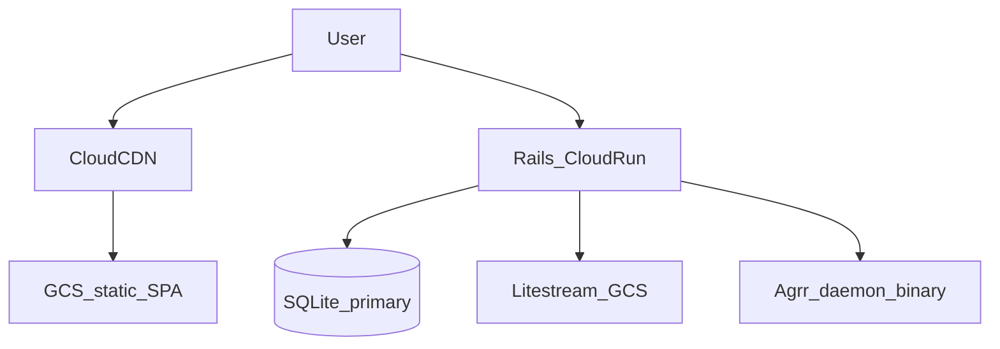
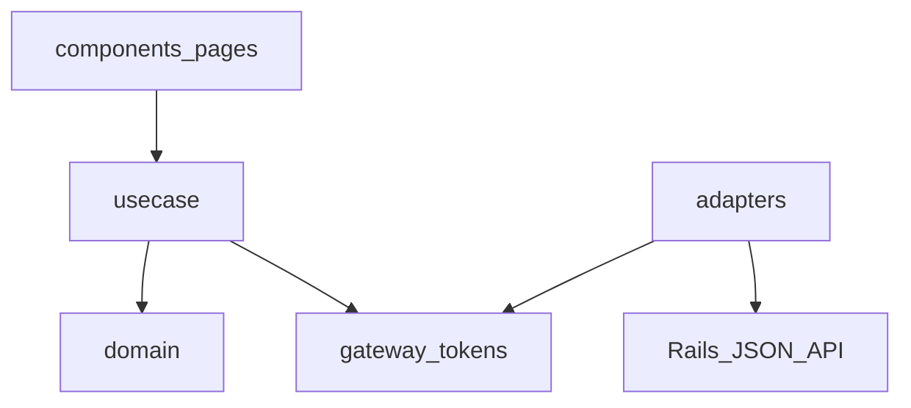

# AGRR Architecture Documentation

## System Overview

AGRR is an agricultural planning and optimization system with a decoupled Angular SPA and a Ruby on Rails 8 JSON API.

**Technology stack**


| Layer               | Technology                                                                                     |
| ------------------- | ---------------------------------------------------------------------------------------------- |
| Frontend            | Angular 21 SPA (Clean Architecture–oriented layers under `frontend/src/app/`)                  |
| Frontend hosting    | Google Cloud Storage + Cloud CDN (see `scripts/gcp-frontend-deploy.sh`)                        |
| Backend             | Ruby on Rails 8 on **Google Cloud Run** (see `scripts/gcp-deploy.sh`)                          |
| Database            | SQLite3 (Solid Cache / Solid Cable / Solid Queue as applicable), **Litestream** replica to GCS |
| Primary integration | **agrr** Python binary / daemon for optimization and weather-related workloads                 |
| Contract-first API  | `docs/contracts/*.md` describe Angular ↔ Rails JSON contracts                                  |


**Architecture (primary):** Decoupled **Angular SPA + Rails API**. Server-rendered Rails HTML exists for some master CRUD flows and delegates to the same domain layer (`lib/domain`) via HTML presenters (`lib/presenters/html/`).

## System flow


```mermaid
flowchart TD
  User[User] --> CDN[CloudCDN]
  CDN --> GCS[GCS_static_SPA]
  User --> CloudRun[Rails_CloudRun]
  CloudRun --> SQLite[(SQLite_primary)]
  CloudRun --> Litestream[Litestream_GCS]
  CloudRun --> AgrrDaemon[Agrr_daemon_binary]
```


## Backend: Clean Architecture (canonical)

Business logic for API and progressively for HTML flows lives under `**lib/**`, not only for AI endpoints.

### Domain modules (`lib/domain/`)

Each bounded context typically has: `entities/`, `dtos/`, `gateways/` (interfaces), `interactors/`, `ports/` (input/output), and sometimes shared policies under `lib/domain/shared/`.

Current domains include (non-exhaustive; inspect `lib/domain/` for source of truth):

- `agricultural_task`, `contact_messages`, `crop`, `cultivation_plan`, `deletion_undo`, `farm`, `fertilize`, `field`, `field_cultivation`, `interaction_rule`, `pest`, `pesticide`, `public_plan`, `weather_data`, plus `shared` and `logger` gateways.

### Adapters (`lib/adapters/`)

Gateway implementations (e.g. ActiveRecord-backed, in-memory for tests) live under `lib/adapters/<context>/gateways/`.

### Presenters (`lib/presenters/`)

- **API JSON:** `lib/presenters/api/<resource>/` — implement domain output ports and call `view.render_response(json:, status:)`.
- **HTML (Rails views):** `lib/presenters/html/<resource>/` — same output ports; perform `redirect_to` / `render` instead of JSON.

**Rule:** New presenters belong under `lib/presenters/{api,html}/`, not under `app/presenters/` (legacy paths are being retired).

**Boundary:** Presenters implement output ports only (format success/failure for HTTP). They do not obtain domain data via `CompositionRoot`, `*Gateway.default`, or `find_model`—that loading belongs in the use case (Interactor) or in controller wiring that passes fully-built DTOs into the Interactor. `lib/domain` does not reference `Rails.*`; use injected ports (logger, translator, gateways from the composition root at the app edge), not framework singletons.

### Rails application layer (`app/`)

- `**app/controllers/api/v1/`** — JSON API; wires params → DTOs → interactors + API presenters.
- `**app/controllers/*_controller.rb`** — HTML controllers for legacy/admin-style flows; increasingly delegate to interactors + HTML presenters.
- `**app/models/**` — ActiveRecord; validations (e.g. resource limits) stay at the model boundary where appropriate.
- `**app/services/**` — Orchestration and legacy services; **prefer** moving durable rules into `lib/domain/.../interactors` (see roadmap).
- `**app/gateways/agrr/`** — HTTP/process integration with the **agrr** daemon (optimization, weather, progress, etc.). These are infrastructure adapters, not domain entities.

### External agrr integration

- Gateways under `app/gateways/agrr/` encapsulate the agrr CLI/daemon protocol.
- Tests: `test/gateways/agrr/`.

## What we require (non-negotiable)

- **Depend inward:** Frameworks, persistence, HTTP, and clocks live at the **edge** and are injected. The core consumes **data (DTOs/entities) and narrow ports**—not `Rails`, not ActiveRecord traversal, not ambient time.
- **One decision, one place:** Business outcomes are expressed in **policies and interactors**. Presenters and templates **shape output only**; they do not re-decide the same rules. Do not duplicate truth across models, services, helpers, and views.
- **Wiring is explicit:** Constructor signatures are the **contract**. No hidden globals, `*.default`, grab-bag context objects, or tests that green-wrap a different graph than production.
- **Truth is specified:** Behavior is defined by **contract text and the tests bound to it**—not by “matching whatever the legacy stack does.”
- **Refactors finish the job:** Moving code out of `lib/domain/` without fixing dependency direction and types is **relocation**, not completion.

## Prohibited practices (hard rules)

The numbering below is **one list** (1–26): the **negative** expression of [What we require](#what-we-require-non-negotiable)—what not to do when meeting that bar for **new code**. Existing code may still violate these; treat those spots as debt. Refactors must not **relocate** a smell (e.g. push the same coupling to a fat controller) or **reintroduce** the same dependency shape under a different name.

### `lib/domain/` (entities, policies, interactors, gateway interfaces)

1. **Framework entry points** — Referencing `Rails.*` (`Rails.logger`, `Rails.env`, `Rails.application`, etc.) from domain code.
2. **ActiveRecord types in domain flow** — Catching or typing against `ActiveRecord::*` in the domain layer. Map persistence failures to `Domain::Shared::Exceptions::*` in adapters only.
3. **ORM in the core** — Calling ActiveRecord APIs on objects in interactors (e.g. `record.association.where`, `pluck`, `includes`). **Also:** passing ActiveRecord models (or thin wrappers that still expose query chains) inward just because they “came through a gateway” — map to **DTOs/entities** at the use-case boundary.
4. **Ambient Rails time** — Relying on `Date.current`, `Time.current`, `Time.zone`, or `n.days` / `n.months` / `n.years` without an explicit clock or `Date` arguments. Prefer injected `clock`, explicit dates, or pure date math.
5. **Instantiating adapters from domain** — `SomeAdapter.new` or `Adapters::...` inside `lib/domain`, including “temporary” refactors. Construct at the edge (`lib/composition_root.rb`, controllers, jobs) and inject **interfaces** only.
6. **Service-locator defaults** — Patterns like `LoggerPort.default`, `TranslatorPort.default`, `*Gateway.default`, or other hidden globals. Dependencies must be **constructor-injected** from the edge.
7. **Framework via inheritance** — Hiding Rails/AR in a base interactor, mixin, or shared superclass used by `lib/domain` so leaf classes look framework-free.
8. **Partial dependency fixes** — Injecting only some ports (e.g. logger) while `Date.current`, I18n, or config stay implicit where rules 1 and 4 require explicit arguments or ports.

### Interactors (use cases)

1. **HTTP concerns** — Raw `params` shapes, `redirect_to`, `render`, HTTP status codes, or flash. Controllers build DTOs; presenters handle HTTP reactions.
2. **View-only shaping in the core** — Logic that exists only for a specific layout or field order belongs in presenters (or helpers). Output DTOs carry **application data**, not presentation trivia. **Do not** “align HTML and JSON” by bloating DTOs or encoding display order in the interactor — use presenters/mappers at the edge.
3. **Service location from interactors** — Calling `CompositionRoot.*` (or equivalent) from an interactor to obtain gateways or loaders. Wiring stays at controllers, jobs, or `CompositionRoot` itself.

### `lib/presenters/` (API and HTML)

1. **Service location from presenters** — Calling `CompositionRoot.*` to load data for the response.
2. **Gateway locators / persistence rehydration in presenters** — `*Gateway.default` or gateways used for `find_model` (or similar) to load persistence models for the view. Loaded data belongs in the interactor output DTO (or controller wiring that completes the DTO before `Interactor#call`).
3. **Business rules in presenters** — Authorization outcomes, validation rules, or “can this happen?” decisions belong in domain policies / interactors.

### Views

1. **Rules in templates** — Duplicating or inventing business rules in ERB/partials/helpers instead of `lib/domain/`.

### Documentation

1. **Framework as sole truth** — Stating in contracts or ADRs that the Rails/HTML implementation alone is the source of truth. Truth is **the contract text and the tests** tied to it, not “whatever Rails does.”

### Application edge and tests (refactor hygiene)

1. **Sideways escape** — Moving coupled logic out of `lib/domain/` into a fat controller, fat `app/services/` class, or controller concern **without** DTOs, ports, and constructor injection. Goal is **dependency direction and testable boundaries**, not “clean domain files.”
2. **Tests that hide wiring** — Making the suite pass with global stubs or implicit time while production code still lacks the constructor contract and explicit ports required above. Fix production wiring first, then tests.

### Rationalizations and loopholes (items 19–26)

Common **excuses** do not exempt new code. If it quacks like a framework/ORM dependency or a second source of truth, it violates the same rules as **1–18**.

1. **Rules living only on models** — Durable logic expressed **only** through `app/models` callbacks and validations to avoid `lib/domain`, without an equivalent policy/interactor path and tests. Validations at the persistence boundary are fine; **exclusive** ownership of business outcomes there is not.
2. **Pseudonym layers** — Coupled orchestration parked in `app/services/`, `app/forms/`, or `lib/` **outside** `lib/domain/<context>/` while still encoding use-case rules, AR traversal, or HTTP — “not in the domain folder” is not architecture.
3. **Trojan `inject`** — Constructor args that smuggle the framework in disguise: e.g. `Current`, a generic `context`/`deps` hash, `ApplicationRecord` as a grab bag, or procs/callables that perform I/O. Prefer **narrow ports** and **plain DTOs/entities**.
4. **Interface theater** — A “gateway” or “repository” that returns structs or types that are still **ActiveRecord**, still expose query chains, or are implemented by one **god** adapter. Rules 2–3 and 5 apply to **behavior**, not only file names.
5. **Permanent temporary paths** — Endless `# TODO: move to domain`, feature flags, or `legacy_path` / `new_path` branches that **normalize two behaviors** without a plan to collapse to one truth.
6. **Non-Rails infrastructure in the core** — Raw SQL, Arel, or HTTP/SDK clients used **inside** `lib/domain` interactors without going through a gateway/port at the edge. Avoiding the `Rails` constant does not avoid rule 5’s intent.
7. **Edge inflation and double rules** — Many **trivial** interactors that only reorder what a controller used to do; presenters or views that **re-validate** or **recompute** outcomes “for display” instead of consuming the interactor output DTO (duplicates rules 10 and 14 in spirit).
8. **Tests that lie about the contract** — Over-mocking so units never see real **constructor arity** and types; relying on integration tests alone while production wiring still uses hidden globals or inner `CompositionRoot` calls. Complements rule 18.

## Frontend: Angular layers (`frontend/src/app/`)

**Intended dependency direction**


```mermaid
flowchart TB
  Components[components_pages] --> UseCase[usecase]
  UseCase --> DomainFE[domain]
  UseCase --> GatewayIF[gateway_tokens]
  Adapters[adapters] --> GatewayIF
  Adapters --> RailsAPI[Rails_JSON_API]
```


- `**domain/**` — Types and pure rules (framework-agnostic where possible).
- `**usecase/**` — Use cases, gateway interfaces (injection tokens), ports.
- `**adapters/**` — API gateway implementations, presenters that map DTOs to view state.
- `**components/**` — Standalone components, routes, templates.
- `**services/**` — Cross-cutting and feature-specific helpers（認証、一覧リフレッシュ、マスタ API クライアント等）。HTTP や環境依存の実装は `**adapters/**` に寄せる（T-053: 空の `infrastructure/` 層は採用しない）。
- `**core/**` — i18n loader, API base URL, browser region, cookie consent helpers, `ListRefreshBus` 等の横断ユーティリティ。
- `**guards/**` — e.g. `authGuard`.
- `**routes/**` — `app.routes.ts` が合成する feature 別ルート定義（T-054）。

**i18n:** `@ngx-translate` with `frontend/src/assets/i18n/ja.json` and `en.json`.

**Routing:** 本番は `PathLocationStrategy`（`app.config.ts`）。CDN では URL map で SPA フォールバックを `index.html` に向ける（`scripts/agrr-frontend-url-map-simple.yaml`）。

## Core business rules

### Resource limits

- **Farm limit:** max 4 non-reference farms per user (`is_reference: false`).
- **Crop limit:** max 20 non-reference crops per user.
- **Reference data:** `is_reference: true` records do not count toward limits.

Enforced in ActiveRecord models via validations.

## Directory structure (summary)

```
app/
├── controllers/          # HTML + api/v1/
├── models/
├── services/             # Application services (migrate toward lib/domain where possible)
├── gateways/agrr/        # agrr daemon clients
├── jobs/
└── views/                # HTML ERB (legacy + masters)

lib/
├── domain/<context>/     # Entities, DTOs, gateways (interfaces), interactors, ports
├── adapters/<context>/gateways/
└── presenters/
    ├── api/<resource>/
    └── html/<resource>/

frontend/
└── src/app/
    ├── domain/
    ├── usecase/
    ├── adapters/
    ├── components/
    ├── services/
    ├── core/
    └── guards/

docs/
├── contracts/            # API / feature contracts (contract-first)
└── planning/             # Design notes, migrations
```

## API controller pattern (Interactor + Presenter)

Typical API action shape:

1. Build input DTO from `params`.
2. Instantiate gateway (e.g. `Adapters::Farm::Gateways::FarmActiveRecordGateway.new`).
3. Instantiate API presenter implementing the domain output port.
4. Call `Domain::<Context>::Interactors::<Action>Interactor.new(...).call(input_dto)`.

AI-specific endpoints (`ai_create`, etc.) follow the same pattern; they are **not** the only Clean Architecture entry points.

## Testing

```
test/
├── domain/               # Interactor / entity tests per context
├── adapters/             # Gateway implementation tests
├── presenters/           # API / HTML presenter tests
├── controllers/
├── models/
├── services/
├── gateways/agrr/
└── system/
```

**Rules**

- Prefer `./bin/test` (or `.cursor/skills/test-common/scripts/run-test-rails.sh`) over raw `rails test` to avoid corrupting the development database.
- Frontend: `cd frontend && npm test`, `npm run build`, and i18n check scripts as documented in `frontend/package.json`.

## Implementation guidelines

### New API features

1. Update or add `docs/contracts/<feature>-contract.md`.
2. Add/adjust DTOs and interactors under `lib/domain/`.
3. Add/adjust gateway implementation under `lib/adapters/`.
4. Add API presenter under `lib/presenters/api/`.
5. Thin controller in `app/controllers/api/v1/`.
6. Tests in `test/domain/`, `test/adapters/`, `test/presenters/`, `test/controllers/`.

### HTML master CRUD (Rails)

HTML master CRUD: presenters in `lib/presenters/html/`, orchestration via interactors under `lib/domain/`.

## Anti-patterns

### Resource limits only in controllers

Invalid — bypassable. Use model validations (and interactors that respect model state).

### Business rules only in `app/services/`

Discouraged for long-lived rules; prefer `lib/domain/.../interactors` with tests.

## Key principles

1. **Contract-first** for Angular ↔ Rails JSON (`docs/contracts/`).
2. **Domain-centric backend** — `lib/domain` is the home for use-case logic; ActiveRecord is persistence.
3. **Thin controllers** — orchestration and HTTP concerns only.
4. **Model-level invariants** — resource limits and DB-backed constraints on models where appropriate.
5. **One action per interactor** (when using Clean Architecture interactors).
6. **Testability** — memory gateways for fast unit tests; integration tests for controllers.

## Additional resources

- [docs/README.md](docs/README.md)（契約・ADR・アーカイブ索引）
- [docs/adr/](docs/adr/)（Architecture Decision Records）
- [docs/DEVELOPMENT_RULES.md](docs/DEVELOPMENT_RULES.md)
- [docs/TESTING_GUIDELINES.md](docs/TESTING_GUIDELINES.md)
- [docs/contracts/README.md](docs/contracts/README.md)
- [docs/RESOURCE_LIMIT_TEMPLATE.md](docs/RESOURCE_LIMIT_TEMPLATE.md)

