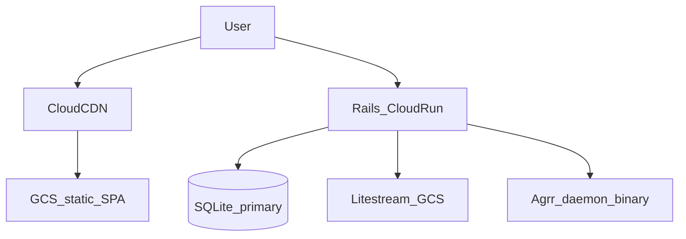
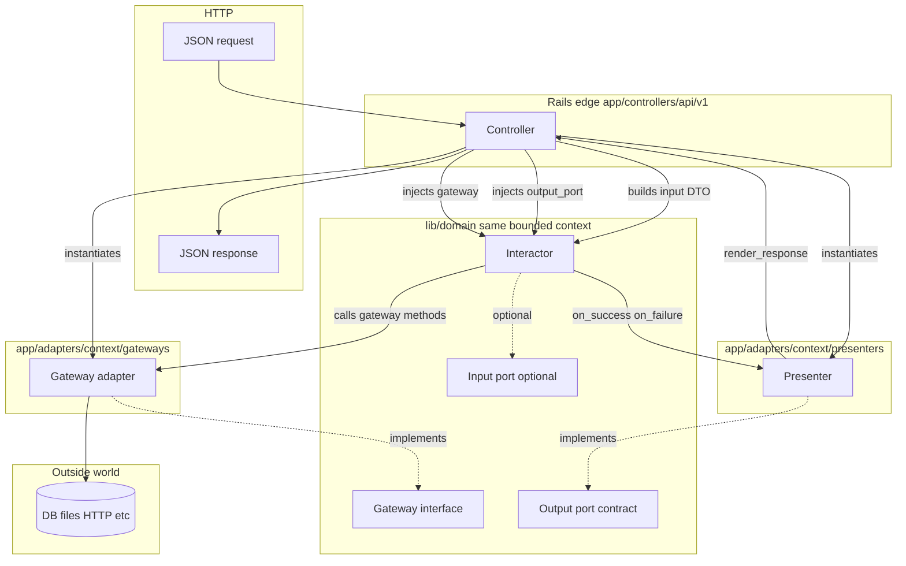
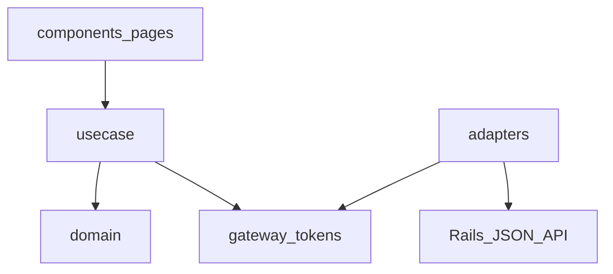

# AGRR Architecture Documentation

## System Overview

AGRR is an agricultural planning and optimization system with a decoupled Angular SPA and a Ruby on Rails 8 JSON API.

**Technology stack**


| Layer               | Technology                                                                                     |
| ------------------- | ---------------------------------------------------------------------------------------------- |
| Frontend            | Angular 21 SPA (Clean Architecture-oriented layers under `frontend/src/app/`)                  |
| Frontend hosting    | Google Cloud Storage + Cloud CDN (see `.cursor/skills/deploy-frontend/scripts/gcp-frontend-deploy.sh`) |
| Backend             | Ruby on Rails 8 on **Google Cloud Run** (see `.cursor/skills/deploy-server/scripts/gcp-deploy.sh`)     |
| Database            | SQLite3 (Solid Cache / Solid Cable / Solid Queue as applicable), **Litestream** replica to GCS |
| Primary integration | **agrr** Python binary / daemon for optimization and weather-related workloads                 |
| Contract-first API  | `docs/contracts/*.md` describe Angular ↔ Rails JSON contracts                                  |


**Architecture (primary):** Decoupled **Angular SPA + Rails API**. Server-rendered Rails HTML exists for some master CRUD flows and delegates to the same domain layer (`lib/domain`) via HTML presenters (`app/adapters/<context>/presenters/`).

## Quick Reference

One-paragraph index to the normative sections: [Rules](#rules) and [API Layer](#api-layer) (includes [Modeled HTTP Outcomes](#modeled-http-outcomes)). **Contract-first** (`docs/contracts/`). **Domain-centric** backend (`lib/domain` for use-case logic; ActiveRecord for persistence). **Thin controllers**; **modeled** success/failure via interactor → presenter, not `rescue` as the main branch ([Checklist](#checklist)). **Domain-level** invariants (Policies enforce rules; ActiveRecord is safety net only) including [Resource Limits](#resource-limits). **One use case per interactor** where Clean Architecture applies. **Testability**: explicit constructor wiring; memory gateways in unit tests; integration tests at the edge ([Testing](#testing)). Typical pitfalls are integrated into the rules above.


## System Flow


```mermaid
flowchart TD
  User[User] --> CDN[CloudCDN]
  CDN --> GCS[GCS_static_SPA]
  User --> CloudRun[Rails_CloudRun]
  CloudRun --> SQLite[(SQLite_primary)]
  CloudRun --> Litestream[Litestream_GCS]
  CloudRun --> AgrrDaemon[Agrr_daemon_binary]
```


## Backend

Business logic lives under `lib/domain/`. `lib/core/` holds external binaries and native code.

### API Layer

One JSON action = **one or more interactor calls**, each with **its own presenter** as `output_port`.

#### Roles and Dependencies

1. **Controller** - HTTP の入口。`params` を **入力 DTO** にする。Presenter と Interactor を生成し、Interactor に `output_port:` で Presenter を渡し、`CompositionRoot` で組み立てた **gateway 実装**(および logger 等)を渡す。モデル化された失敗の振り分けを、広い `rescue` / `rescue_from` で Controller に持ち込まない。
2. **Presenter**(`app/adapters/<context>/presenters/...`)- そのユースケースの **Output port の実装**。`on_success(dto)` / `on_failure(dto)` を受け取り、`view.render_response(json:, status:)`(HTML なら `render` / `redirect_to`)に写す。Gateway や `CompositionRoot` でデータを取らない。
3. **Output port**(`lib/domain/.../ports/...`)- Interactor が呼ぶ **コールバックの型**(`on_success` / `on_failure` と DTO)。Presenter がこの契約を実装する。
4. **Input port**(`lib/domain/.../ports/...`、任意)- Interactor が `include` / 継承して `call` の形を型にする場合がある。無い場合は `call(input_dto)` のみ。入力の形は Controller が組み立てた DTO。
5. **Interactor**(`lib/domain/.../interactors/...`)- **ユースケース**。注入された **Gateway interface** 等のみを呼び、成功またはモデル化された失敗を決めて `output_port.on_success` / `on_failure` を呼ぶ。`render`、生 `params`、Gateway を経ない ActiveRecord 直叩きは書かない。
6. **Gateway interface**(gateway port、`lib/domain/.../gateways/...`)- **ドメイン側の契約**(取得・永続化などの操作)。Interactor はこの型に依存し、ActiveRecord に直接依存しない。
7. **Gateway 実装**(`app/adapters/<context>/gateways/...`)- Gateway interface を SQLite / ActiveRecord / HTTP 等で実現するクラス。`CompositionRoot` でインスタンス化し Interactor に注入する。


```mermaid
flowchart TB
  subgraph http["HTTP"]
    REQ[JSON request]
    RES[JSON response]
  end
  subgraph app_edge["Rails edge app/controllers/api/v1"]
    CTRL[Controller]
  end
  subgraph domain_core["lib/domain same bounded context"]
    IP[Input port optional]
    IU[Interactor]
    GIF[Gateway interface]
    OPORT[Output port contract]
  end
  subgraph presentation["app/adapters/context/presenters"]
    PRES[Presenter]
  end
  subgraph adapters["app/adapters/context/gateways"]
    GADP[Gateway adapter]
  end
  subgraph io["Outside world"]
    DB[(DB files HTTP etc)]
  end

  REQ --> CTRL
  CTRL -->|"builds input DTO"| IU
  CTRL -->|"instantiates"| PRES
  CTRL -->|"instantiates"| GADP
  CTRL -->|"injects output_port"| IU
  CTRL -->|"injects gateway"| IU
  IU -.->|optional| IP
  PRES -.->|implements| OPORT
  GADP -.->|implements| GIF
  IU -->|"calls gateway methods"| GADP
  GADP --> DB
  IU -->|"on_success on_failure"| PRES
  PRES -->|"render_response"| CTRL
  CTRL --> RES
```


#### Modeled HTTP Outcomes

- **Interactor** decides success vs modeled failure and calls `output_port.on_success` / `on_failure` with explicit DTOs. **Presenter** owns HTTP shape (`view.render_response` / HTML `render` / `redirect_to`). **Controller** maps strong params to input DTOs, constructs presenter + interactor, injects gateways from `CompositionRoot`. It is **not** the main `rescue` / `rescue_from` switch for anticipated domain outcomes (validation, not found, conflict, auth, etc.). **Do not** call `on_failure` then `raise` the same case for the controller to rescue (second HTTP path). Guard-only early returns before a DTO exists (e.g. malformed request) are fine; they must not replace the output-port contract for domain results. Negative wording: see **Rules (by layer) → Application edge (R7)**.

#### Checklist

1. Strong-params → **input DTO**.
2. Instantiate API presenter (output port implementation): `presenter = PresenterClass.new(view: self)`.
3. Instantiate gateway(s) from `CompositionRoot`.
4. `InteractorClass.new(output_port: presenter, gateway: gw, ...).call(input_dto)`.
5. Let the interactor finish through the **output port** for both success and modeled failures-do not wrap `interactor.call` in `rescue` for those paths.

Per layer (detail in **Rules (by layer)** → Interactors / Presenters / Application edge where relevant):


| Layer             | Do                                                                                                                                            | Do not                                                                                                                       |
| ----------------- | --------------------------------------------------------------------------------------------------------------------------------------------- | ---------------------------------------------------------------------------------------------------------------------------- |
| **Controller**    | `presenter = PresenterClass.new(view: self)`; gateways from `CompositionRoot` → `InteractorClass.new(output_port: presenter, gateway: gw, ...).call(dto)` | `rescue StandardError`, `rescue ActiveRecord::RecordNotFound`, or `rescue_from` as the **main** mapper for use-case outcomes |
| **Interactor**    | Every client-visible failure path: `output_port.on_failure(failure_dto)`                                                                      | `render` / raw `params` / AR without gateways; `on_failure` then `raise` for controller rescue                               |
| **Presenter**     | Implement output port; `on_success` / `on_failure` → `view.render_response(json:, status:)`                                                   | `CompositionRoot`, `find_model`, gateway loads, business rules                                                               |
| **Gateway impl.** | Implement domain gateway interface; map boundary failures to `Domain::Shared::Exceptions::`*; return entities/DTOs                            | Construct adapters inside `lib/domain`                                                                                       |


AI-specific endpoints (`ai_create`, etc.) follow this checklist; they are not special cases for layering.

#### Layout example (reference implementation)

**DTO (input)** → **gateway interface** → **interactor** → **output port(Presenter が実装)** → **adapter gateway** → `CompositionRoot`. **Example:** CRUD under `app/controllers/api/v1/masters/farms_controller.rb` (e.g. `create`) with `lib/domain/farm/interactors/farm_create_interactor.rb`, `app/adapters/farm/presenters/farm_create_api_presenter.rb`, `app/adapters/farm/gateways/farm_active_record_gateway.rb`, and `CompositionRoot.farm_gateway`.


### Domain Modules

Domain modules live under `lib/domain/`.

Each bounded context typically has: `entities/`, `dtos/`, `gateways/` (interfaces), `interactors/`, `policies/` (intrinsic validation rules; extrinsic validation rules **are defined here**, Interactors fetch data via gateways and pass to Policies for validation), `ports/` (output ports for interactors), and `mappers/` (**domain mappers** — DTO/Entity の純粋変換; 必要に応じて配置). Infrastructure ports (logger, clock, translator, etc.) live under `lib/domain/shared/ports/`. Cross-context gateways that exchange entities/DTOs (e.g. `UserLookupGateway`) live under `lib/domain/shared/gateways/`.

Source of truth: `lib/domain/` のディレクトリ一覧。新しい bounded context を追加する際は `lib/domain/<context>/` 配下に標準的なサブディレクトリ構成（`entities/`, `dtos/`, `gateways/`, `interactors/`, `policies/`, `ports/`）を配置する。

### Adapters

Adapters live under `app/adapters/<context>/`.

Framework-dependent adapter code (gateway implementations, presenters, and presenter-side helpers) lives under **`app/adapters/<context>/`**, autoloaded by Zeitwerk. The pure domain in `lib/domain/<context>/` stays Rails-agnostic.

- `app/adapters/<context>/gateways/` - gateway interface implementations (ActiveRecord, in-memory for tests, HTTP, CLI, ActionCable, ActiveJob, ...).
- `app/adapters/<context>/presenters/` - output port implementations; see [Presenters](#presenters) for the full subtree (forms / view_models).
- `app/adapters/<context>/mappers/` - Domain output → JSON Hash / display shape. See [Mappers](#mappers).
- `app/adapters/agrr/gateways/` - external agrr daemon clients (cross-context infrastructure).
- `app/adapters/shared/ports/` - infrastructure port adapters (logger, clock, translator, mailer transport, etc.).

Legacy locations (`lib/adapters/<context>/`, `lib/presenters/`, `app/gateways/agrr/`) are being migrated to the layout above. Migration plan: [`docs/planning/naming-placement-migration.md`](docs/planning/naming-placement-migration.md). **New code uses the canonical paths only.**

File-name and method-name rules are in [Naming and placement conventions](#naming-and-placement-conventions) below.

### Gateway Boundary

Gateways **must not** depend on HTTP or incidental UI conventions: shapes named for a specific template/partials; Hash layouts driven by `data-`* attributes or route-helper-only keying; or return types / method naming that encode a **screen identifier** (`*_page`, `*_html`, etc.) when the real intent is **view/SPA-specific key arrangement** assembled inside the persistence adapter.

**Heuristic:** If the gateway's job is effectively "produce the blob this one HTML partial or Angular screen expects," the boundary is wrong-lift assembly to the **Interactor** or to a domain **mapper** under `lib/domain/<context>/mappers/` (read snapshots → **output-port DTOs** / use-case payloads; **not** HTTP-aware types).

**Allowed:** Persistence operations and **domain-meaningful read snapshots** as DTOs or value objects (IDs, dates, counts, cultivated rows, etc.). Gateways may accept identity-bound filters as input parameters (e.g. `find_by_user(user_id)`), but do not make authorization or validation decisions. **Authorization and validation decisions belong in Policies.** **Presenter-shaped** composites required by an output port (for example `PrivatePlanShowOutput`) are composed **outside** the gateway adapter — in the **Interactor** or a domain **mapper** under `lib/domain/<context>/mappers/`.

**Decision boundary:** Gateway methods are narrow persistence / HTTP / process I/O. Cross-context orchestration, multi-step business flow, authorization decisions, and validation decisions driven by domain rules belong in Policies (called by Interactors). Examples on the wrong side of the boundary include authorization encoded as a scope chooser (`scope_for_admin_or_user`, `is_admin ? A.where(...) : B.where(...)`), role-aware visibility filters, conditional dispatch across multiple I/O calls, uniqueness checks, resource limit checks, and methods that bundle several persistence operations into a single use-case-encoding entry point. A gateway that returns different domain shapes depending on caller identity has crossed the boundary.

### Gateway injection

Gateways are constructor-injected into Interactors from `CompositionRoot`. The keyword argument name reflects the gateway's role in the interactor (e.g. `farm_gateway:`, `deletion_undo_gateway:`). Interactors receive gateway instances — they never instantiate or locate gateways internally. When a use case requires multiple gateways, all are passed at construction time; interactors do not call other interactors (composition is gateway-level).

Interactor constructor signatures **must** explicitly list all required gateways as keyword arguments, mirroring the `output_port:` convention already established for Presenters. This makes the dependency graph visible at the call site and simplifies test wiring (memory gateways in `test/adapters/`, real gateways in edge tests).

### Presenters

Presenters live under `app/adapters/<context>/presenters/`.

- **API JSON:** `app/adapters/<context>/presenters/<usecase>_api_presenter.rb` - implements the domain output port and calls `view.render_response(json:, status:)`.
- **HTML (Rails views):** `app/adapters/<context>/presenters/<usecase>_html_presenter.rb` - same output port; performs `redirect_to` / `render` instead of JSON.

**Rule:** New presenters belong under `app/adapters/<context>/presenters/`. The legacy locations (`app/presenters/`, `lib/presenters/`) are retired - see [`docs/planning/naming-placement-migration.md`](docs/planning/naming-placement-migration.md).

#### Presenter-side helpers (forms / view models)

The Presenter itself stays thin: it implements the output port (`on_success` / `on_failure`) and delegates shape work to the helpers below. Each helper is a **Plain Ruby object** - no `ActiveModel::Model`, no callbacks, no Rails magic, no I/O of its own.

| Helper | Path | Direction | Mutability | Responsibility |
|---|---|---|---|---|
| **Form** | `app/adapters/<context>/presenters/forms/<usecase>_form.rb` | params → `<Usecase>Input` (write) | mutable (survives `on_failure` re-render) | **params → DTO conversion** (type coercion, defaults). No validation, no authorization, no business rules, no gateway calls |
| **ViewModel** | `app/adapters/<context>/presenters/view_models/<usecase>_view_model.rb` | `<Usecase>Output` → display (read) | immutable | formatted dates, derived labels, URLs, CSS classes; nothing that needs a gateway |

**Why this split:** domain output DTOs are use-case-neutral - they encode *what the use case produced*, not *what the screen needs*. Form / ViewModel are where screen / API shape lives, so that `lib/domain/` does not grow per-screen variants like `*_read_model.rb` or `*_payload_dto.rb`.

**Boundary:** Presenters implement output ports only (shape HTTP from success/failure payloads). For JSON actions, **modeled outcomes** follow [API Layer → Modeled HTTP Outcomes](#modeled-http-outcomes). No presenter fetch via `CompositionRoot` / `find_model` / gateways; no business rules in presenters. Load in the **Interactor** via gateways; pass **DTOs/entities** on the port. Do not hide `find_model` or gateway calls in **controller-local procs/lambdas** passed into the presenter. `lib/domain` does not reference `Rails.`*; inject from the **composition root at the app edge** (controller/job), not framework singletons.

#### Output Port Contract

1. **Bundling (scope)** - Unit of work is **one `Interactor#call` = one use case** (e.g. farm list, farm detail, field list), not "one view file." **Same business use case ⇒ same interactor** for HTML and API; format differences belong in **presenters only**, not in `*HtmlInteractor` / `*ApiInteractor` splits. **Multiple concerns composed into one response (e.g. farm detail + weather) are themselves one use case** - they become a single interactor that calls multiple gateways. For each use case, define in **one sentence** what `on_success` (and failure) passes to the port; **ActiveRecord must not cross that boundary** (state it explicitly).
2. **Contract-first (drift prevention)** - The output port lists what **the use case produces** as **DTOs/entities** (fields enumerated). Anything missing is **filled by the gateway or by a domain mapper** under `lib/domain/<context>/mappers/` - **no fetch/load in the presenter**.
3. **Implementation order (safe sequence)** - **Interactor (+ tests)** first: gateway-only data load, port arguments match the new contract. Then **Gateway impl**: implement the adapter the Interactor depends on. Then **Presenter**: mapping to HTTP/view only; remove `CompositionRoot` / `find_model` / gateway injection into presenters (including via callables). Then **Controller**: **only** `CompositionRoot` injection into the interactor and presenter construction - **do not pass gateways into presenters**. Then **Views**: if `@model` assumed AR, replace with **DTO attributes and helpers** in the **same PR or the commit immediately before/after** - do **not** bring AR back through the presenter for convenience.
4. **Orchestration** - Presenters **must not** spawn another interactor (e.g. weather). **Single-context** composition (e.g. farm detail + weather) uses a **single interactor** that calls multiple gateways within the same bounded context. **Cross-context** composition (e.g. wizard step that needs data from both `public_plan` and `crop` contexts) is orchestrated by the **Controller** calling multiple interactors, each with its own presenter — the controller integrates results for the response.
5. **Definition of done** - `app/adapters/<context>/presenters/**/*.rb` contains **no** `CompositionRoot` and **no** `find_model`. Each target use case has an **Interactor test** that fixes **types and required fields** reaching the port. **System/controller tests** (where needed) prove HTML/JSON behavior is unchanged.

**Planning summary (one line each):**

- **Before:** "Remove presenter service location and push load toward the Interactor."
- **After:** "Fix the **output port contract** on **DTOs/entities**; the **Interactor** satisfies it using **gateways only**. Presenters **map for display only**; where templates assumed AR, update templates to **DTO-first** in the same scope - **do not reintroduce AR via presenters or controller-embedded fetch procs.**"

### Mappers

Mappers are **Plain Ruby objects** that perform pure type transformations. They are used in two layers:

- **Domain mappers** (`lib/domain/<context>/mappers/`) — Interactor から呼び出し。Entity ↔ DTO, DTO ↔ DTO の変換。**I/O なし**、Gateway/Policy 呼び出しなし。必要に応じて配置（全コンテキストに均一に配置しない）。単純なフィールド写し替えであっても mapper に抽出し、Interactor 内でインライン変換しない。
- **Adapter mappers** (`app/adapters/<context>/mappers/`) — Presenter から呼び出し。Domain output → JSON Hash / HTML 表示形状への変換。

**Rule:** `lib/domain/<context>/assemblers/` は認めない。複合化は Interactor 内で完結するか、domain mapper を利用する。

**Naming:**
- **Domain mapper**: `lib/domain/<context>/mappers/<name>_mapper.rb` — `Domain::<Context>::Mappers::<Name>Mapper`
- **Adapter mapper**: `app/adapters/<context>/mappers/<name>_mapper.rb` — `Adapters::<Context>::Mappers::<Name>Mapper`

**Boundary:** Mappers は純粋変換のみ。ビジネスルール、承認判断、I/O は書かない。入出力は DTO/Entity/Snapshot に限定。

### Naming and placement conventions

These conventions apply to all new code; existing violations are catalogued in [`docs/planning/naming-placement-migration.md`](docs/planning/naming-placement-migration.md).

#### Placement principle

| Layer | Path | Allowed dependencies |
|---|---|---|
| Pure domain | `lib/domain/<context>/` | Plain Ruby only - no `Rails`, no `ActiveRecord`, no adapters |
| Domain mappers | `lib/domain/<context>/mappers/` | Plain Ruby only - DTO/Entity の純粋変換。I/O なし、Gateway/Policy 呼び出しなし |
| Output ports (domain side) | `lib/domain/<context>/ports/` | Plain Ruby only - no `Rails`, no `ActiveRecord`, no adapters |
| Infrastructure ports (domain side) | `lib/domain/shared/ports/` | Plain Ruby only - no `Rails`, no `ActiveRecord`, no adapters |
| Framework-dependent adapters | `app/adapters/<context>/` | Rails / ActiveRecord / HTTP clients allowed; depends on `lib/domain/<context>/` interfaces |
| Output port implementations (Presenters) | `app/adapters/<context>/presenters/` | Rails allowed; implements `lib/domain/<context>/ports/` interfaces |
| Mappers (adapter side) | `app/adapters/<context>/mappers/` | Rails allowed; domain output → JSON Hash / display shape |
| Infrastructure port adapters | `app/adapters/shared/ports/` | Rails / HTTP clients allowed; depends on `lib/domain/shared/ports/` interfaces |
| Cross-context external adapter | `app/adapters/agrr/` | Same as above; not bound to a single domain context |
| External binary / native code | `lib/core/` | No Rails dependency; external executables, native extensions |

#### Port or Gateway?

The framework-dependent layer distinguishes two roles:

- **Gateway** (`<context>/gateways/`) - operations that take or return *domain entities / DTOs / snapshots*, mediating persistence or external systems (DB, HTTP, daemon, ActionCable, ActiveJob). Bound to a domain context.
- **Infrastructure Port** (interface in `lib/domain/shared/ports/`, impl in `app/adapters/shared/ports/<name>_<tech>_adapter.rb`) - one-way framework / driver outputs that do **not** exchange entities: logger, translator, clock, mailer transport, metrics sink. Typically cross-cutting; the "context" name is synthetic (e.g. `shared`).

- **Output port** (interface in `lib/domain/<context>/ports/`, impl in `app/adapters/<context>/presenters/`) - defines the callback shape (`on_success` / `on_failure` and DTOs) for a use case. Presenters implement this contract. Bound to a domain context.

**Rule of thumb**: if the abstraction takes or returns entities / DTOs → Gateway. If it accepts a primitive payload (a log message, a key + locale, a `now()` call) and emits to a framework driver one-way → Port. New cross-cutting framework abstractions (clock, mailer transport, metrics sink) follow the port convention, not the gateway convention.

#### Gateway file naming

| File | Path | Class |
|---|---|---|
| Interface | `lib/domain/<context>/gateways/<name>_gateway.rb` | `Domain::<Context>::Gateways::<Name>Gateway` |
| ActiveRecord impl. | `app/adapters/<context>/gateways/<name>_active_record_gateway.rb` | `Adapters::<Context>::Gateways::<Name>ActiveRecordGateway` |
| In-memory impl. | `app/adapters/<context>/gateways/<name>_memory_gateway.rb` | `...<Name>MemoryGateway` |
| HTTP impl. | `app/adapters/<context>/gateways/<name>_http_gateway.rb` | `...<Name>HttpGateway` |
| CLI / process impl. | `app/adapters/<context>/gateways/<name>_cli_gateway.rb` | `...<Name>CliGateway` |
| ActionCable impl. | `app/adapters/<context>/gateways/<name>_action_cable_gateway.rb` | `...<Name>ActionCableGateway` |
| ActiveJob impl. | `app/adapters/<context>/gateways/<name>_active_job_gateway.rb` | `...<Name>ActiveJobGateway` |
| agrr daemon impl. | `app/adapters/agrr/gateways/<name>_daemon_gateway.rb` | `Adapters::Agrr::Gateways::<Name>DaemonGateway` |

**Allowed adapter-type suffixes are fixed at seven** - `_active_record_gateway`, `_http_gateway`, `_cli_gateway`, `_daemon_gateway`, `_memory_gateway`, `_action_cable_gateway`, `_active_job_gateway`. Object-storage backends (GCS / S3) are treated as `_http_gateway` (the I/O category); the specific SDK / bucket is an implementation detail injected into the adapter, not encoded in the file name. Do not add new adapter-type suffixes without an ADR.

**Disallowed suffixes**: `_gateway_adapter`, `_active_gateway` (always spell out `_active_record_gateway`), `_through_host_gateway` as the adapter type (it names a workflow - rename to the actual adapter), and unqualified `*_gateway.rb` inside `app/adapters/<context>/gateways/` without an adapter type.

**Disallowed infixes**: presentation channel names like `*_rest_*_gateway.rb`, `*_html_*_gateway.rb`, `*_json_*_gateway.rb`. Gateways are presentation-agnostic; an "adjust" gateway is the same whether the request arrives via REST, HTML form, or background job.

#### Port file naming

| File | Path | Class |
|---|---|---|
| Interface | `lib/domain/shared/ports/<name>_port.rb` | `Domain::Shared::Ports::<Name>Port` |
| Adapter impl. | `app/adapters/shared/ports/<name>_<tech>_adapter.rb` | `Adapters::Shared::Ports::<Name><Tech>Adapter` |

Example: `Domain::Shared::Ports::LoggerPort` (interface) ↔ `Adapters::Shared::Ports::RailsLoggerAdapter` at `app/adapters/shared/ports/rails_logger_adapter.rb`. Ports are file-named with the `_adapter` suffix - distinct from gateways - because they emit one-way to a framework driver rather than mediating entity I/O.

#### Gateway method naming (the five verbs)

| Verb | Return | Use |
|---|---|---|
| `find_by_*(criteria)` | `Entity \| nil` | Read one entity. Criteria may be any scalar or identity (`find_by_id`, `find_by_token`, `find_by_user`). Entity name is never encoded in the method name |
| `list_by_*(criteria)` | `Array<Entity>` | Read multiple entities. Criteria may be any scalar or identity (`list_by_user`, `list_index_by_filter`). Entity name is never encoded in the method name |
| `create(...)` | persisted entity | Insert a new entity. `save` is deprecated; unify to `create`/`update` within the bounded context. |
| `update(...)` | persisted entity | Modify an existing entity. `save` is deprecated; unify to `create`/`update` within the bounded context. |
| `delete(id)` | result | Permanent delete. `destroy` is deprecated; unify to `delete` within the bounded context. |

**The gateway only filters by the given criteria**; authorization decisions belong in the Interactor/Policy. Soft delete is the dedicated method `soft_destroy_with_undo(id, user)`.

**Allowed exceptions:**
- `get_<state>` - *narrow, non-entity* scalar getter (progress percentage, fetched-year list). Never for entities.
- `fetch_*` - only for external HTTP / process I/O (e.g. `fetch_historical_weather_data` from a remote API). Not for DB reads.
- `upsert_*` - when both insert and update are explicit semantics for one operation.

**Disallowed**: `get_<entity>(id)`, `load_<entity>(id)`, `find_<entity>_by_<criteria>`, `list_<entity>_by_<criteria>`, `query_*`, `by_*` as the whole method name, DB reads under `fetch_*`, using both `save` and `create`/`update` for the same write operation.

#### Interactor naming

- **File**: `lib/domain/<context>/interactors/<entity>_<action>_interactor.rb` (e.g. `crop_create_interactor.rb`, `farm_detail_interactor.rb`).
- **Execution method**: **`call(input)`** only. `execute` and `perform` are forbidden. Jobs that wrap an interactor translate `perform` → `interactor.call`. **`output_port` is passed via constructor keyword argument.**
- **One use case ⇒ one interactor**: HTML and API share the same interactor - see [Output Port Contract](#output-port-contract) §1. No `*HtmlInteractor` / `*ApiInteractor` split.
- **Interactor responsibilities**: Orchestrates validation and business logic. Fetches data via Gateways, passes results to Policies for validation, then executes business rules. Extrinsic validation (uniqueness, resource limits) is the Interactor's responsibility.

#### Domain DTO naming

Domain DTOs encode **use-case semantics only** - what the use case takes in, what it produces, and how it fails. Display shape is **not** a domain concern.

**Validation boundary:** **Intrinsic validation** (pure, no I/O - e.g. `start_date < end_date`, `name.length <= 100`, regex) belongs in **Policies** under `lib/domain/<context>/policies/`. **Extrinsic validation** (needs existing data - e.g. uniqueness, resource limits) is performed by **Policies** (Interactors fetch data via Gateways and pass to Policies). **DB constraints** (UNIQUE INDEX, CHECK) are the final safety net against race conditions.

| Role | File | Class |
|---|---|---|
| Input to interactor | `lib/domain/<context>/dtos/<usecase>_input.rb` | `<Usecase>Input` |
| Success output | `lib/domain/<context>/dtos/<usecase>_output.rb` | `<Usecase>Output` |
| Modeled failure | `lib/domain/<context>/dtos/<usecase>_failure.rb` | `<Usecase>Failure` |
| Persisted read-only snapshot | `lib/domain/<context>/dtos/<name>_snapshot.rb` | `<Name>Snapshot` |

**Disallowed in `lib/domain/`**:
- `*_dto.rb` suffix - `Input` / `Output` / `Failure` / `Snapshot` already encode the role; the redundant `_dto` tail is forbidden in new code.
- `persisted_*` prefix - predates the `Snapshot` suffix; rename to `<Name>Snapshot`.
- `*_read_model.rb`, `*_payload_dto.rb` - these are presenter-side ViewModels in disguise. Move to `app/adapters/<context>/presenters/view_models/`.

### Rails Application Layer

The Rails application layer lives under `app/`.

- `**ActiveSupport::Concern`** - **Do not add** new concern modules under `app/controllers/concerns/`, `app/models/concerns/`, or elsewhere to share **domain-shaped or use-case** logic. Express reuse in `lib/domain` as **Plain Ruby**, wire it with **explicit injection** at the edge. Legacy concerns are **debt** to fold into interactors and policies.
- `**app/controllers/api/v1/`** - JSON API; params → DTOs → interactors + API presenters. Flow: [API Layer](#api-layer).
- `**app/controllers/*_controller.rb`** - HTML controllers for legacy/admin-style flows; increasingly delegate to interactors + HTML presenters.
- `**app/models/`** - ActiveRecord; **DB-level constraints only** (UNIQUE INDEX, NOT NULL, CHECK). Business validations belong in `lib/domain` (Policies/Interactors). Model validations are **safety net only**.
- `**app/services/`** - Orchestration and legacy services; **prefer** moving durable rules into `lib/domain/.../interactors` and `lib/domain/.../policies` (see roadmap).
- `**app/adapters/agrr/gateways/`** - HTTP/process integration with the **agrr** daemon (optimization, weather, progress, etc.). These are infrastructure adapters, not domain entities. Legacy path `app/gateways/agrr/` is being migrated per [`docs/planning/naming-placement-migration.md`](docs/planning/naming-placement-migration.md).

### External agrr integration

- Gateways under `app/adapters/agrr/gateways/` encapsulate the agrr CLI/daemon protocol.
- Tests: `test/adapters/agrr/`.

## Rules

This section defines the normative rules for new code. Positive rules are stated first; prohibited patterns (**❌**) show common violations. Where common community patterns, prevailing pragmatism, or existing project conventions conflict with the rules below, this file takes precedence. "Existing code already does this" or "tests pass" does not override a rule — treat such mismatches as debt to fix, not a template to copy. Refactors must not **relocate** a smell (e.g. push the same coupling to a fat controller) or **reintroduce** the same dependency shape under a different name.

### Domain Layer

**R1. Framework-free** — Plain Ruby only. No `Rails.*`, no `ActiveRecord`, no framework mixins. Shared behavior and use-case judgment belong under `lib/domain` as ordinary classes/modules (policies, interactors, value objects).

- ❌ `Rails.logger`, `Rails.env`, `Rails.application` etc. from domain code
- ❌ `ActiveRecord::`* types in domain flow — map persistence failures to `Domain::Shared::Exceptions::`* in adapters only
- ❌ ActiveRecord APIs on objects in interactors (`record.association.where`, `pluck`, `includes`); passing AR models inward through gateways — map to **DTOs/entities** at the use-case boundary
- ❌ `Date.current`, `Time.current`, `Time.zone`, `n.days`/`n.months`/`n.years` without explicit clock or date arguments
- ❌ `SomeAdapter.new` or `Adapters::...` inside `lib/domain` — construct at the edge (`lib/composition_root.rb`, controllers, jobs) and inject **interfaces** only
- ❌ `*Port.default`, `*Gateway.default` or other hidden globals — dependencies must be **constructor-injected** from the edge
- ❌ Hiding Rails/AR in a base interactor, mixin, or shared superclass
- ❌ Injecting only some ports while `Date.current`, I18n, or config stay implicit
- ❌ Raw SQL, Arel, or HTTP/SDK clients used inside `lib/domain` without going through a gateway/port
- ❌ Durable logic expressed **only** through `app/models` callbacks/validations without equivalent policy/interactor path and tests

**R2. Constructor injection** — All dependencies passed explicitly via constructor keyword arguments. No hidden globals, grab-bag context objects, or `proc`/callable arguments that perform I/O. Tests must exercise the same constructor contract as production.

- ❌ `Current`, generic `context`/`deps` hashes, `ApplicationRecord` as grab bag
- ❌ Over-mocking so unit tests never exercise real constructor arity and types; relying on integration tests alone while production wiring still uses hidden globals

**R3. Gateway boundary** — Gateways are narrow persistence/HTTP/process I/O only. Returns entities/DTOs or maps boundary failures to `Domain::Shared::Exceptions::*`. May accept identity-bound filters (e.g. `find_by_user(user_id)`), but does not select scope by role, branch the use case, orchestrate multiple steps, or encode screen-specific shaping.

- ❌ Authorization encoded as scope chooser (`scope_for_admin_or_user`)
- ❌ Returning different domain shapes depending on caller identity
- ❌ Presenter-shaped composites (`PrivatePlanShowOutput`) assembled inside gateway — compose in Interactor or output-port DTO
- ❌ "Nominal interfaces" — gateways that return AR types, expose query chains, or are single monolithic adapters
- ✅ Identity-scoped reads: `find_<entity>_by_<identity>(user, ...)` — gateway only filters by given identity; **authorization decisions belong in Interactor/Policy**

### Use Cases

**R4. Use-case ownership** — Interactors own validation, business rules, and gateway orchestration. One use case ⇒ one interactor; HTML and API share the same interactor. `call(input)` is the only execution method. `output_port` passed via constructor keyword argument.

- ❌ Raw `params`, `redirect_to`, `render`, HTTP status codes, flash
- ❌ View-only shaping — logic for specific layout/field order belongs in presenters; do not bloat DTOs to "align HTML and JSON"
- ❌ `CompositionRoot.*` calls from interactors — wiring stays at the application edge (controllers, jobs) using `CompositionRoot`
- ❌ Delivery channel or screen shape in names (`*HtmlInteractor`, `*_html_success`, `*JsonBundle*`)
- ❌ `execute` or `perform` as execution method — use `call(input)` only
- ❌ Interactors that only reshuffle what a controller previously did (trivial interactors)

**R5. Output port contract** — Success and modeled failures go through `output_port.on_success` / `on_failure` with explicit DTOs. The interactor decides outcomes; the presenter shapes HTTP.

- ❌ `on_failure` then `raise` for the controller to rescue (second HTTP path)
- ❌ Presenter or view re-validates or recomputes outcomes instead of consuming interactor output DTO

### Output Ports

**R6. Display-only** — Presenters implement output ports and shape HTTP/view only. No data loading, no business rules, no side effects.

- ❌ `CompositionRoot.*` calls to load data for the response
- ❌ `*Gateway.default` or gateways used for `find_model` — loaded data belongs in Interactor output, carried as DTOs/entities on the port; not via controller-defined lambdas
- ❌ Authorization outcomes, validation rules, or "can this happen?" decisions
- ❌ Side effects from `on_success`/`on_failure`: `perform_later`, job dispatchers, other interactors, external services, cache writes, date/cache branching
- ❌ Forms performing authorization, uniqueness checks, or cross-record validation
- ❌ ViewModels calling gateways, `find_model`, or any I/O
- ❌ Mappers branching on business rules

### Application Edge

**R7. Thin controllers** — Controllers map `params` → input DTO, instantiate presenter + interactor + gateways, and call. See [Checklist](#checklist).

- ❌ `rescue StandardError`, `rescue ActiveRecord::RecordNotFound`, or `rescue_from` as the **primary** mapper for anticipated domain outcomes — use output port instead
- ❌ Business behavior inside action methods, private helpers, `before_action`, or controller-only `app/services/` adapters
- ❌ ActiveRecord/ActiveStorage reads/writes for the use case (`current_user.farms.where(...)`, `Model.find`, `Blob.create_and_upload!`)
- ❌ Third-party SDK/process clients, retry loops, JSON parsing as control flow, cross-record aggregation, authorization branches, conditional `*Job.perform_later`, `Rails.cache.fetch` whose result selects domain output
- ❌ New CRUD or integration endpoints that don't route through an interactor
- ❌ Coupled orchestration left in `app/services/`, `app/forms/`, or `lib/` outside `lib/domain/<context>/` — renaming the folder does not change the layer
- ❌ `ActiveSupport::Concern` modules for domain-shaped or use-case logic — express reuse in `lib/domain` as Plain Ruby with explicit injection

### Refactor Hygiene

**R8. Complete refactors** — Moving code without fixing dependency direction and types is **relocation**, not completion. Convenience is not an exemption — skipping layering because it is faster, when it commits us to wholesale rework afterward, **is rejected**.

- ❌ Moving coupled logic into a fat controller, fat `app/services/`, or `ActiveSupport::Concern` without DTOs, ports, and constructor injection
- ❌ Tests that green-wrap a different graph than production (global stubs, implicit time) — fix production wiring first, then tests
- ❌ `# TODO: move to domain`, feature flags, or `legacy_path`/`new_path` branches without a plan and deadline to collapse them
- ✅ Deliberate interim steps belong in the **same PR or adjacent commits** with repayment, or their **lifetime and replacement** must be spelled out in `docs/contracts/` and tests bound to those contracts — see `.cursor/rules/no-convenience-tech-debt.mdc`

### View Templates

- ❌ Duplicating or inventing business rules in ERB/partials/helpers instead of `lib/domain/`

### Contract-first Documentation

**R9. Contract-first** — Behavior is defined by **contract text and the tests bound to it** (`docs/contracts/`), not by "matching whatever the legacy stack does."

- ❌ Stating in contracts or ADRs that the Rails/HTML implementation alone is the source of truth

### Naming and Placement

Naming and placement conventions are defined in [Naming and placement conventions](#naming-and-placement-conventions) under Backend. Existing violations are catalogued in [`docs/planning/naming-placement-migration.md`](docs/planning/naming-placement-migration.md).


## Frontend

### Layer Structure

**Intended dependency direction**


```mermaid
flowchart TB
  Components[components_pages] --> UseCase[usecase]
  UseCase --> DomainFE[domain]
  UseCase --> GatewayIF[gateway_tokens]
  Adapters[adapters] --> GatewayIF
  Adapters --> RailsAPI[Rails_JSON_API]
```


- `**domain/**` - Types and pure rules (framework-agnostic where possible).
- `**usecase/**` - Use cases, gateway interfaces (injection tokens), ports.
- `**adapters/**` - API gateway implementations, presenters that map DTOs to view state.
- `**components/**` - Standalone components, routes, templates.
- `**services/**` - Cross-cutting and feature-specific helpers(認証、一覧リフレッシュ、マスタ API クライアント等)。HTTP や環境依存の実装は `adapters/` に寄せる(T-053: 空の `infrastructure/` 層は採用しない)。
- `**core/**` - i18n loader, API base URL, browser region, cookie consent helpers, `ListRefreshBus` 等の横断ユーティリティ。
- `**guards/**` - e.g. `authGuard`.
- `**routes/**` - `app.routes.ts` が合成する feature 別ルート定義(T-054)。

### i18n

`@ngx-translate` with `frontend/src/assets/i18n/ja.json` and `en.json`.

### Routing

本番は `PathLocationStrategy`(`app.config.ts`)。CDN では URL map で SPA フォールバックを `index.html` に向ける(`scripts/agrr-frontend-url-map-simple.yaml`)。

## Resource Limits

- **Farm limit:** max 4 non-reference farms per user (`is_reference: false`).
- **Crop limit:** max 20 non-reference crops per user.
- **Reference data:** `is_reference: true` records do not count toward limits.

Enforced in **domain Policies**. ActiveRecord validations and DB constraints are **safety net only** (last line of defense against corrupted data).

## Directory Structure

```
app/
├── controllers/                              # HTML + api/v1/
├── models/                                   # ActiveRecord; DB-level constraints only (UNIQUE INDEX, NOT NULL, CHECK)
├── services/                                 # Legacy; migrate toward lib/domain
├── adapters/<context>/                       # Framework-dependent adapters
│   ├── gateways/                             # *_active_record_gateway.rb, *_memory_gateway.rb, ...
│   ├── presenters/
│   │   ├── <usecase>_api_presenter.rb
│   │   ├── <usecase>_html_presenter.rb
│   │   ├── forms/                            # params → *Input (write-side)
│   │   └── view_models/                      # *Output → display (read-side)
│   └── mappers/                              # domain output → JSON Hash / display shape
├── adapters/agrr/gateways/                   # External agrr daemon (cross-context)
├── adapters/shared/ports/                    # Infrastructure port adapters (logger, translator, clock, etc.)
├── jobs/
└── views/                                    # HTML ERB (legacy + masters)

lib/
├── domain/<context>/                         # Plain Ruby; no Rails / no ActiveRecord
│   ├── entities/                             # Pest, Crop, Farm, ...
│   ├── dtos/                                 # *Input, *Output, *Failure, *Snapshot
│   ├── gateways/                             # Interfaces only (<name>_gateway.rb)
│   ├── mappers/                              # Pure type transforms (Entity↔DTO, DTO↔DTO); I/Oなし
│   ├── policies/                             # Validation rules (intrinsic + extrinsic)
│   ├── ports/                                # Output ports (on_success / on_failure contracts for interactors)
│   ├── interactors/                          # call(input) only
│   └── value_objects/, ...
├── domain/shared/gateways/                   # Cross-context gateways (UserLookupGateway, etc.)
├── domain/shared/ports/                      # Infrastructure ports (logger, clock, translator, etc.)
├── core/                                     # External binaries and native code (agrr daemon)

# Legacy paths (being migrated; see docs/planning/naming-placement-migration.md)
# lib/adapters/<context>/gateways/  → app/adapters/<context>/gateways/
# lib/presenters/{api,html}/        → app/adapters/<context>/presenters/
# app/gateways/agrr/                → app/adapters/agrr/gateways/

frontend/
└── src/app/
    ├── domain/
    ├── usecase/
    ├── adapters/
    ├── components/
    ├── services/
    ├── core/
    └── guards/

docs/
├── contracts/                                # API / feature contracts (contract-first)
└── planning/                                 # Design notes, migrations
```

## Testing

Placement follows two rules.

1. **Runtime** - `test/domain/` is the only Rails-free suite (`run-test-domain-lib.sh`); everything else runs on the Rails stack (`run-test-rails.sh`). `test/domain/` tests only **domain abstractions** (interfaces, entities, DTOs, policies, interactors) using **memory gateways** injected into interactors. Concrete adapter implementations (including memory gateways under `app/adapters/`) are tested under `test/adapters/` on the Rails stack.
2. **Layer mirror** - `test/<X>/` mirrors the target production path with the source root (`app/` / `lib/`) dropped.

```
test/
├── domain/       # ⇔ lib/domain/  pure Interactor / entity / DTO / policy units; abstractions only
├── adapters/     # ⇔ app/adapters/<context>/  gateway (AR, memory, HTTP, ...) / presenter / mapper implementation tests
├── controllers/  # HTTP edge (JSON / HTML) - the only place the real graph is exercised
├── models/       # AR validations / persistence invariants
├── policies/ jobs/ channels/ mailers/ helpers/ views/ forms/ migrations/ tasks/
├── integration/  # multi-request flows only (ActionDispatch::IntegrationTest)
├── system/       # browser E2E
└── support/ factories/ fixtures/ domain_stubs/   # shared, non-test files
```

**Granularity** - two kinds per use case: a pure unit test (interactor + memory gateways injected, `test/domain/`) and an edge test (HTTP through the controller, `test/controllers/`). Do not instantiate an interactor directly with real gateway implementations in a test (Controller-mediated indirect instantiation in edge tests is fine).

**Rules**

- Use the runner scripts, not raw `rails test` (protects the development database). Orchestration: `[.cursor/rules/rails-testing-workflow.mdc](.cursor/rules/rails-testing-workflow.mdc)`, `[.cursor/skills/test-common/SKILL.md](.cursor/skills/test-common/SKILL.md)`.
- Do not create a test directory that belongs to neither runner.
- Frontend: `cd frontend && npm test`, `npm run build`, i18n check scripts (`frontend/package.json`).

## Implementation Guidelines

### New API features

1. Update or add `docs/contracts/<feature>-contract.md`.
2. Add/adjust DTOs and gateway interfaces under `lib/domain/`.
3. Add/adjust interactor under `lib/domain/`.
4. Add/adjust domain mapper under `lib/domain/<context>/mappers/` (必要に応じて).
5. Add/adjust gateway implementation under `app/adapters/<context>/gateways/`.
6. Add API presenter under `app/adapters/<context>/presenters/`.
7. Add adapter mapper under `app/adapters/<context>/mappers/` (JSON shape が DTO と異なる場合).
8. Thin controller in `app/controllers/api/v1/` (see [Checklist](#checklist)).
9. Tests in `test/domain/`, `test/adapters/`, `test/controllers/`.

### HTML master CRUD (Rails)

HTML master CRUD: presenters in `app/adapters/<context>/presenters/`, domain mappers in `lib/domain/<context>/mappers/`, orchestration via interactors under `lib/domain/`.

## Additional Resources

### Agent Workflow

本章(**Rules**)が**規約本体**である。エディタ支援や違反削減タスクでの**実行手順**(洗い出し、ARCHITECTURE ゲート、全体テスト、リポジトリ横断スキャン)は次を参照する。便宜による境界逸脱は `[.cursor/rules/no-convenience-tech-debt.mdc](.cursor/rules/no-convenience-tech-debt.mdc)` と整合させる。


| 参照                                                                                                                                                                                                         | 役割                                                                                                               |
| ---------------------------------------------------------------------------------------------------------------------------------------------------------------------------------------------------------- | ---------------------------------------------------------------------------------------------------------------- |
| `[.cursor/rules/agent-conventions.mdc](.cursor/rules/agent-conventions.mdc)`                                                                                                                               | 用語(**実装後の Clean Architecture チェック**:親がゲート・test-common を省略しない等)、ワークフローの**セクション番号**とユーザー向け表記                       |
| `[.cursor/skills/clean-architecture-violation-fix-workflow/SKILL.md](.cursor/skills/clean-architecture-violation-fix-workflow/SKILL.md)`                                                                   | 外側・内側ループ(**セクション0**〜**セクション6**)。新規・改修・削減で同一手順                                                                             |
| `[.cursor/rules/ca-violation-fix-architecture-gate.mdc](.cursor/rules/ca-violation-fix-architecture-gate.mdc)`                                                                                             | **セクション4**の ARCHITECTURE.md ゲートを定める(**1 回目・2 回目**、Rulesとの照合、記録の必須出力)。Rails / `frontend/` のみの差分でも同一手順・同一フォーマット |
| `[.cursor/skills/clean-architecture-violation-fix-workflow/references/agent-operational-canonical.md](.cursor/skills/clean-architecture-violation-fix-workflow/references/agent-operational-canonical.md)` | backlog 同期(通し走査の省略なし)・本番断定・シェル完了の手続集約                                                                               |
| `[.cursor/rules/rails-testing-workflow.mdc](.cursor/rules/rails-testing-workflow.mdc)`                                                                                                                     | バックエンド/フロント変更時の **test-common** 経由テスト(手元では `rails test` を直接乱発しない)                                                |

### Related Documentation

- [docs/README.md](docs/README.md)(契約・ADR・アーカイブ索引)
- [docs/adr/](docs/adr/)(Architecture Decision Records)
- [docs/contracts/](docs/contracts/)(API / 機能契約、契約優先)
- [.cursor/rules/rails-testing-workflow.mdc](.cursor/rules/rails-testing-workflow.mdc)(テスト運用ルール)
- [.cursor/skills/test-common/SKILL.md](.cursor/skills/test-common/SKILL.md)(テスト実行スクリプト)

