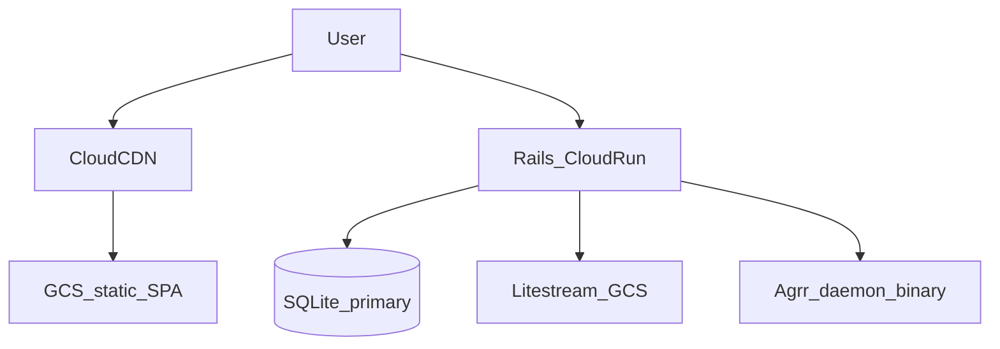
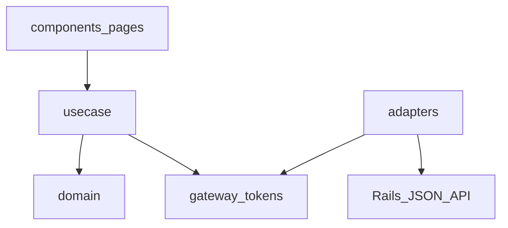

# AGRR Architecture Documentation

## System Overview

AGRR is an agricultural planning and optimization system with a decoupled Angular SPA and a Ruby on Rails 8 JSON API.

**Technology stack**

| Layer | Technology |
|-------|------------|
| Frontend | Angular 21 SPA (Clean Architecture–oriented layers under `frontend/src/app/`) |
| Frontend hosting | Google Cloud Storage + Cloud CDN (see `scripts/gcp-frontend-deploy.sh`) |
| Backend | Ruby on Rails 8 on **Google Cloud Run** (see `scripts/gcp-deploy.sh`) |
| Database | SQLite3 (Solid Cache / Solid Cable / Solid Queue as applicable), **Litestream** replica to GCS |
| Primary integration | **agrr** Python binary / daemon for optimization and weather-related workloads |
| Contract-first API | `docs/contracts/*.md` describe Angular ↔ Rails JSON contracts |

**Architecture (primary):** Decoupled **Angular SPA + Rails API**. Server-rendered Rails HTML exists for some master CRUD flows and is being aligned with the same domain layer (`lib/domain`) via HTML presenters (`lib/presenters/html/`) per [docs/contracts/rails-html-clean-architecture-contract.md](docs/contracts/rails-html-clean-architecture-contract.md).

## System flow


```mermaid
flowchart TD
  User[User] --> CDN[CloudCDN]
  CDN --> GCS[GCS_static_SPA]
  User --> CloudRun[Rails_CloudRun]
  CloudRun --> SQLite[(SQLite_primary)]
  CloudRun --> Litestream[Litestream_GCS]
  CloudRun --> AgrrDaemon[Agrr_daemon_binary]
```

## Backend: Clean Architecture (canonical)

Business logic for API and progressively for HTML flows lives under **`lib/`**, not only for AI endpoints.

### Domain modules (`lib/domain/`)

Each bounded context typically has: `entities/`, `dtos/`, `gateways/` (interfaces), `interactors/`, `ports/` (input/output), and sometimes shared policies under `lib/domain/shared/`.

Current domains include (non-exhaustive; inspect `lib/domain/` for source of truth):

- `agricultural_task`, `contact_messages`, `crop`, `cultivation_plan`, `deletion_undo`, `farm`, `fertilize`, `field`, `field_cultivation`, `interaction_rule`, `pest`, `pesticide`, `public_plan`, `weather_data`, plus `shared` and `logger` gateways.

### Adapters (`lib/adapters/`)

Gateway implementations (e.g. ActiveRecord-backed, in-memory for tests) live under `lib/adapters/<context>/gateways/`.

### Presenters (`lib/presenters/`)

- **API JSON:** `lib/presenters/api/<resource>/` — implement domain output ports and call `view.render_response(json:, status:)`.
- **HTML (Rails views):** `lib/presenters/html/<resource>/` — same output ports; perform `redirect_to` / `render` instead of JSON.

**Rule:** New presenters belong under `lib/presenters/{api,html}/`, not under `app/presenters/` (legacy paths are being retired).

### Rails application layer (`app/`)

- **`app/controllers/api/v1/`** — JSON API; wires params → DTOs → interactors + API presenters.
- **`app/controllers/*_controller.rb`** — HTML controllers for legacy/admin-style flows; increasingly delegate to interactors + HTML presenters.
- **`app/models/`** — ActiveRecord; validations (e.g. resource limits) stay at the model boundary where appropriate.
- **`app/services/`** — Orchestration and legacy services; **prefer** moving durable rules into `lib/domain/.../interactors` (see roadmap).
- **`app/gateways/agrr/`** — HTTP/process integration with the **agrr** daemon (optimization, weather, progress, etc.). These are infrastructure adapters, not domain entities.

### External agrr integration

- Gateways under `app/gateways/agrr/` encapsulate the agrr CLI/daemon protocol.
- Tests: `test/gateways/agrr/`.

## Frontend: Angular layers (`frontend/src/app/`)

**Intended dependency direction**


```mermaid
flowchart TB
  Components[components_pages] --> UseCase[usecase]
  UseCase --> DomainFE[domain]
  UseCase --> GatewayIF[gateway_tokens]
  Adapters[adapters] --> GatewayIF
  Adapters --> RailsAPI[Rails_JSON_API]
```

- **`domain/`** — Types and pure rules (framework-agnostic where possible).
- **`usecase/`** — Use cases, gateway interfaces (injection tokens), ports.
- **`adapters/`** — API gateway implementations, presenters that map DTOs to view state.
- **`components/`** — Standalone components, routes, templates.
- **`services/`** — Cross-cutting and feature-specific helpers (list refresh, auth, etc.); **target state** is to consolidate cross-cutting pieces under `infrastructure/` (see project roadmap).
- **`core/`** — i18n loader, API base URL, browser region, cookie consent helpers.
- **`guards/`** — e.g. `authGuard`.
- **`infrastructure/`** — Reserved for future consolidation of cross-cutting services (may be empty until refactors land).

**i18n:** `@ngx-translate` with `frontend/src/assets/i18n/ja.json` and `en.json`.

**Routing:** `HashLocationStrategy` may still be in use in `app.config.ts`; path-based hosting requires CDN URL map fallback to `index.html` (see `scripts/agrr-frontend-url-map-simple.yaml` when migrating off hash URLs).

## Core business rules

### Resource limits

- **Farm limit:** max 4 non-reference farms per user (`is_reference: false`).
- **Crop limit:** max 20 non-reference crops per user.
- **Reference data:** `is_reference: true` records do not count toward limits.

Enforced in ActiveRecord models via validations.

## Directory structure (summary)

```
app/
├── controllers/          # HTML + api/v1/
├── models/
├── services/             # Application services (migrate toward lib/domain where possible)
├── gateways/agrr/        # agrr daemon clients
├── jobs/
└── views/                # HTML ERB (legacy + masters)

lib/
├── domain/<context>/     # Entities, DTOs, gateways (interfaces), interactors, ports
├── adapters/<context>/gateways/
└── presenters/
    ├── api/<resource>/
    └── html/<resource>/

frontend/
└── src/app/
    ├── domain/
    ├── usecase/
    ├── adapters/
    ├── components/
    ├── services/
    ├── core/
    └── guards/

docs/
├── contracts/            # API / feature contracts (contract-first)
└── planning/             # Design notes, migrations
```

## API controller pattern (Interactor + Presenter)

Typical API action shape:

1. Build input DTO from `params`.
2. Instantiate gateway (e.g. `Adapters::Farm::Gateways::FarmActiveRecordGateway.new`).
3. Instantiate API presenter implementing the domain output port.
4. Call `Domain::<Context>::Interactors::<Action>Interactor.new(...).call(input_dto)`.

AI-specific endpoints (`ai_create`, etc.) follow the same pattern; they are **not** the only Clean Architecture entry points.

## Testing

```
test/
├── domain/               # Interactor / entity tests per context
├── adapters/             # Gateway implementation tests
├── presenters/           # API / HTML presenter tests
├── controllers/
├── models/
├── services/
├── gateways/agrr/
└── system/
```

**Rules**

- Prefer `./bin/test` (or `.cursor/skills/test-common/scripts/run-test-rails.sh`) over raw `rails test` to avoid corrupting the development database.
- Frontend: `cd frontend && npm test`, `npm run build`, and i18n check scripts as documented in `frontend/package.json`.

## Implementation guidelines

### New API features

1. Update or add `docs/contracts/<feature>-contract.md`.
2. Add/adjust DTOs and interactors under `lib/domain/`.
3. Add/adjust gateway implementation under `lib/adapters/`.
4. Add API presenter under `lib/presenters/api/`.
5. Thin controller in `app/controllers/api/v1/`.
6. Tests in `test/domain/`, `test/adapters/`, `test/presenters/`, `test/controllers/`.

### HTML master CRUD (Rails)

Follow [docs/contracts/rails-html-clean-architecture-contract.md](docs/contracts/rails-html-clean-architecture-contract.md): HTML presenters in `lib/presenters/html/`, reuse interactors from `lib/domain/`.

## Anti-patterns

### Resource limits only in controllers

Invalid — bypassable. Use model validations (and interactors that respect model state).

### Business rules only in `app/services/`

Discouraged for long-lived rules; prefer `lib/domain/.../interactors` with tests.

## Key principles

1. **Contract-first** for Angular ↔ Rails JSON (`docs/contracts/`).
2. **Domain-centric backend** — `lib/domain` is the home for use-case logic; ActiveRecord is persistence.
3. **Thin controllers** — orchestration and HTTP concerns only.
4. **Model-level invariants** — resource limits and DB-backed constraints on models where appropriate.
5. **One action per interactor** (when using Clean Architecture interactors).
6. **Testability** — memory gateways for fast unit tests; integration tests for controllers.

## Additional resources

- [docs/README.md](docs/README.md)（契約・ADR・アーカイブ索引）
- [docs/adr/](docs/adr/)（Architecture Decision Records）
- [docs/DEVELOPMENT_RULES.md](docs/DEVELOPMENT_RULES.md)
- [docs/TESTING_GUIDELINES.md](docs/TESTING_GUIDELINES.md)
- [docs/contracts/README.md](docs/contracts/README.md)
- [docs/RESOURCE_LIMIT_TEMPLATE.md](docs/RESOURCE_LIMIT_TEMPLATE.md)
