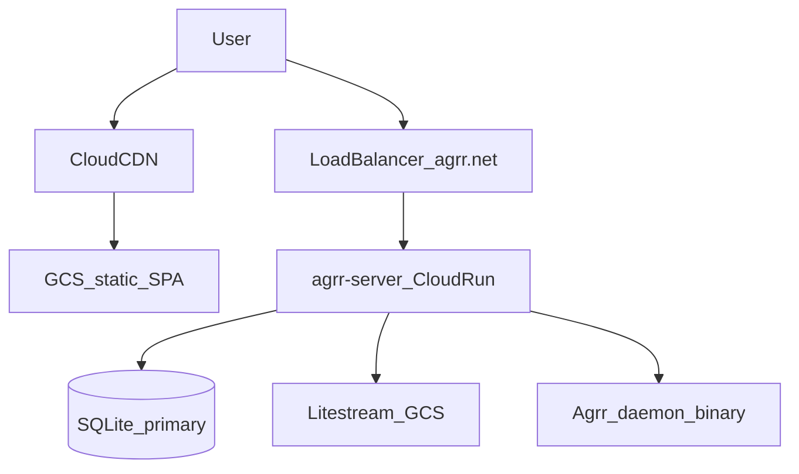

# AGRR Architecture Documentation

**L1 codemap** — detailed layer rules: [`docs/architecture/LAYER-RULES.md`](docs/architecture/LAYER-RULES.md).

## System Overview

AGRR is an agricultural planning and optimization system: an **Angular 21 SPA** uses **agrr-server** (Rust / Axum on Cloud Run) for JSON API, WebSocket (`/cable`), and OAuth (`/auth/*`). Domain logic is pure in **`crates/agrr-domain`**; HTTP edge in **`crates/agrr-server`**.

A **Rails shell** remains for local SPA fallback, static pages, and dev/test helpers only—not production business API. Migration: [`docs/migration/app-rust-stack/PRODUCTION-CUTOVER-STATUS.md`](docs/migration/app-rust-stack/PRODUCTION-CUTOVER-STATUS.md).

| Layer | Technology |
| ----- | ------------ |
| Frontend | Angular 21 SPA (`frontend/src/app/`) |
| Frontend hosting | GCS + Cloud CDN |
| Backend (API/WS) | **agrr-server** (Rust) on Cloud Run |
| Rails shell (dev) | SPA fallback, `auth_test`, static pages only |
| Database | SQLite3 + Litestream → GCS; schema via `agrr-migrate` |
| Integration | **agrr** Python binary / daemon (optimization, weather) |
| Contracts | `crates/agrr-r4-contract` + `scripts/run-rust-contract-tests.sh` |

## System Flow

```mermaid
flowchart TD
  User[User] --> CDN[CloudCDN]
  CDN --> GCS[GCS_static_SPA]
  User --> LB[LoadBalancer_agrr.net]
  LB --> CloudRun[agrr-server_CloudRun]
  CloudRun --> SQLite[(SQLite_primary)]
  CloudRun --> Litestream[Litestream_GCS]
  CloudRun --> AgrrDaemon[Agrr_daemon_binary]
```

## Codemap (Rust production)

| Path | Role |
| ---- | ---- |
| `crates/agrr-domain/src/<context>/` | Entities, DTOs, policies, interactors, gateway traits, ports |
| `crates/agrr-adapters-*/` | SQLite, HTTP, agrr daemon, OAuth adapters |
| `crates/agrr-server/src/` | Axum routes, composition, presenter wiring |
| `crates/agrr-r4-contract/` | R4 contract fixtures and harness |
| `frontend/src/app/` | Angular: `domain/`, `usecase/`, `adapters/`, `components/` |
| `docs/design/UI-COMPOSITION-RULES.md` | Frontend page composition (Shell + Pattern, conformance L0–L4) |
| `scripts/run-rust-contract-tests.sh` | Production-path contract tests |

**Bounded contexts** (`crates/agrr-domain/src/`): `agricultural_task`, `api_keys`, `auth`, `backdoor`, `contact_messages`, `crop`, `cultivation_plan`, `deletion_undo`, `farm`, `fertilize`, `field`, `field_cultivation`, `interaction_rule`, `internal_jobs`, `organization`, `pest`, `pesticide`, `public_plan`, `shared`, `user_account`, `weather_data`, `work_record`.

Each context typically has: `entities/`, `dtos/`, `gateways/` (traits), `interactors/`, `policies/`, `ports/`, `mappers/`.

## Layer rules summary (R0–R9)

Full normative text: [`docs/architecture/LAYER-RULES.md`](docs/architecture/LAYER-RULES.md).

| Rule | Summary |
| ---- | ------- |
| **R0** | Policies decide auth/validation; Interactors orchestrate; Gateways never authorize |
| **R1** | Domain is framework-free (`agrr-domain` — no HTTP, ORM, or hidden globals) |
| **R2** | Constructor injection only; no service locators |
| **R3** | Gateways = narrow persistence/I/O; no presenter-shaped blobs |
| **R4** | One user-facing use case = one top-level interactor; HTML/API share it |
| **R5** | Outcomes via output port `on_success` / `on_failure`; no rescue-as-control-flow |
| **R6** | Presenters shape HTTP only; no data loading or side effects |
| **R7** | Thin HTTP edge: map params → input DTO, wire deps, `interactor.call` |
| **R8** | Refactors must fix dependency direction, not relocate smells |
| **R9** | Contract-first: this doc + ports/DTOs + observable tests |

**Vertical slice:** one JSON action → one interactor call + one output port (presenter). Sub-steps use **input ports** injected at the edge.

## Fail-closed and fallback policy

**Domain and business logic must not silently fall back to alternate algorithms** that present a misleading success (e.g. showing `eligible: true` when the primary optimization path failed). Allowed responses: explicit errors, `eligible: false`, or infrastructure-style `501` fail-closed ([`crates/agrr-server/src/fallback.rs`](crates/agrr-server/src/fallback.rs)).

This extends the P6 **infrastructure** no-fallback rule ([`docs/migration/archive/P6-COMPLETION-CRITERIA.md`](docs/migration/archive/P6-COMPLETION-CRITERIA.md)) to product logic. Full normative text: [`.cursor/rules/fallback.mdc`](.cursor/rules/fallback.mdc). Aligns with [`.cursor/rules/no-convenience-tech-debt.mdc`](.cursor/rules/no-convenience-tech-debt.mdc) (convenience fallbacks are prohibited tech debt).

## Frontend

Dependency: `components → usecase → domain`; `adapters → gateway tokens`.

- `domain/` — types and pure rules
- `usecase/` — use cases, gateway tokens, ports
- `adapters/` — HTTP implementations, DTO → view state
- `components/` — routes, templates
- `services/` — cross-cutting helpers
- `core/` — i18n, API base URL, `ListRefreshBus`, etc.

i18n: `@ngx-translate` (`frontend/src/assets/i18n/{ja,en}.json`). Production routing: `PathLocationStrategy`; CDN `index.html` fallback.

## Resource Limits

- **Farm:** max 4 non-reference farms per user (`is_reference: false`)
- **Crop:** max 20 non-reference crops per user
- **Reference data:** `is_reference: true` excluded from limits

Enforced in **domain policies**; DB constraints are safety net only.

## Testing

| Target | Runner |
| ------ | ------ |
| R4 contracts (production path) | `scripts/run-rust-contract-tests.sh` |
| Domain logic | `.cursor/skills/test-common/scripts/run-test-rust-domain.sh` |
| Angular | `.cursor/skills/test-common/scripts/run-test-frontend.sh` |

Do not run `rails test` (removed P8.6). Use [test-common SKILL](.cursor/skills/test-common/SKILL.md).

## Domain fallback policy (fail-closed)

**Domain judgment（ドメイン判定） and business logic must not use convenience fallbacks** that produce plausible-looking success when the primary path fails. Allowed outcomes are **`eligible: false`**, explicit errors (`ErrorDto`), or infrastructure-style **fail-closed** (`501` / `api_not_migrated` — see [`crates/agrr-server/src/fallback.rs`](crates/agrr-server/src/fallback.rs)).

Do **not** switch to an alternate algorithm (threshold scan, fuzzy match, fixed defaults, etc.) and show “suitable period found” or optimization success. This extends the P6 **no infrastructure fallback** rule ([`docs/migration/archive/P6-COMPLETION-CRITERIA.md`](docs/migration/archive/P6-COMPLETION-CRITERIA.md)) to **product logic**. Full norm: [`.cursor/rules/fallback.mdc`](.cursor/rules/fallback.mdc) (cross-ref [`no-convenience-tech-debt.mdc`](.cursor/rules/no-convenience-tech-debt.mdc)).

## Additional Resources

| Reference | Role |
| --------- | ---- |
| [`docs/architecture/LAYER-RULES.md`](docs/architecture/LAYER-RULES.md) | **L2** — full What we require / prohibited patterns / layer detail |
| [`.cursor/rules/agent-conventions.mdc`](.cursor/rules/agent-conventions.mdc) | Workflow terminology and ownership table |
| [`.cursor/skills/clean-architecture-violation-fix-workflow/SKILL.md`](.cursor/skills/clean-architecture-violation-fix-workflow/SKILL.md) | CA violation fix loop (sections 0–6) |
| [`.cursor/rules/ca-violation-fix-architecture-gate.mdc`](.cursor/rules/ca-violation-fix-architecture-gate.mdc) | ARCHITECTURE gate (1st / 2nd pass) |
| [`.cursor/rules/fallback.mdc`](.cursor/rules/fallback.mdc) | Domain fail-closed — no silent alternate-algorithm success |
| [docs/README.md](docs/README.md) | Supplementary docs index |
| [docs/migration/archive/](docs/migration/archive/) | Historical migration docs (not current norm) |
