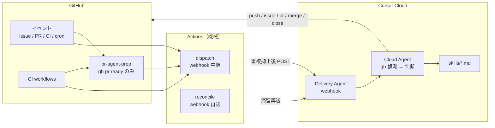
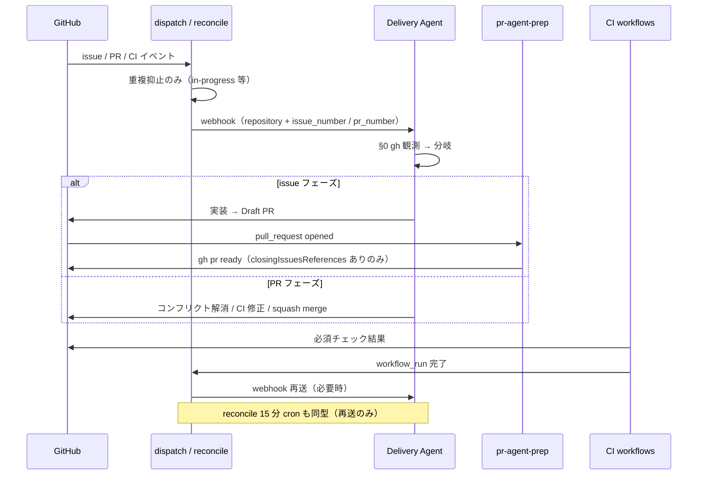

# Cursor Automation と GitHub Workflows — 全体俯瞰

AGRR では **Cursor Automation（Cloud Agent）** と **GitHub Actions** を組み合わせて、issue 実装・PR マージ・UX 監査などを自動化している。本ドキュメントは両者の**役割分担・データの流れ・ワークフロー一覧**を俯瞰する。

**判断基準（正本・迷ったら先に読む）**: [JUDGMENT-CRITERIA.md](../../.cursor/skills/automation-authoring/references/JUDGMENT-CRITERIA.md)

**目的**: 人間がラベルを付けたり UI で再開したりしなくても、パイプラインが **完了・再開・完遂**できること。設計背景: [PRINCIPLES.md](../../.cursor/skills/automation-authoring/references/PRINCIPLES.md)。

**運用設定の正本**（cron・prefill URL・secrets 登録手順）は [cursor-automation-schedule.md](../../.cursor/skills/cloud-automation-audit/references/cursor-automation-schedule.md)。本資料はアーキテクチャ説明に専念し、手順の重複は避ける。

---

## 二層の役割

| 層 | やること | やらないこと |
|----|----------|--------------|
| **GitHub Actions** | イベント検知、CI、webhook 中継、重複抑止、`gh pr ready`（機械 prep）、reconcile 再送 | merge / close / obsolete 判定、本文パース、判断ラベル付与 |
| **Cursor Cloud Agent** | 毎 run `gh` 観測 → 実装・修正・マージ・close・コメント | payload / ラベル名を信用して skip |

Cloud Agent はリポジトリを clone して `.cursor/skills/` を読む。**ローカル Docker / ng serve は使えない**。

---

## 全体フロー（正本）

```
GitHub イベント（issue / PR / CI 完了 / cron）
  → dispatch workflow（webhook 中継・重複抑止のみ）
  → Delivery Agent webhook
  → §0: gh 観測 → 分岐（実装 / §0a / コンフリクト解消 / CI 修正 / マージ / close / 待ち）
  → git push / gh issue / gh pr / close / merge
  → （滞留時）reconcile が webhook 再送 → 上記を繰り返す
```

**機械は判断しない。** reconcile も再送まで。何をするかは Agent が毎 run 観測して決める。



**認証の二系統**（Cloud Agent 内）:

| 用途 | トークン | 設定場所 |
|------|----------|----------|
| `git clone` / `git push` / PR 作成 | Cursor GitHub App（`ghs_…`） | Cursor Dashboard → Integrations |
| `gh issue` / `gh pr comment` 等 | ユーザー PAT（`AGRR_GH_PAT`） | Cursor Dashboard → Cloud Agents → Secrets |

詳細は [cursor-automation-schedule.md § GitHub CLI 認証](../../.cursor/skills/cloud-automation-audit/references/cursor-automation-schedule.md#github-cli-認証cloud-agent)。

---

## 主要パイプライン

### 1. Issue 実装 → マージ（メインループ）



| 段階 | 実行者 | 参照 |
|------|--------|------|
| 観測・判断・実装・マージ | **Delivery Agent** | [`delivery-agent/SKILL.md`](../../.cursor/skills/delivery-agent/SKILL.md) §0 |
| issue 起動 | **issue-worker-dispatch** | [`.github/workflows/issue-worker-dispatch.yml`](../../.github/workflows/issue-worker-dispatch.yml) |
| PR 起動 | **pr-merge-worker-dispatch** | [`.github/workflows/pr-merge-worker-dispatch.yml`](../../.github/workflows/pr-merge-worker-dispatch.yml) |
| 滞留再送 | **retry dispatch**（15 分 cron） | `issue-worker-retry-dispatch` / `pr-merge-worker-retry-dispatch` |
| Draft → ready | **pr-agent-prep**（AI 不要） | [`.github/workflows/pr-agent-prep.yml`](../../.github/workflows/pr-agent-prep.yml) |
| 実装・マージ手順 | 参照スキル | `github-issue-worker` / `github-pr-merge-worker`（Agent が観測後に読み分け） |

#### Delivery Agent §0（毎 run 先頭）

1. **重複抑止** — `agent-in-progress` / `agent-merge-in-progress` あり → exit 0
2. **`gh` 観測** — issue / PR / CI / リンク状態を読む
3. **分岐** — issue 実装 / PR §0a（obsolete）/ コンフリクト解消 / CI 修正 / マージ / close / コメント待ち

payload の `issue_number` / `pr_number` / `pr_unlinked` は**ヒントのみ**。観測と矛盾したら観測が優先。

#### 機械 prep（pr-agent-prep）

`closingIssuesReferences` **あり**の Draft PR を直列 `gh pr ready`。**未リンクは prep スキップ**（判断ラベルは付けない）。

#### 救済経路（Agent が観測して着手）

滞留理由は機械が「経路名」で分岐しない。Agent が `gh` で読んで次を選ぶ。

| 観測（Agent） | 参照 |
|---------------|------|
| 必須 CI FAIL・コンフリクトなし | [`github-pr-merge-worker` §5](../../.cursor/skills/github-pr-merge-worker/SKILL.md) |
| BEHIND / CONFLICTING | 同上 §5.1 コンフリクト解消 |
| 未リンク PR・陳腐化疑い | 同上 §0a |
| 依存未充足 | [`delivery-agent` §依存](../../.cursor/skills/delivery-agent/SKILL.md) — コメントのみで exit 0 |

起動のきっかけは dispatch（CI 完了・PR イベント）または reconcile（15 分 cron）の **webhook 再送**。どちらも payload に `action` は載せない。

**本文・コメントのパースは機械層禁止。** 依存・obsolete・merge 可否は Agent のみ。

### 2. UX キャンペーン（マージ後ループ）

PR マージ成功後、**Delivery Agent の同一 run** がリンク issue の `ux-campaign:breadcrumb` を見て post-merge（scan・残件起票）を実行する。

```
issue（ux-campaign:*）→ Delivery Agent（実装）→ PR → Delivery Agent（マージ + post-merge）→ 残件 issue（agent-ready）→ …
```

| 段階 | 実行者 | 参照 |
|------|--------|------|
| マージ + post-merge | Cursor **Delivery Agent** | [`delivery-agent/SKILL.md`](../../.cursor/skills/delivery-agent/SKILL.md) / [`ux-campaign-loop/SKILL.md`](../../.cursor/skills/ux-campaign-loop/SKILL.md) |

### 3. UX Issue Audit（週次・条件付き起票）

月曜 9:00 JST の **Cursor cron** で起動。リポジトリ上の `visual-review-results.md` を前提に CSS 監査・草案作成。**条件を満たすときだけ** issue 起票（実装 PR は Issue Worker 経由）。

| 段階 | 実行者 | 参照 |
|------|--------|------|
| 定期監査 | Cursor **UX Issue Audit** | [`ux-issue-pipeline/SKILL.md`](../../.cursor/skills/ux-issue-pipeline/SKILL.md) § Automation |
| 画面キャプチャ（非 Automation） | **frontend-e2e-capture** | [`.github/workflows/frontend-e2e-capture.yml`](../../.github/workflows/frontend-e2e-capture.yml) |

### 4. Automation Audit（週次・自己監査）

金曜 10:00 JST。Issue Worker / UX Audit の**GitHub 副作用**を間接監査し、repo 側のクリティカル不具合のみ PR を開く。

| 段階 | 実行者 | 参照 |
|------|--------|------|
| 監査 | Cursor **Automation Audit** | [`cloud-automation-audit/SKILL.md`](../../.cursor/skills/cloud-automation-audit/SKILL.md) |

### 5. Pipeline Watchdog（毎時・運用監視）

毎時 0 分 JST。issue / PR / dispatch workflow を機械収集し、P0/P1 異常を調査して **GitHub issue** 化（`automation-watchdog` ラベル）。週次 Audit とは補完関係。

| 段階 | 実行者 | 参照 |
|------|--------|------|
| 監視・起票 | Cursor **Pipeline Watchdog** | [`automation-pipeline-watchdog/SKILL.md`](../../.cursor/skills/automation-pipeline-watchdog/SKILL.md) |

### 6. Cleanup 外側ループ（手動・repository_dispatch）

大規模クリーンアップの機械的外側ループ。shell が backlog 管理し、**1 item ずつ** webhook で Cloud Agent を起動する（AI は item 実行のみ）。

| 段階 | 実行者 | 参照 |
|------|--------|------|
| dispatch | **cleanup-outer-loop-dispatch** | [`.github/workflows/cleanup-outer-loop-dispatch.yml`](../../.github/workflows/cleanup-outer-loop-dispatch.yml) |
| 手順 | shell + スキル | [`sequential-cleanup-review-workflow`](../../.cursor/skills/sequential-cleanup-review-workflow/SKILL.md) |

---

## GitHub Workflows 一覧

### A. CI / デプロイ（Cursor とは独立）

| Workflow | ファイル | トリガ | 役割 |
|----------|----------|--------|------|
| Backend test | [`rails-test.yml`](../../.github/workflows/rails-test.yml) | PR / master push | agrr-domain + R4 契約テスト。**Merge Worker の CI ゲートの正** |
| Frontend test | [`frontend-test.yml`](../../.github/workflows/frontend-test.yml) | reusable | Angular ユニットテスト |
| Lint | [`lint.yml`](../../.github/workflows/lint.yml) | reusable | frontend-lint 等 |
| Rust domain test | [`rust-domain-test.yml`](../../.github/workflows/rust-domain-test.yml) | PR | cargo テスト（補助） |
| Frontend E2E smoke | [`frontend-e2e-smoke.yml`](../../.github/workflows/frontend-e2e-smoke.yml) | PR | route-smoke |
| Frontend E2E capture | [`frontend-e2e-capture.yml`](../../.github/workflows/frontend-e2e-capture.yml) | 週次 cron | 全ルート PNG artifact（UX Audit の入力） |
| Frontend deploy | [`frontend-deploy.yml`](../../.github/workflows/frontend-deploy.yml) | master / PR | 本番フロントデプロイ |

### B. Dispatch（GitHub イベント → Cursor webhook）

| Workflow | ファイル | トリガ | 起動する Automation | Secrets |
|----------|----------|--------|---------------------|---------|
| Issue Worker Dispatch | [`issue-worker-dispatch.yml`](../../.github/workflows/issue-worker-dispatch.yml) | issue opened / labeled | **Delivery Agent** | `CURSOR_DELIVERY_WEBHOOK_*` |
| Issue Worker Retry | [`issue-worker-retry-dispatch.yml`](../../.github/workflows/issue-worker-retry-dispatch.yml) | 15 分 cron / cancelled retry / issue closed | **Delivery Agent** | 同上 |
| PR Merge Worker Dispatch | [`pr-merge-worker-dispatch.yml`](../../.github/workflows/pr-merge-worker-dispatch.yml) | PR イベント / Backend test 完了 | **Delivery Agent** | 同上 |
| PR Merge Worker Retry | [`pr-merge-worker-retry-dispatch.yml`](../../.github/workflows/pr-merge-worker-retry-dispatch.yml) | 15 分 cron / cancelled retry | **Delivery Agent** | 同上 |
| Cleanup Outer Loop | [`cleanup-outer-loop-dispatch.yml`](../../.github/workflows/cleanup-outer-loop-dispatch.yml) | workflow_dispatch / repository_dispatch | （個別 webhook） | `CLEANUP_OUTER_LOOP_WEBHOOK_*` |

※ すべての dispatch は同一 `CURSOR_DELIVERY_WEBHOOK_*`（依存の別 webhook はない）。

### C. 機械処理のみ（Cloud Agent を起動しない）

| Workflow | ファイル | 役割 |
|----------|----------|------|
| PR Agent Prep | [`pr-agent-prep.yml`](../../.github/workflows/pr-agent-prep.yml) | Draft PR の直列 `gh pr ready`（`closingIssuesReferences` ありのみ。判断ラベルなし） |

---

## Cursor Automation 一覧

| Automation | トリガ種別 | スキル | PR を開くか |
|------------|------------|--------|-------------|
| **Delivery Agent** | Webhook（issue/PR dispatch workflows） | `delivery-agent` → 参照 `github-issue-worker` / `github-pr-merge-worker` / `ux-campaign-loop` | 可（実装時） |
| ~~Issue Worker~~ | — | `github-issue-worker` | **廃止**（Delivery に統合） |
| ~~PR Merge Worker~~ | — | `github-pr-merge-worker` | **廃止**（Delivery に統合） |
| ~~UX Campaign Loop~~ | — | `ux-campaign-loop`（参照スキル） | **廃止**（Delivery post-merge に統合） |
| **UX Issue Audit** | Schedule（月曜 9:00 JST） | `ux-issue-pipeline` § Automation | 不可（条件付き issue） |
| **Automation Audit** | Schedule（金曜 10:00 JST） | `cloud-automation-audit` | 可（クリティカル修正時のみ） |
| **Pipeline Watchdog** | Schedule（毎時 0 分 JST） | `automation-pipeline-watchdog` | 不可（異常時 issue・P0 のみ最小 PR） |

**GitHub Actions のみ**（Cursor Automation ではない）: PR Agent Prep、Retry dispatch、Frontend E2E capture。

---

## Webhook の流れ（共通パターン）

1. GitHub 上でイベント発生（issue ラベル、PR CI 完了、cron 等）
2. **Dispatch workflow** が重複抑止（`agent-in-progress` 等）を確認
3. 抑止対象なら skip（ログのみ）
4. 対象なら `post-cursor-webhook.mjs` で Delivery Agent の webhook URL へ JSON payload を送信
5. Delivery Agent が **§0 で `gh` 観測**し、参照スキルに従って実行

dispatch lib の内部処理（候補列挙・レガシー経路名）は **webhook 再送の実装詳細**。Agent は信用しない。

Delivery Agent payload（`action` **なし**）:

| フィールド | 例 | 意味 |
|------------|-----|------|
| `repository` | `rick-chick/agrr` | 必須 |
| `issue_number` | `323` | issue 起点 / PR の `closingIssuesReferences` |
| `pr_number` | `427` | PR 起点（**ヒントのみ**。Agent は `gh` で観測して分岐） |
| `pr_unlinked` | `true` | **レガシー optional**。Agent は信用しない — `gh pr view` で確認 |
| `mergeable_state` 等 | （任意） | PR 観測ヒント。Agent は GitHub を正とする |

UX Campaign Loop 等、Delivery 以外の Automation は従来どおり個別 payload（`pr_number`, `campaign_id` 等）。

secrets 未設定時、issue dispatch は **exit 0 でスキップ**（切替後は設定漏れに注意）。PR dispatch も未設定時は exit 0。

---

## スキルと規約の関係

すべての Automation は **プロンプトで特定スキルを `exactly` 読む**よう指示される。スキルが TDD（[`tdd-on-edit`](../../.cursor/skills/tdd-on-edit/SKILL.md)）、Clean Architecture（[`ARCHITECTURE.md`](../../ARCHITECTURE.md)）、テスト実行（[`test-common`](../../.cursor/skills/test-common/SKILL.md)）を定義する。

Cloud 起動時の bootstrap: [`.cursor/environment.json`](../../.cursor/environment.json) → `cloud-gh-auth.sh` で `AGRR_GH_PAT` を `gh` に注入。

---

## 関連リンク

| 資料 | 内容 |
|------|------|
| [JUDGMENT-CRITERIA.md](../../.cursor/skills/automation-authoring/references/JUDGMENT-CRITERIA.md) | **判断基準（正本）** — 機械 vs Agent・Go/No-Go |
| [PRINCIPLES.md](../../.cursor/skills/automation-authoring/references/PRINCIPLES.md) | 設計原則・目的・ラベル契約 |
| [cursor-automation-schedule.md](../../.cursor/skills/cloud-automation-audit/references/cursor-automation-schedule.md) | 設定手順・prefill・secrets・トラブルシュート（**運用正本**） |
| [Cursor Automations 公式](https://cursor.com/docs/cloud-agent/automations) | プロダクト仕様 |
| [delivery-agent/SKILL.md](../../.cursor/skills/delivery-agent/SKILL.md) | Delivery Agent（観測・分岐の正本） |
| [github-issue-worker/SKILL.md](../../.cursor/skills/github-issue-worker/SKILL.md) | Issue 実装の詳細（Delivery から参照） |
| [github-pr-merge-worker/SKILL.md](../../.cursor/skills/github-pr-merge-worker/SKILL.md) | PR マージの詳細（Delivery から参照） |
| [cloud-automation-audit/SKILL.md](../../.cursor/skills/cloud-automation-audit/SKILL.md) | 監査観点 |
| [automation-authoring/SKILL.md](../../.cursor/skills/automation-authoring/SKILL.md) | 新規 Automation / dispatch 追加時の設計規約 |
