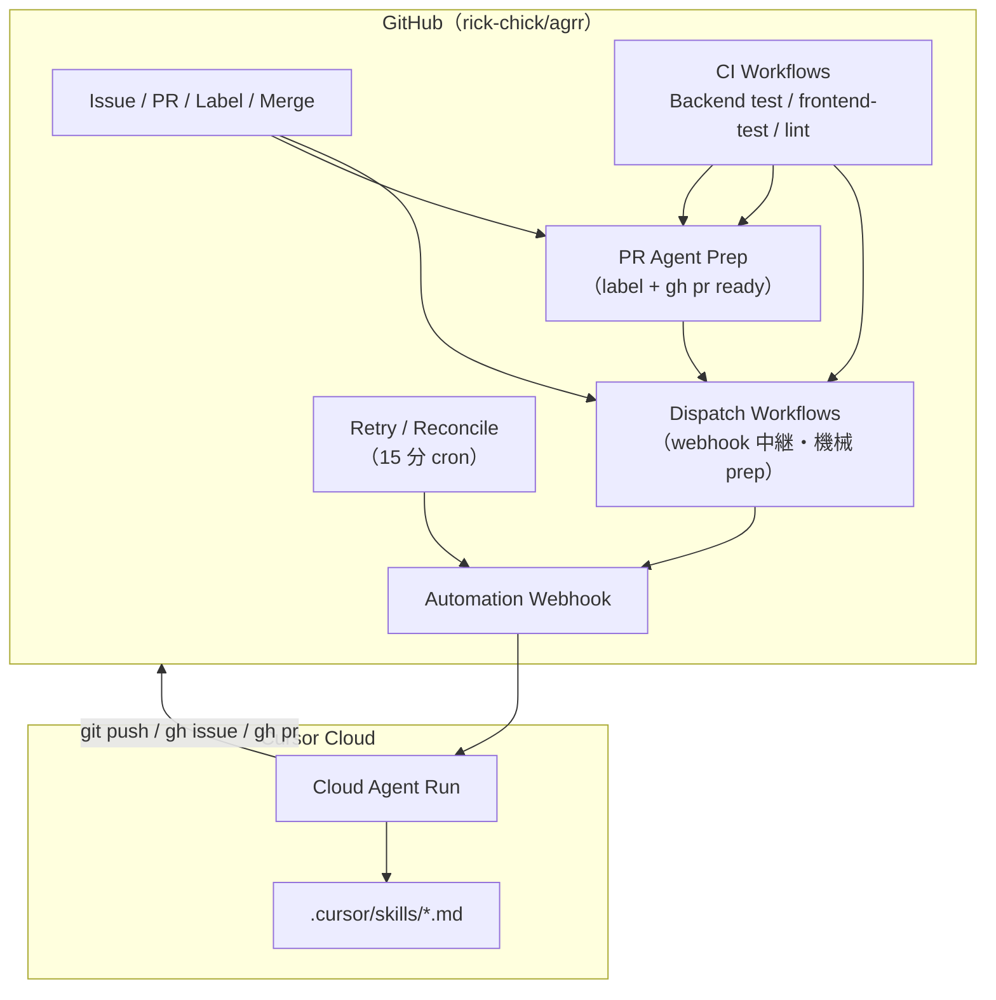
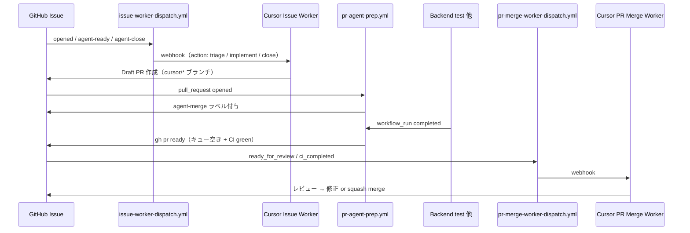
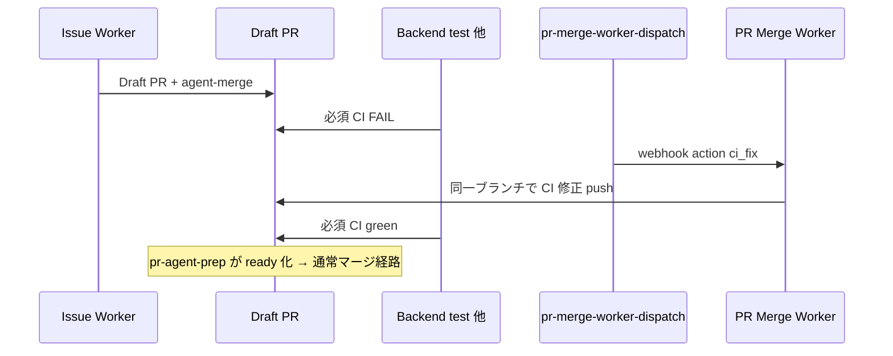

# Cursor Automation と GitHub Workflows — 全体俯瞰

AGRR では **Cursor Automation（Cloud Agent）** と **GitHub Actions** を組み合わせて、issue 実装・PR マージ・UX 監査などを自動化している。本ドキュメントは両者の**役割分担・データの流れ・ワークフロー一覧**を俯瞰する。

**運用設定の正本**（cron・prefill URL・secrets 登録手順）は [`.cursor/skills/cloud-automation-audit/references/cursor-automation-schedule.md`](../../.cursor/skills/cloud-automation-audit/references/cursor-automation-schedule.md)。本資料はアーキテクチャ説明に専念し、手順の重複は避ける。

---

## なぜ 2 つの仕組みか

| 層 | 担当 | 典型タスク |
|----|------|------------|
| **Cursor Automation** | Cloud Agent（LLM） | スキルに従った判断・コード変更・PR 作成・レビュー・マージ判断 |
| **GitHub Actions** | 決定的な機械処理 | CI テスト、イベント検知、webhook 中継、ラベル付与、`gh pr ready`、リトライ・reconcile |

**原則**: GitHub 上のイベントやゲート条件は Actions が機械的に処理し、**判断が要る作業だけ** Cursor Automation の webhook で Cloud Agent を起動する。Cloud Agent はリポジトリを clone して `.cursor/skills/` を読むが、**ローカル Docker / ng serve は使えない**。

---

## 全体アーキテクチャ



**認証の二系統**（Cloud Agent 内）:

| 用途 | トークン | 設定場所 |
|------|----------|----------|
| `git clone` / `git push` / PR 作成 | Cursor GitHub App（`ghs_…`） | Cursor Dashboard → Integrations |
| `gh issue` / `gh pr comment` 等 | ユーザー PAT（`AGRR_GH_PAT`） | Cursor Dashboard → Cloud Agents → Secrets |

詳細は [cursor-automation-schedule.md § GitHub CLI 認証](../../.cursor/skills/cloud-automation-audit/references/cursor-automation-schedule.md#github-cli-認証cloud-agent)。

---

## 主要パイプライン

### 1. Issue 実装 → マージ（メインループ）



| 段階 | 実行者 | 参照 |
|------|--------|------|
| issue 選定・TDD 実装 | Cursor **Issue Worker** | [`github-issue-worker/SKILL.md`](../../.cursor/skills/github-issue-worker/SKILL.md) |
| 起動トリガ | GitHub **issue-worker-dispatch** | [`.github/workflows/issue-worker-dispatch.yml`](../../.github/workflows/issue-worker-dispatch.yml) |
| Draft → ready・直列キュー | GitHub **pr-agent-prep**（AI 不要） | [`.github/workflows/pr-agent-prep.yml`](../../.github/workflows/pr-agent-prep.yml) |
| CI ゲート | GitHub **Backend test** / **frontend-test** / **lint** | ruleset `master CI required` |
| レビュー・マージ | Cursor **PR Merge Worker** | [`github-pr-merge-worker/SKILL.md`](../../.cursor/skills/github-pr-merge-worker/SKILL.md) |
| 起動トリガ | GitHub **pr-merge-worker-dispatch** | [`.github/workflows/pr-merge-worker-dispatch.yml`](../../.github/workflows/pr-merge-worker-dispatch.yml) |

**オプトイン条件**（Merge Worker 対象 PR）: ラベル `agent-merge`、head `issue/<number>-*`、または本文 `Merge-Strategy: agent`。

**リトライ**: `issue-worker-retry-dispatch.yml` / `pr-merge-worker-retry-dispatch.yml` が 15 分ごとに滞留を reconcile。primary dispatch が `cancelled` になった場合も再送する。

#### 例外: Draft + 必須 CI 失敗（責任空白の回復）

Issue Worker が Draft PR を作成したあと必須 CI が FAIL すると、Issue Worker（open PR ゲート）・pr-agent-prep（ready は CI green 必須）・従来の Merge Worker dispatch（Draft スキップ）のいずれも介入しない状態になりうる（#354）。

| 層 | 回復経路 |
|----|----------|
| **PR Merge Worker** | `action: ci_fix` — Draft + `agent-merge` + 必須 CI FAIL + 非コンフリクト |
| **起動** | `pr-merge-worker-dispatch`（Backend test 完了で FAIL 検知）または `pr-merge-worker-retry-dispatch`（15 分 reconcile） |
| **Issue Worker** | open PR がある間は **再 dispatch しない**（意図的 — 二重実装防止） |



### 2. UX キャンペーン（マージ後ループ）

PR マージ後、キャンペーン対象なら **UX Campaign Loop** Automation がスキャンし、残件を issue 化。完了時は Automation 自身を無効化する。

```
issue（ux-campaign:*）→ Issue Worker → PR → PR Merge Worker
  → ux-campaign-review-dispatch → UX Campaign Loop → 残件 issue（agent-ready）→ …
```

| 段階 | 実行者 | 参照 |
|------|--------|------|
| マージ検知 | **ux-campaign-review-dispatch** | [`.github/workflows/ux-campaign-review-dispatch.yml`](../../.github/workflows/ux-campaign-review-dispatch.yml) |
| スキャン・起票 | Cursor **UX Campaign Loop** | [`ux-campaign-loop/SKILL.md`](../../.cursor/skills/ux-campaign-loop/SKILL.md) |

### 3. UX Issue Audit（週次・条件付き起票）

月曜 9:00 JST の **Cursor cron** で起動。リポジトリ上の `visual-review-results.md` を前提に CSS 監査・草案作成。**条件を満たすときだけ** issue 起票（実装 PR は Issue Worker 経由）。

| 段階 | 実行者 | 参照 |
|------|--------|------|
| 定期監査 | Cursor **UX Issue Audit** | [`ux-issue-pipeline/SKILL.md`](../../.cursor/skills/ux-issue-pipeline/SKILL.md) § Automation |
| 画面キャプチャ（非 Automation） | **frontend-e2e-capture** | [`.github/workflows/frontend-e2e-capture.yml`](../../.github/workflows/frontend-e2e-capture.yml) |

### 4. Automation Audit（週次・自己監査）

金曜 10:00 JST。Issue Worker / UX Audit の**GitHub 副作用**を間接監査し、repo 側のクリティカル不具合のみ PR を開く。

| 段階 | 実行者 | 参照 |
|------|--------|------|
| 監査 | Cursor **Automation Audit** | [`cloud-automation-audit/SKILL.md`](../../.cursor/skills/cloud-automation-audit/SKILL.md) |

### 5. Pipeline Watchdog（毎時・運用監視）

毎時 0 分 JST。issue / PR / dispatch workflow を機械収集し、P0/P1 異常を調査して **GitHub issue** 化（`automation-watchdog` ラベル）。週次 Audit とは補完関係。

| 段階 | 実行者 | 参照 |
|------|--------|------|
| 監視・起票 | Cursor **Pipeline Watchdog** | [`automation-pipeline-watchdog/SKILL.md`](../../.cursor/skills/automation-pipeline-watchdog/SKILL.md) |

### 6. Cleanup 外側ループ（手動・repository_dispatch）

大規模クリーンアップの機械的外側ループ。shell が backlog 管理し、**1 item ずつ** webhook で Cloud Agent を起動する（AI は item 実行のみ）。

| 段階 | 実行者 | 参照 |
|------|--------|------|
| dispatch | **cleanup-outer-loop-dispatch** | [`.github/workflows/cleanup-outer-loop-dispatch.yml`](../../.github/workflows/cleanup-outer-loop-dispatch.yml) |
| 手順 | shell + スキル | [`sequential-cleanup-review-workflow`](../../.cursor/skills/sequential-cleanup-review-workflow/SKILL.md) |

---

## GitHub Workflows 一覧

### A. CI / デプロイ（Cursor とは独立）

| Workflow | ファイル | トリガ | 役割 |
|----------|----------|--------|------|
| Backend test | [`rails-test.yml`](../../.github/workflows/rails-test.yml) | PR / master push | agrr-domain + R4 契約テスト。**Merge Worker の CI ゲートの正** |
| Frontend test | [`frontend-test.yml`](../../.github/workflows/frontend-test.yml) | reusable | Angular ユニットテスト |
| Lint | [`lint.yml`](../../.github/workflows/lint.yml) | reusable | frontend-lint 等 |
| Rust domain test | [`rust-domain-test.yml`](../../.github/workflows/rust-domain-test.yml) | PR | cargo テスト（補助） |
| Frontend E2E smoke | [`frontend-e2e-smoke.yml`](../../.github/workflows/frontend-e2e-smoke.yml) | PR | route-smoke |
| Frontend E2E capture | [`frontend-e2e-capture.yml`](../../.github/workflows/frontend-e2e-capture.yml) | 週次 cron | 全ルート PNG artifact（UX Audit の入力） |
| Frontend deploy | [`frontend-deploy.yml`](../../.github/workflows/frontend-deploy.yml) | master / PR | 本番フロントデプロイ |

### B. Dispatch（GitHub イベント → Cursor webhook）

| Workflow | ファイル | トリガ | 起動する Automation | Secrets |
|----------|----------|--------|---------------------|---------|
| Issue Worker Dispatch | [`issue-worker-dispatch.yml`](../../.github/workflows/issue-worker-dispatch.yml) | issue opened / labeled | Issue Worker | `CURSOR_ISSUE_WORKER_WEBHOOK_*` |
| Issue Worker Retry | [`issue-worker-retry-dispatch.yml`](../../.github/workflows/issue-worker-retry-dispatch.yml) | 15 分 cron / cancelled retry | Issue Worker | 同上 |
| PR Merge Worker Dispatch | [`pr-merge-worker-dispatch.yml`](../../.github/workflows/pr-merge-worker-dispatch.yml) | PR イベント / Backend test 完了 / master push | PR Merge Worker | `CURSOR_PR_MERGE_WEBHOOK_*` |
| PR Merge Worker Retry | [`pr-merge-worker-retry-dispatch.yml`](../../.github/workflows/pr-merge-worker-retry-dispatch.yml) | 15 分 cron / cancelled retry | PR Merge Worker | 同上 |
| UX Campaign Review | [`ux-campaign-review-dispatch.yml`](../../.github/workflows/ux-campaign-review-dispatch.yml) | PR merged | UX Campaign Loop | `CURSOR_UX_CAMPAIGN_REVIEW_WEBHOOK_*` |
| Cleanup Outer Loop | [`cleanup-outer-loop-dispatch.yml`](../../.github/workflows/cleanup-outer-loop-dispatch.yml) | workflow_dispatch / repository_dispatch | （個別 webhook） | `CLEANUP_OUTER_LOOP_WEBHOOK_*` |

### C. 機械処理のみ（Cloud Agent を起動しない）

| Workflow | ファイル | 役割 |
|----------|----------|------|
| PR Agent Prep | [`pr-agent-prep.yml`](../../.github/workflows/pr-agent-prep.yml) | `agent-merge` ラベル付与、直列 `gh pr ready`、キュー進行 |

---

## Cursor Automation 一覧

| Automation | トリガ種別 | スキル | PR を開くか |
|------------|------------|--------|-------------|
| **Issue Worker** | Webhook（issue-worker-dispatch） | `github-issue-worker` | ✅ 実装時 |
| **PR Merge Worker** | Git イベント（CI completed / PR opened）+ Webhook（pr-merge-worker-dispatch） | `github-pr-merge-worker` | ❌（マージのみ） |
| **UX Campaign Loop** | Webhook（ux-campaign-review-dispatch） | `ux-campaign-loop` | ❌（issue 起票のみ） |
| **UX Issue Audit** | Schedule（月曜 9:00 JST） | `ux-issue-pipeline` § Automation | ❌（条件付き issue） |
| **Automation Audit** | Schedule（金曜 10:00 JST） | `cloud-automation-audit` | ✅ クリティカル修正時のみ |
| **Pipeline Watchdog** | Schedule（毎時 0 分 JST） | `automation-pipeline-watchdog` | ❌（異常時 issue・P0 のみ最小 PR） |

**GitHub Actions のみ**（Cursor Automation ではない）: PR Agent Prep、Retry dispatch、Frontend E2E capture。

---

## Webhook の流れ（共通パターン）

1. GitHub 上でイベント発生（issue ラベル、PR CI 完了など）
2. **Dispatch workflow** が `scripts/*-dispatch-lib.mjs` で対象・action を判定
3. 対象外なら skip（ログのみ）
4. 対象なら `curl POST` で Cursor Automation の webhook URL へ JSON payload を送信
5. Cloud Agent が payload とスキルに従って実行

payload の `action` フィールド例:

| Automation | action 例 | 意味 |
|------------|-----------|------|
| Issue Worker | `triage` / `implement` / `close_with_reason` | 新規 issue / agent-ready / agent-close |
| PR Merge Worker | `ci_completed` / `conflict` / `ci_fix` / `stuck_retry` | CI 後レビュー / コンフリクト解消 / Draft CI 修正 / 滞留再試行 |
| UX Campaign Loop | （`pr_number`, `merged`, `campaign_id` 等） | マージ後キャンペーンレビュー |

secrets 未設定時、多くの dispatch workflow は **exit 0 でスキップ**（Issue Worker）または **exit 1 で失敗**（PR Merge Worker — 気づきやすくするため）。

---

## スキルと規約の関係

すべての Automation は **プロンプトで特定スキルを `exactly` 読む**よう指示される。スキルが TDD（[`tdd-on-edit`](../../.cursor/skills/tdd-on-edit/SKILL.md)）、Clean Architecture（[`ARCHITECTURE.md`](../../ARCHITECTURE.md)）、テスト実行（[`test-common`](../../.cursor/skills/test-common/SKILL.md)）を定義する。

Cloud 起動時の bootstrap: [`.cursor/environment.json`](../../.cursor/environment.json) → `cloud-gh-auth.sh` で `AGRR_GH_PAT` を `gh` に注入。

---

## 関連リンク

| 資料 | 内容 |
|------|------|
| [cursor-automation-schedule.md](../../.cursor/skills/cloud-automation-audit/references/cursor-automation-schedule.md) | 設定手順・prefill・secrets・トラブルシュート（**運用正本**） |
| [Cursor Automations 公式](https://cursor.com/docs/cloud-agent/automations) | プロダクト仕様 |
| [github-issue-worker/SKILL.md](../../.cursor/skills/github-issue-worker/SKILL.md) | Issue 実装の詳細 |
| [github-pr-merge-worker/SKILL.md](../../.cursor/skills/github-pr-merge-worker/SKILL.md) | PR マージの詳細 |
| [cloud-automation-audit/SKILL.md](../../.cursor/skills/cloud-automation-audit/SKILL.md) | 監査観点 |
