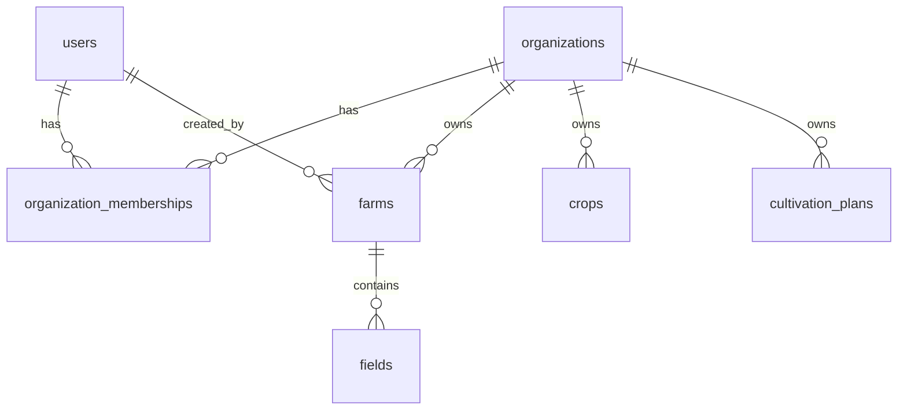

# Organization データモデル案

親: [ADR-002: Organization モデル（B2B マルチテナンシー土台）](../adr/ADR-002-organization-multi-tenancy.md) / エピック [#604](https://github.com/rick-chick/agrr/issues/604)

## 概要

B2B 法人・チーム共有の土台として、`organizations` と `organization_memberships` を新設し、所有リソースに `organization_id` を付与する。

## 新規テーブル

### `organizations`

| 列 | 型 | 制約 | 説明 |
|----|-----|------|------|
| `id` | INTEGER | PK | |
| `name` | TEXT | NOT NULL | 表示名 |
| `slug` | TEXT | NOT NULL UNIQUE | URL / API 識別子 |
| `is_personal` | INTEGER | NOT NULL DEFAULT 0 | 1 = 個人 org（自動作成・削除不可） |
| `created_at` | TEXT | NOT NULL | ISO8601 |
| `updated_at` | TEXT | NOT NULL | ISO8601 |

### `organization_memberships`

| 列 | 型 | 制約 | 説明 |
|----|-----|------|------|
| `id` | INTEGER | PK | |
| `organization_id` | INTEGER | NOT NULL FK → organizations | |
| `user_id` | INTEGER | NOT NULL FK → users | |
| `role` | TEXT | NOT NULL | `owner` / `admin` / `member` |
| `created_at` | TEXT | NOT NULL | |
| `updated_at` | TEXT | NOT NULL | |

**一意制約**: `(organization_id, user_id)`

### ロール定義（フェーズ 1）

| ロール | 権限 |
|--------|------|
| `owner` | org 削除（personal 除く）、メンバー管理、設定変更、リソース CRUD |
| `admin` | メンバー管理（owner 除名不可）、設定変更、リソース CRUD |
| `member` | org 内リソースの CRUD（メンバー管理不可） |

## 既存テーブルへの `organization_id` 付与

### Tier 1 — 列を追加（フェーズ 1）

| テーブル | 現行キー | 備考 |
|----------|----------|------|
| `farms` | `user_id NOT NULL` | 主要アンカー |
| `crops` | `user_id` nullable | 参照作物は `organization_id` も NULL |
| `cultivation_plans` | `user_id` nullable | 公開計画は別軸（`session_id`） |
| `fields` | `user_id` nullable | `farm_id` 経由でも到達 |
| `agricultural_tasks` | `user_id` nullable | ユーザー複製のみ |
| `fertilizes` | `user_id` nullable | 同上 |
| `interaction_rules` | `user_id` nullable | 同上 |
| `pests` | `user_id` nullable | 同上 |
| `pesticides` | `user_id` nullable | 同上 |

**インデックス例**: `index_farms_on_organization_id`, `index_crops_on_organization_id`

移行期間中は `user_id` 列を維持。新規作成時は `organization_id` を必須とし、`user_id` は作成者（actor）を記録。

### Tier 2 — 親経由でスコープ（列追加なし）

子テーブルは親の `organization_id` で JOIN フィルタ:

- `crop_stages`, `crop_task_schedule_blueprints`, `crop_pests`, requirements 系
- `cultivation_plan_crops`, `cultivation_plan_fields`, `field_cultivations`
- `task_schedules`, `task_schedule_items`
- `work_records`, `work_record_photos`
- pest / pesticide 詳細テーブル

### Tier 3 — スコープ外（変更なし）

| テーブル | 理由 |
|----------|------|
| `users`, `sessions` | 認証主体。org とは membership で接続 |
| 参照マスタ（`is_reference = 1`） | グローバルカタログ |
| `weather_locations`, `weather_data` | 共有インフラ |
| `contact_messages`, `farm_sizes` | テナント非スコープ |
| `deletion_undo_events` | 操作者監査。org は削除対象リソース経由 |

## 移行手順（personal org バックフィル）

```
FOR EACH user IN users:
  1. INSERT organizations (name = user.email or "Personal", slug = "user-{id}", is_personal = 1)
  2. INSERT organization_memberships (role = owner)
  3. UPDATE Tier 1 tables SET organization_id = new_org.id WHERE user_id = user.id
```

**冪等性**: バックフィルスクリプトは `is_personal = 1` の org が既に存在するユーザーはスキップ。

## クォータ移行（フェーズ 2 — 参考）

現行:

- Farm: ユーザーあたり非参照最大 4 件（`FarmCreateLimitPolicy`）
- Crop: ユーザーあたり非参照最大 20 件（`CropCreateLimitPolicy`）

移行後:

- personal org: 現行と同等の上限
- 法人 org: 契約プランに応じた org 単位上限（フェーズ 2 で定義）

## ER 図（フェーズ 1）



## 関連ファイル（実装時の起点）

| 領域 | パス |
|------|------|
| スキーマ | `crates/agrr-migrate/migrations/schema/` |
| ポリシー | `crates/agrr-domain/src/shared/policies/` |
| 一覧フィルタ | `crates/agrr-adapters-sqlite/src/shared/reference_index.rs` |
| 認証 | `crates/agrr-server/src/session_auth.rs` |
