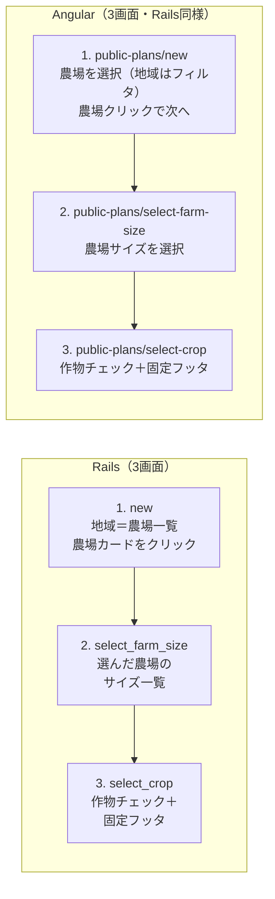

# 無料作付け画面 デザイン相違一覧（Rails 正・Angular 修正）

Rails を正（リファレンス）とし、Angular 側の相違点と修正方法をまとめる。

---

## 事実確認（コードベースに基づく）

- **無料作付けで選ぶもの**: 地域 → ほ場（農場）・広さ（農場サイズ）→ 作物。地域は無料作付けの最初に選ぶ想定。
- **Angular の地域選択**: **タブではない**。`public-plan-create.component.ts` では `<button class="region-tab">` のボタン群（🇯🇵 Japan / 🇺🇸 US / 🇮🇳 India）で地域を切り替えている。MatTab 等のタブコンポーネントは未使用。
- **ほ場と広さ**: Angular では **同一画面**（`/public-plans/new`）で、地域選択 → 農場一覧表示 → 農場を1つ選択 → 同じ画面で農場サイズ一覧表示 → サイズを1つ選択。ほ場と広さを **一緒に**（連続して同じページで）選んでいる。
- **Angular の固定フッタ**: create 画面では **常時固定フッタはない**。`@if (canProceed())` のときだけ「計画 →」のバーが表示される（`app.css` の `.fixed-bottom-bar` で `position: fixed`）。Rails の select_crop のように「常時画面下端に固定された戻る・カウンタ・送信」がある画面は、Angular では **select-crop 画面のみ**（create には常時固定バーなし）。

**事実確認の根拠**: Rails `app/views/public_plans/new.html.erb`（農場一覧のみ）, `select_farm_size.html.erb`（サイズ一覧）, `select_crop.html.erb`（固定フッタあり）。Angular `public-plan-create.component.ts`（region-tabs は `<button class="region-tab">`、ほ場・広さは同一画面、`@if (canProceed())` でバー表示）, `public-plan-select-crop.component.ts`（fixed-bottom-bar 使用）。Rails select_crop は `.fixed-bottom-bar-container` あり（79行目付近）、Angular select-crop は container なし。

---

## Rails と Angular の画面フロー相違図

| 観点 | Rails | Angular（対応後） |
|------|-------|-------------------|
| 地域の選び方 | new で農場一覧のみ表示（地域はサーバ/セッション側） | 地域は **農場一覧のフィルタ**。画面タイトルは「農場を選択」、地域タブで絞り込んで農場をクリック。 |
| ほ場・広さ | **別画面**: new で農場 → select_farm_size でサイズ | **別画面**: new で農場クリック → select-farm-size でサイズ → select-crop（Rails と同様）。下までスクロール不要。 |
| 固定フッタ | select_crop のみ常時 `.fixed-bottom-bar`（戻る・カウンタ・送信・ヒント） | select-crop のみ常時固定フッタ。戻るは select-farm-size へ。 |

---

## 1. 画面フロー・構成

| 項目 | Rails（正） | Angular（現状） | 修正方法 |
|------|-------------|-----------------|----------|
| Step 1〜2 の分割 | **3画面**: (1) `new` 農場一覧 → (2) `select_farm_size` 農場サイズ一覧 → (3) `select_crop` 作物 | **3画面**（対応済）: (1) `public-plans/new` 農場を選択（地域はフィルタ）→ (2) `public-plans/select-farm-size` サイズ選択 → (3) `public-plans/select-crop` 作物。農場クリックで別画面へ（下スクロール不要）。 | 済。 |
| 地域の出し方 | サーバ側で `@farms` を渡し、一覧は農場のみ | 地域は **農場一覧のフィルタ**。画面タイトルは「農場を選択」（`public_plans.select_farm.title`）。栽培地域選択を独立ステップにせず、フィールド（農場）をクリックしたらサイズ画面→作物選択へ。 | 済。 |

---

## 2. クラス名・HTML 構造

| 項目 | Rails（正） | Angular（現状） | 修正方法 |
|------|-------------|-----------------|----------|
| コンテンツカード見出し | `.content-card-title` / `.content-card-subtitle` | `.content-card__title` / `.content-card__subtitle`（BEM） | Angular の `public-plan.component.css` で `.content-card__title` を `.content-card-title` に合わせるか、Rails 側のスタイルが `.content-card-title` を参照しているため、**Angular のクラス名を `content-card-title` / `content-card-subtitle` に変更**し、Rails の `public-plans.css` のスタイルがそのまま効くようにする。 |
| ルート要素 | `div.public-plans-wrapper`（layout でラップ） | `main.page-main.public-plans-wrapper` | `main` はセマンティクスとして妥当。Rails 側でも `main` でラップするかは任意。Angular の `page-main` は Rails の `layouts.css` にないため、**Rails の背景・パディングに合わせるなら** `public-plan.component.css` の `.public-plans-wrapper.page-main` を、Rails の `.public-plans-wrapper`（`layouts.css`）および `public-plans.css` の指定と揃える。 |
| 固定フッタ（作物選択） | `.fixed-bottom-bar` > `.fixed-bottom-bar-container` > `.fixed-bottom-bar-content`（Rails は常時固定）。create には固定フッタなし | select-crop は `.fixed-bottom-bar` > `.fixed-bottom-bar-content` のみ（`app.css` で position:fixed）。**container がない**。create は条件付きでバー表示のみ | Angular select-crop の `fixed-bottom-bar` 直下に **`.fixed-bottom-bar-container`** を追加し、その中に `fixed-bottom-bar-content` と `hint-message` を入れる。Rails の max-width・padding を合わせる。 |

---

## 3. 地域・農場選択（new / select_farm_size）

| 項目 | Rails（正） | Angular（現状） | 修正方法 |
|------|-------------|-----------------|----------|
| 農場カードのアイコン | 🌏（地球） | 🚜（トラクター） | テンプレートの `enhanced-card-icon` を **🌏** に統一する。 |
| 農場カードのサブタイトル | 緯度・経度 `"#{farm.latitude.round(2)}, #{farm.longitude.round(2)}"` | `farm.region` | API で `latitude` / `longitude` を返しているなら、Angular では **緯度・経度** を表示する。返していない場合は Rails の表示に合わせて API を拡張するか、現状の region 表示を許容する。 |
| 農場サイズカードのアイコン（Rails select_farm_size） | 🏡 | Angular の new 画面（ほ場・広さを一緒に選ぶ画面）では 📐 | 農場サイズ選択は Angular では new 内で表示。Rails に合わせるなら **🏡** に統一する。 |
| 戻るボタン（select_farm_size） | `public_plans_path`（地域選択へ）・`.btn.btn-white` | （同一画面のためなし） | 2 ページに分ける場合は「地域選択に戻る」リンクを `routerLink="/public-plans/new"`、クラス `btn btn-white` で追加。 |

---

## 4. 作物選択（select_crop）

| 項目 | Rails（正） | Angular（現状） | 修正方法 |
|------|-------------|-----------------|----------|
| 完了ステップの表示 | `t('public_plans.steps.completed')` → 「✓」を `.step-number` に表示 | ハードコード `✓` | i18n の `public_plans.steps.completed` を使うように **`{{ 'public_plans.steps.completed' \| translate }}`** に変更する。 |
| ヒントメッセージの位置 | `.fixed-bottom-bar-container` 内、`.fixed-bottom-bar-content` の下で常に表示（中身は 0 種類のときのメッセージ） | `@if (selectedCropIds.size === 0)` で条件表示 | Rails は常にヒント用のブロックを表示し、中身で「0 種類のとき」の文言を出している。Angular も **常にヒント用の div を出し**、表示文言だけ `selectedCropIds.size === 0` で切り替えてもよい。構造は上記「固定フッタ」のとおり `.fixed-bottom-bar-container` を挟む。 |
| 送信ボタンの無効スタイル | `.submit-button` に `opacity: 0.5; cursor: not-allowed`（Rails CSS） | `[disabled]` によるブラウザデフォルト | Angular の `public-plan.component.css` に、Rails の `.submit-button` に相当する **opacity と cursor** を、`disabled` 時用に追加する。 |

---

## 5. 最適化中（optimizing）

| 項目 | Rails（正） | Angular（現状） | 修正方法 |
|------|-------------|-----------------|----------|
| レイアウト | メインエリアは **ヘッダー＋スペーサーのみ**。進捗は **画面下部の固定バー**（`.fixed-progress-bar`）で表示 | メインエリア内に **カード**（`.content-card.optimizing-card`）でスピナー・進捗・経過時間を表示 | Rails を正とするなら、Angular で **固定下部バー** を採用する。(1) `.spacer-for-fixed-bar` 相当のスペーサーを入れる。(2) メインの進捗カードをやめ、代わりに **画面下部に `.fixed-progress-bar`** を配置し、その中に `.fixed-progress-container` → `.progress-header`（スピナー・フェーズメッセージ・経過時間）とエラー用の `.error-message-container` を入れる。(3) Rails の `optimizing.css` および `public-plans.css` の fixed-progress-bar 系クラスを Angular の `public-plan.component.css` に取り込むか、共通スタイルで読み込む。 |
| ラッパーの余白 | `.public-plans-wrapper.pb-0` で下パディングなし | `pb-0` なし | 最適化画面では **`public-plans-wrapper` に `pb-0` 相当**（padding-bottom: 0）を付け、固定バーと重ならないようにする。 |
| エラー時のボタン | 「作物を変更してもう一度試す」→ `select_crop_public_plans_path`、「最初からやり直す」→ `public_plans_path` | `routerLink` で同等 | 文言は i18n の `public_plans.optimizing.error.try_again` / `start_over` を使用。クラスは Rails と同様 **`btn btn-primary`** / **`btn btn-white`**。 |

---

## 6. 結果画面（results）

| 項目 | Rails（正） | Angular（現状） | 修正方法 |
|------|-------------|-----------------|----------|
| ヘッダー構造 | `_header.html.erb`: `.gantt-results-header` → `.gantt-results-header-main`（アイコン 🎉、タイトル、バッジ）、`.gantt-results-header-summary`（地域・総面積・圃場数・総コスト・総収益・総利益）、`.gantt-results-header-subtitle` | `.compact-header-card.success`（アイコン 📊、タイトル、バッジ）＋ `.compact-subtitle`。サマリーは別の `.enhanced-summary-card` で **総利益・総コストのみ** | Rails を正とするなら、(1) ヘッダーを **`.gantt-results-header`** 系の構造に変更する（アイコン 🎉、タイトル、バッジ、summary 行、subtitle）。(2) 表示項目を **地域・総面積・圃場数・総コスト・総収益・総利益** に揃え、Rails の `_header.html.erb` と同じ順・同じ i18n キーを使う。(3) 使用する CSS は Rails の `public-plans.css` 等の `.gantt-results-header*` を Angular に取り込むか、クラス名を合わせて共通スタイルを読み込む。 |
| 保存・リンクの UI | `form_with` で submit → `.btn-primary`。ログイン時は「マイプランを見る」→ `plans_path`（`.btn.btn-white`）。「新しい計画を作成」→ `public_plans_path`（`.btn.btn-white`） | ボタン `(click)="savePlan()"`、`routerLink` で同等 | 見た目を Rails に合わせるなら、保存は **`class="btn-primary"`**、その他は **`class="btn btn-white"`**。Rails では submit が `btn-primary`、リンクが `btn btn-white`。 |

---

## 7. CSS・スタイルの参照

| 項目 | Rails（正） | Angular（現状） | 修正方法 |
|------|-------------|-----------------|----------|
| ラッパー背景・余白 | `layouts.css`: `.public-plans-wrapper`（background, padding, min-height）、`.free-plans-container`（max-width, margin, padding） | `public-plan.component.css`: `.public-plans-wrapper.page-main` で独自の padding / flex | Rails の `--page-container-max-width` や `--navbar-height` 等のトークンを使うなら、Angular の `styles.css` で同じトークンを定義する。ラッパーは **Rails の layouts.css + public-plans.css の指定に合わせる**。 |
| 固定フッタのスタイル | `public-plans.css`: `.fixed-bottom-bar`, `.fixed-bottom-bar-container`, `.fixed-bottom-bar-content`, `.back-button`, `.counter-badge`, `.submit-button`, `.hint-message` 等 | `public-plan.component.css` に一部のみ（counter-badge, hint-message 等） | Rails の **fixed-bottom-bar 系のスタイル一式**（特に container の max-width、padding、レスポンシブ）を Angular の `public-plan.component.css` にコピーするか、共通 CSS として読み込む。 |
| コンテンツカード | `public-plans.css`: `.content-card`, `.content-card-title`, `.content-card-subtitle` | Angular は `.content-card__title` 等 BEM と、`public-plan.component.css` 内のカード系 | クラス名を Rails と統一（上記「クラス名・HTML 構造」）し、必要なら Rails の `.content-card*` のスタイルを Angular に取り込む。 |

---

## 8. i18n キー

| 項目 | Rails（正） | Angular（現状） | 修正方法 |
|------|-------------|-----------------|----------|
| 完了ステップ | `public_plans.steps.completed` → "✓" | ハードコード "✓" | テンプレートで `{{ 'public_plans.steps.completed' | translate }}` を使用する。 |
| 最適化中の作物数 | `public_plans.optimizing.crops_count` または Rails では `.crops_count`（view で `t('.crops_count', count: ...)`） | `public_plans.optimizing.crops_count` を translate で使用 | Rails の view は `t('.crops_count', count: @cultivation_plan.cultivation_plan_crops.count, default: "%{count}種類の作物")`。Angular の `ja.json` に `optimizing.crops_count: "%{count}種類の作物"` があるか確認し、なければ追加。 |

---

## 9. 修正優先度の目安

1. **高**: 固定フッタの `.fixed-bottom-bar-container` 追加、最適化画面のレイアウト（固定下部バー化）、結果画面のヘッダー・サマリー項目の統一。
2. **中**: クラス名の統一（content-card-title/subtitle）、農場カードのアイコン・サブタイトル、完了ステップの i18n、submit ボタンの disabled スタイル。
3. **低**: 画面フローを 2 ページに分割するかどうか（仕様判断）、ラッパーに `main` を残すか、Rails 側でも `main` を採用するか。

---

## 10. 参照ファイル（Rails 正）

- ビュー: `app/views/public_plans/new.html.erb`, `select_farm_size.html.erb`, `select_crop.html.erb`, `optimizing.html.erb`, `results.html.erb`, `results/_header.html.erb`
- スタイル: `app/assets/stylesheets/components/layouts.css`, `app/assets/stylesheets/features/public-plans.css`, `app/assets/stylesheets/features/optimizing.css`
- i18n: `config/locales/views/public_plans.ja.yml` 等

## 参照ファイル（Angular 修正対象）

- コンポーネント: `public-plan-create.component.ts`, `public-plan-select-farm-size.component.ts`, `public-plan-select-crop.component.ts`, `public-plan-optimizing.component.ts`, `public-plan-results.component.ts`
- スタイル: `frontend/src/app/components/public-plans/public-plan.component.css`
