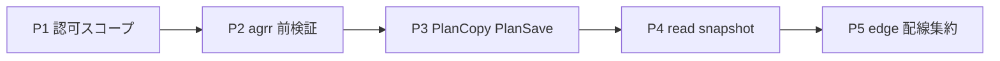

# Gateway ドメインロジック移行（境界）

命名違反の一覧は [gateway-naming-violations.md](./gateway-naming-violations.md)。**禁止の正解像は [ARCHITECTURE.md](../ARCHITECTURE.md) のみ**（Gateway boundary、五動詞、[Disallowed gateway public method name patterns](../ARCHITECTURE.md#disallowed-gateway-public-method-name-patterns)、R0 / R3 / R10）。本書は移行記録と PR 用チェックリスト（規約の二重定義はしない）。

## 正規フロー（コピー元）

1. Output port / 出力 DTO 契約
2. Interactor + `lib/domain` テスト（gateway は mock）
3. Gateway adapter（五動詞 I/O のみ）
4. Presenter / adapter mapper
5. Controller / Job（`CompositionRoot` 配線）
6. 旧 gateway メソッド削除（同一 PR または直後コミット）

参照実装:

- 読取: `RetrieveCultivationPlanInteractor`（`CultivationPlanGateway#find_by_id` → `RestPlanAccess` → `load_snapshot_by_plan_id`）+ `CultivationPlanRestPlanPreload#find_by_plan_id`
- REST 変更系: `AddFieldInteractor` 等 + `find_by_id` + `RestPlanAccess`（旧 `PlanScopes` / `find_by_id_for_rest` は廃止）
- REST add_crop / adjust: Input port nesting — [ARCHITECTURE.md — Composite use cases and Input port injection](../ARCHITECTURE.md#composite-use-cases-and-input-port-injection)（`AddCropCropResolveInputPort` + `PlanAllocationAdjustInputPort` + `build_*` at edge）
- adjust 後の field_cultivation 同期: `FieldCultivationSyncInteractor` + `FieldCultivationSyncPlanSnapshot` / `FieldCultivationSyncTargetSnapshot` + `FieldCultivationSyncApply`（未参照 `cultivation_plan_crop_ids_to_delete` は `FieldCultivationSyncUnreferencedPlanCropIds`）；agrr JSON → `AgrrAdjustResultFieldCultivationSyncMapper`（adapter）；`FieldCultivationSyncGateway#sync_by_plan_id`
- 認可 + count: `CropCreateInteractor` + `CropCreateLimitPolicy`
- PlanSave farm step: `PlanSaveEnsureUserFarmInteractor` + `FarmCreateLimitPolicy` + `PlanSaveFarmGateway`（戻り値 `PlanSaveReferenceFarmSnapshot` / `PlanSaveUserFarmSnapshot`）
- PlanSave field step: `PlanSaveEnsureUserFieldsInteractor` + `PlanSaveFieldGateway`（戻り値 `PlanSaveFieldSnapshot`；template-copy は `PlanSaveTemplateCopyIntegrity#field_records_for_template_copy`）
- PlanSave crop/pest step: `PlanSaveEnsureUserCropsInteractor` / `PlanSaveEnsureUserPestsInteractor` + Read 行 DTO + User gateway（戻り値 `PlanSaveUserCropSnapshot` / `PlanSaveUserPestSnapshot`）；template-copy は `PlanSaveTemplateCopyIntegrity#crop_records_for_template_copy` / `#pest_records_for_template_copy`
- PlanSave fertilize step: `PlanSaveEnsureUserFertilizesInteractor` + `PublicPlanSaveReadGateway#list_fertilize_reference_rows` / `#exists_fertilize_name?` + `PlanSaveUserFertilizeGateway`（戻り値 `PlanSaveUserFertilizeSnapshot`；`list_by_ids` なし）
- PlanSave pesticide step: `PlanSaveEnsureUserPesticidesInteractor` + `PublicPlanSaveReadGateway#list_pesticide_reference_rows` + `PlanSaveUserPesticideGateway#create`（optional 子 kwargs；`PlanSaveUserPesticideSnapshot`）；template-copy は `PlanSaveTemplateCopyIntegrity#pesticide_records_for_template_copy`
- PlanSave agricultural_task step: `PlanSaveEnsureUserAgriculturalTasksInteractor` + `PublicPlanSaveReadGateway#list_agricultural_task_reference_rows` + `PlanSaveUserAgriculturalTaskGateway`（find/create + crop_task_template find/create；`PlanSaveUserAgriculturalTaskSnapshot`）；template-copy は `PlanSaveTemplateCopyIntegrity#agricultural_task_records_for_template_copy`（`user_id` スコープ）
- PlanSave interaction_rule step: `PlanSaveEnsureUserInteractionRulesInteractor` + `PublicPlanSaveReadGateway#list_interaction_rule_reference_rows` + `PlanSaveUserInteractionRuleGateway`（`find_by_*` / `create` / `update`；`PlanSaveUserInteractionRuleSnapshot`）；template-copy は `PlanSaveTemplateCopyIntegrity#interaction_rule_records_for_template_copy`（`user_id` スコープ）
- フェーズ更新: `AdvanceCultivationPlanPhaseInteractor` + `OptimizationCompletion`（Interactor 連鎖なし）

## フェーズ完了状況

| Phase | 内容 | 主な成果 |
|-------|------|----------|
| 0 | Advance から nested Interactor 除去 | `OptimizationCompletion` モジュール |
| 1 | CultivationPlan 読取 | `CultivationPlanPrivateReadGateway`（`find_plan_read_snapshot_by_plan_id` / `find_optimization_snapshot_by_plan_id`）+ Policy/Mapper |
| 2 | 計画初期化・コピー・公開保存 | `CultivationPlanInitializeInteractor`, `PlanCopyInteractor`, `PublicPlanSaveInteractor`（統合テスト: `test/integration/cultivation_plan/public_plan_save_test.rb`） |
| 3 | Crop 認可・テンプレ | Policy に gateway なし、`CropTaskTemplateGateway` |
| 4 | TaskScheduleItem | `TaskScheduleItemCreatePolicy`, `AmountUnitConversionCalculator` |
| 5 | Adjust 同期・ペイロード | `FieldCultivationSyncInteractor`, `PlanAllocationAdjustReadGateway`（`find_adjust_read_snapshot_by_plan_id`）+ REST 時 `PlanAllocationAdjustInteractor` + `RestPlanAccess`, `PlanAllocationAdjustReadSnapshot`（`plan_crop_entries#has_growth_stages` で REST 前検証）, `PlanAllocationAdjustAgrrPayloadMapper`, `WeatherPredictionTargets`, `AgrrAdjustResultFieldCultivationSyncMapper` |
| 6 | Pest 関連・ステージ複製 | `CropPestGateway`, `CropStageCopyInteractor` |
| 7 | agrr wire / EntrySchedule | `InteractionRuleAgrrFormatBuilderPort`, `EntryScheduleOptimizeInteractor` |

## PR チェックリスト（再混入防止）

各 PR で ARCHITECTURE ゲートと併用すること。

| チェック | 参照 |
|----------|------|
| Gateway 新規 public メソッド | [ARCHITECTURE.md — Gateway method naming / Disallowed patterns](../ARCHITECTURE.md#disallowed-gateway-public-method-name-patterns) |
| Interactor | 別 Interactor の `call`；`CompositionRoot.*`；Policy への gateway 渡し |
| Policy | gateway / ActiveRecord / `find` / `count` |
| Presenter | gateway / `find_model` / 副作用 |
| 削除 | 旧メソッドを残したまま新 Interactor のみ追加（R8） |
| テスト | Interactor テストが output port へ届く型・必須フィールドを固定（R10） |

## 反パターン（追加禁止）

- `AdvanceCultivationPlanPhaseInteractor` が別 Interactor を注入して `call` する形の復活
- `CropMastersCropEditAccess` のように Policy が gateway を受け取る形
- `CultivationPlanActiveRecordGateway` に `find_private_*` / `initialize_*` のようなユースケース束ねメソッドを再追加

## 機械チェック

[`test/architecture/gateway_public_method_naming_test.rb`](../test/architecture/gateway_public_method_naming_test.rb) が ARCHITECTURE.md の Disallowed patterns と同一の正規表現を適用する。

**命名**は上記テストと [gateway-naming-violations.md](./gateway-naming-violations.md)。**メソッド本体のドメイン判断**（認可スコープ・検証・多段永続化など）は本節「adapter 残存ドメインロジック」を正とする。

---

## adapter 残存ドメインロジック（洗い出し）

**最終更新**: 2026-05-28。**対象**: `app/adapters`（`gateways` / `mappers` / `ports` / `sessions` / トップレベル `.rb`）。**基準**: [ARCHITECTURE.md — Gateway Boundary](../ARCHITECTURE.md#gateway-boundary)（R0 / R3）。禁止条項の二重定義はしない。

### 判定ラベル

| ラベル | 意味 |
|--------|------|
| **移行候補** | Policy / Interactor / `lib/domain/.../mappers` へ寄せる |
| **エッジ配線** | HTTP・Job 境界の `build_*` / Input port 注入に集約（adapter 内 `CompositionRoot`・Interactor 直 `call` は整理対象） |
| **許容** | ワイヤ正規化・AR→DTO 写像・インフラのみ（新規の業務判断を足さない） |

### 系統一覧（優先度）

| 優先 | 系統 | 移行の型 | 代表パス |
|------|------|----------|----------|
| **P1** | 認可・可視性のスコープ埋め込み | Interactor + Policy（`RestPlanAccess` / `PlanReadAuthorization` 等）→ Gateway は identity 済みの narrow `find` | 下表 §P1 |
| **P2** | agrr / 保存前の業務検証 | Policy または domain mapper（adapter は wire のみ） | 下表 §P2 |
| **P3** | ユースケース束ね（多段永続化） | 専用 Interactor + 狭い Gateway 五動詞 | 下表 §P3 |
| **P4** | 厚い read snapshot 組立 | `lib/domain/<context>/mappers` + Gateway は preload + `find` | 下表 §P4 |
| **P5** | adapter からの Interactor / `CompositionRoot` 起動 | Controller / Job / `CompositionRoot.build_*` のみ | 下表 §P5 |

### §P1 — 認可・可視性（移行候補）

| ファイル | メソッド / モジュール | 内容 |
|----------|----------------------|------|
| `pesticide/gateways/pesticide_active_record_gateway.rb` | `index_relation_for_filter`, `selectable_scope` | reference OR owned の一覧スコープ |
| `cultivation_plan/gateways/cultivation_plan_active_record_gateway.rb` | `find_by_farm_id`, `list_by_ids`, `total_field_area_for_farm` 等 | `user_id` / `is_reference` 込みの find |
| `crop/gateways/crop_active_record_gateway.rb` | `find_reference_crop_*`, `list_by_ids` 等 | 公開プラン・所有作物の参照条件 |

### §P1 — 移行済み（REST 計画 read / mutation）

| ファイル | 認可の所在 | Gateway |
|----------|------------|---------|
| `cultivation_plan/persistence/cultivation_plan_rest_plan_preload.rb` | `RetrieveCultivationPlanInteractor`（`plan_gateway` + `RestPlanAccess` を read 前） | `find_by_plan_id`（preload のみ） |
| `cultivation_plan/gateways/cultivation_plan_workbench_read_active_record_gateway.rb` | 同上 | `load_snapshot_by_plan_id` |
| `cultivation_plan/gateways/plan_allocation_adjust_read_active_record_gateway.rb` | `PlanAllocationAdjustInteractor` + `RestPlanAccess`（REST adjust） | `find_adjust_read_snapshot_by_plan_id` |
| `cultivation_plan/gateways/task_schedule_item_mutation_active_record_gateway.rb` | `TaskScheduleItem*Interactor` + `TaskSchedulePrivatePlanAccess` | `plan_id` narrow find / join |
| `cultivation_plan/gateways/cultivation_plan_private_read_active_record_gateway.rb`（timeline read） | `TaskScheduleTimelineInteractor` + `TaskSchedulePrivatePlanAccess`（read 前） | `find_task_schedule_timeline_by_plan_id` |

### §P2 — 業務検証・整合性（移行候補）

| ファイル | 内容 | 備考 |
|----------|------|------|
| `crop/mappers/crop_agrr_requirement_mapper.rb` | 生育ステージ・温度/積算の欠落で `ArgumentError` | `CropAgrrRequirementBuilderPort` 実装の本体。Phase 5 後も adapter に残存 |
| `cultivation_plan/mappers/plan_allocation_adjust_read_snapshot_mapper.rb` | `has_growth_stages`、`cultivation_days` 算出、条件付き `agrr_requirement` | REST 前検証の一部は domain `PlanAllocationAdjustReadSnapshotParts` へ分割済み。組立の多くは adapter |
| `cultivation_plan/gateways/cultivation_plan_active_record_gateway.rb` | `find_crop_id!` → `CultivationPlanCropMissingError` | 整合性メッセージ付き raise |
| `crop/crop_ai_upsert_active_record_persistence.rb` | `validate_stage_requirements!`、ステージ永続化オーケストレーション | AI 経路の永続化ブロック |
| `cultivation_plan/sessions/plan_save_template_copy_integrity.rb` | template-copy 用 ID の存在・user スコープ | domain 例外型へ（`PlanSaveTemplateCopyIntegrity` は domain モジュール名と揃える） |
| `contact_messages/services/contact_message_rate_limiter.rb` | IP 単位レート制限 | domain Policy + インフラ Port が理想 |
| `deletion_undo/manager.rb` | 期限・復元トランザクション・ドメイン例外 | Undo ユースケース Interactor へ（`CompositionRoot` デフォルト解決あり） |

### §P3 — ユースケース束ね（移行候補）

| ファイル | 内容 |
|----------|------|
| `cultivation_plan/gateways/plan_copy_active_record_gateway.rb` | `copy_plan_relations`, `copy_task_schedules`, `establish_master_data_relationships` 等 |
| `cultivation_plan/gateways/public_plan_template_copy_active_record_gateway.rb` | 公開 template copy の同種ステップ |
| `cultivation_plan/sessions/plan_save_session.rb` | 複数 `PlanSaveEnsureUser*` の連鎖・blueprint/stage copy | `PublicPlanSaveInteractor` と責務重複に注意 |

[gateway-naming-violations.md §C](./gateway-naming-violations.md#c-ゲートウェイ境界違反-6件) の **P3（境界）** と同エピック。

### §P4 — 厚い read snapshot 組立（移行候補）

| ファイル | 内容 |
|----------|------|
| `cultivation_plan/gateways/cultivation_plan_private_read_active_record_gateway.rb` | `find_task_schedule_timeline_by_plan_id` の `build_task_schedule_*`、`list_private_plan_index_rows_by_user_id` の集計・並べ |
| `cultivation_plan/gateways/cultivation_plan_workbench_read_active_record_gateway.rb` | workbench snapshot 組立 |
| `cultivation_plan/mappers/task_schedule_generation_context_mapper.rb` | タスクスケジュール生成 context（agrr requirement 込み） |
| `cultivation_plan/gateways/public_plan_save_read_active_record_gateway.rb` | 参照マスタ行の業務フィルタ（例: `rule_type: "continuous_cultivation"`） |
| `crop/gateways/crop_active_record_gateway.rb` 等 | `find_*_show_detail`, `find_delete_usage` |
| `farm` / `pest` / `agricultural_task` / `pesticide` gateways | 同上パターンの複合 read |

**部分移行済み**: `TaskScheduleTimelineInteractor` + `lib/domain/cultivation_plan/mappers/task_schedule_timeline_mapper.rb` は read_model → 表示 DTO のみ。スナップショット構築は依然 `CultivationPlanPrivateReadActiveRecordGateway`。

### §P5 — adapter 内 Interactor / CompositionRoot（エッジ配線 → 整理）

| ファイル | 内容 |
|----------|------|
| `cultivation_plan/gateways/adjust_weather_prediction_active_record_gateway.rb` | `weather_prediction_interactor_factory.build` |
| `weather_data/weather_prediction_interactor_factory.rb` | `WeatherPredictionInteractor` 組立 |
| `public_plan/entry_schedule_optimization_runner_adapter.rb` | `CompositionRoot.entry_schedule_optimize_interactor(...).call` |
| `deletion_undo/manager.rb` | 省略時 `CompositionRoot.deletion_undo_gateway` |
| `fertilize/fertilize_ai_gateway_resolver.rb` | `CompositionRoot.logger` / `translator` |
| `cultivation_plan/ports/add_crop_crop_resolve_{private,public}.rb` | Crop find Interactor を port 実装から `call` |
| `crop|pest|fertilize/*_for_ai_adapter.rb` | AI 経路で Interactor 直起動 |
| `crop/crop_ai_upsert_active_record_persistence.rb` | create interactor 呼び出し含む |

**望ましい形**: [Composite use cases and Input port injection](../ARCHITECTURE.md#composite-use-cases-and-input-port-injection) — Controller / Job が `build_*_interactor` し、オーケストレータは Input port のみ `call`。

### 許容（新規業務判断を増やさない）

| ファイル | 理由 |
|----------|------|
| `cultivation_plan/adjust_moves_from_request.rb` | `params[:moves]` の HTTP 正規化 |
| `cultivation_plan/mappers/agrr_adjust_result_field_cultivation_sync_mapper.rb` | agrr JSON キー → `FieldCultivationSyncInput`（Phase 5 参照実装） |
| `public_plan/entry_schedule_cursor_decoder.rb` | cursor の Base64/JSON デコード |
| 各 `*_api_presenter.rb`（多く） | output port DTO → JSON |
| `shared/ports/*`, `shared/iso8601_*` | インフラ |
| agrr `*_daemon_gateway.rb` | 外部プロセス I/O |

### Presenter の注意（表示層）

| ファイル | 内容 |
|----------|------|
| `cultivation_plan/presenters/task_schedule_timeline_html_presenter.rb` | 週次バケット・肥料/一般の分類・ソート（domain timeline mapper と役割が重なる） |

### Phase 5 との差分（進行中リファクタ）

次は **domain 側に寄ったが adapter に残る** 典型（ブランチ差分と整合）:

| 項目 | domain | adapter に残るもの |
|------|--------|-------------------|
| adjust 後同期 | `FieldCultivationSyncInteractor`, sync DTO/Policy, `FieldCultivationSyncUnreferencedPlanCropIds` | `AgrrAdjustResultFieldCultivationSyncMapper`（許容） |
| adjust read | `PlanAllocationAdjustReadSnapshot`, `PlanAllocationAdjustAgrrPayloadMapper` | `PlanAllocationAdjustReadSnapshotMapper` の `has_growth_stages` / days 算出（§P2） |
| 廃止方向 | `SaveAdjustedAgrrResult*` 系 | — |

### PR 時の追記ルール

移行 PR をマージしたら、本節の該当行を **削除または「移行済み」へ移動** し、上表「Phase 5 との差分」を更新する。新規 Gateway public メソッド追加時は [PR チェックリスト](#pr-チェックリスト再混入防止) と併用。
