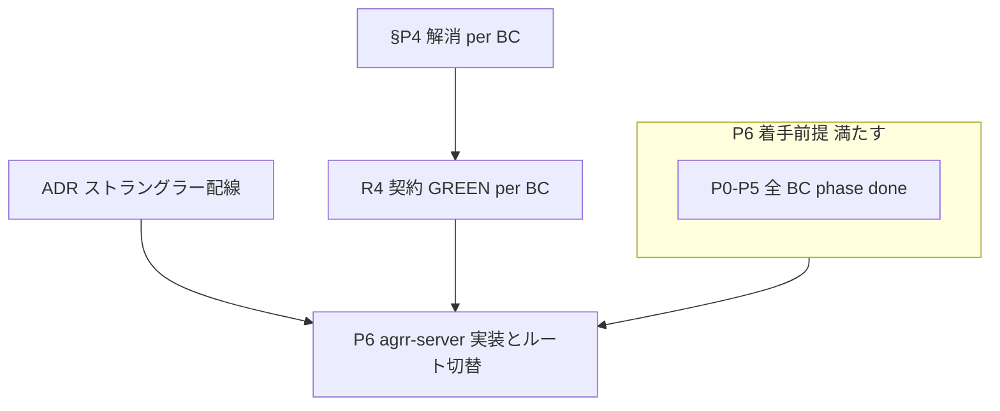

# アプリ RUST 化 — スタック調査ブロッカー回答

> **更新**: 2026-05-29（§4 を [`TRACKING.yaml`](../lib-domain-rust/TRACKING.yaml) と同期 — 旧「shared のみ done」は誤記）  
> **根拠**: [`PROVISIONAL-STACK.md`](./PROVISIONAL-STACK.md)、本番 primary レプリカ照会、コードベース到達性調査  
> **関連**: [`lib-domain-rust` プログラム](../lib-domain-rust/PROGRAM.md)、[`TRACKING.md`](../lib-domain-rust/TRACKING.md)、[`gateway-domain-logic-migration.md`](../../gateway-domain-logic-migration.md)

**進捗の正（P0–P5）**: [`TRACKING.yaml`](../lib-domain-rust/TRACKING.yaml) → `TRACKING.md`（`./scripts/sync-lib-domain-rust-tracking.sh`）。**2026-05-29 時点: 全 19 bounded context が `phase: done`（19/19）** — [`PROGRAM.md`](../lib-domain-rust/PROGRAM.md) のプログラム出口を満たす。

## ストレージの前提（調査で確定した運用実態）

| 系統 | 実体 | 本番 |
|------|------|------|
| **マスタ DB** | SQLite `primary` / `cache`（移行期 `cable`） | Litestream → `GCS_BUCKET`（例: `agrr-production-db`）の `production/*.sqlite3` |
| **天気バルク** | GCS 上 `weather_data/{location_id}/{year}.json` | **`WEATHER_DATA_STORAGE=gcs`**（`agrr-adapters-gcs` 相当）。primary に載せない（コールドスタートで DB リストアが肥大化するため） |
| **Angular 静的** | 別 GCS + CDN | 変更なし |
| **ユーザー添付** | — | **未使用**（本番 `active_storage_*` 0 件、API・UI 未配線）。2026-05-29 にコード・テーブル削除済み |

S3 / ActiveStorage は本番 Cloud Run env に無く、運用の中心は **GCS（DB レプリカ + 天気 JSON + フロント）** である。

---

## ブロッカー一覧と回答

### 1. ~~ActiveStorage / 添付（`agrr-adapters-storage`）~~ — **解消（スコープ外）**

| 項目 | 内容 |
|------|------|
| 旧 ADR 論点 | GCS 直アクセス vs ActiveStorage 互換 |
| 調査結果 | `/api/v1/files`・計画添付・本番 DB いずれも **未使用** |
| **回答** | P6 で **`agrr-adapters-storage` は作らない**。要件が出るまで再導入しない |
| 実施 | `file_blob` BC、`FilesController`、ActiveStorage テーブル、計画コピー `copy_attachments` を削除 |

---

### 2. ストラングラー配線 — **解消（ADR 確定）**

| 項目 | 内容 |
|------|------|
| 論点 | 同一 Cloud Run 内プロキシ vs 二サービス + URL map |
| **決定** | **二 Cloud Run サービス + グローバル URL map** のパス振分。[`ADR-strangler-lb-url-map.md`](./ADR-strangler-lb-url-map.md) |
| 振分枠 | `/api/*`・`/cable`・`/auth/*` を **BC 単位**で `rust-backend` へ（未移行は Rails）。OAuth Console は変更不要 |
| P6 ブロック | **いいえ**（設計確定。map ルール追加は各 BC 切替時の実装タスク） |

---

### 3. Gateway §P4（adapter 厚み）— **field_cultivation / cultivation_plan read 解消（2026-05-29）**

| 項目 | 内容 |
|------|------|
| §4 との関係 | **`agrr-domain` パリティ（P0–P5）は完了**。本項は **Rails `app/adapters` 残留**であり、lib/domain プログラム未完了ではない |
| 根拠 | [`PROGRAM.md`](../lib-domain-rust/PROGRAM.md) ガバナンス（出口後の adapter バックログ） |
| 内容 | ~~adapter に残る厚い read snapshot 組立~~ → `field_cultivation`（sync read / climate_progress）・`cultivation_plan`（rest plan / timeline / adjust read / optimization read）を per-table gateway + domain `from_snapshots` / `load_snapshot` へ |
| **回答** | Ruby 側は上記 BC で §P4 対応済み。P6 切替時は分割後 gateway trait を `agrr-adapters-sqlite` に写す（[`gateway-domain-logic-migration.md`](../../gateway-domain-logic-migration.md) 移行済み表参照） |
| P6 ブロック | **当該 BC は no**（他 BC・新規 read の再混入は PR チェックリストで防止） |

---

### 4. P0–P5（`agrr-domain` パリティ）— **解消（lib/domain プログラム完了）**

| 指標 | 値（[`TRACKING.yaml`](../lib-domain-rust/TRACKING.yaml) / [`TRACKING.md`](../lib-domain-rust/TRACKING.md) 2026-05-29） |
|------|------------------------------------------------------------------------------------------------------------------|
| `phase: done` | **19/19** bounded context（shared 含む全ウェーブ） |
| PROGRAM 出口 | ① 全 BC `phase: done` ② R0・R1・R2 GREEN（`run-test-rust-domain.sh` / `run-test-domain-lib.sh`）③ `agrr-domain` に port/trait パリティ — ①③ は TRACKING・モジュール存在で確認。②は CI / ローカル test-common で維持 |
| 旧記述の訂正 | 初版 §4「shared のみ done」は **TRACKING 未同期の誤記**。現行 YAML は wave-2〜5 完了を反映 |
| **回答** | **P6 着手の lib/domain ブロッカーはなし**（[`README.md`](../lib-domain-rust/README.md) と一致）。Ruby adapter §P4 は 2026-05-29 対応済み。 |
| P6 ブロック | **いいえ** |

---

### 5. P6 実装物（agrr-server / adapter / R4）— **コード完了・本番 URL map 未切替**

| 項目 | 状態 |
|------|------|
| `crates/agrr-server` | 実装済み（[`TRACKING-P6.yaml`](./TRACKING-P6.yaml) 全 BC `done`） |
| `agrr-adapters-sqlite` / `gcs` / `agrr` | 実装済み |
| `test/contract/**` + `scripts/run-rust-contract-tests.sh` | R4 正 |
| Cloud Run 起動 | [`Dockerfile.agrr-server`](../../../Dockerfile.agrr-server) + [`scripts/start_agrr_server.sh`](../../../scripts/start_agrr_server.sh)（[`scripts/db_bootstrap_common.sh`](../../../scripts/db_bootstrap_common.sh) を Rails [`start_app.sh`](../../../scripts/start_app.sh) と共有） |
| 本番トラフィック | **未** — `agrr-rails-backend` が `/api/*` 等を処理（P7 カットオーバー待ち） |

**回答**: 添付用 adapter は不要（§1）。残作業は URL map・Rails サービス廃止（P7）。

---

### 6. 本番 env の天気ストレージ明示 — **解消**

| 項目 | 内容 |
|------|------|
| 現状 | `env.gcp.example`・`gcp-deploy.sh` が Cloud Run に **`WEATHER_DATA_STORAGE=gcs`** を注入（未設定時デフォルト `gcs`）。バケットは `GCS_BUCKET`（任意 `GCS_WEATHER_DATA_BUCKET`） |
| **回答** | 本番は GCS 天気 JSON を正とする。開発既定 `active_record` は `env.example` のまま |
| P6 ブロック | **いいえ** |

---

### 7. P7 refinery — **方針確定・詳細は P7 着手時**

P6 中の migrate 発行は Rails のみ。スキーマ移管手順・ダウンタイムは P7 ADR。**現時点のスタック調査ブロッカーではない。**

---

## P6 着手ゲート（まとめ）

| ゲート | 必須 |
|--------|------|
| ~~P0–P5（`agrr-domain` / TRACKING）~~ | ✅ 19/19 `phase: done` — [§4](#4-p0p5agrr-domain-パリティ解消libdomain-プログラム完了) |
| ~~ストラングラー LB/プロキシ ADR~~ | ✅ 確定 — [`ADR-strangler-lb-url-map.md`](./ADR-strangler-lb-url-map.md) |
| 切替 BC の §P4 解消 + R4 GREEN | ✅（R0–R2 は各 BC で完了済み。切替時に再確認） |
| 単一ライター（BC 単位で Rust **または** Rails） | ✅ |
| URL map ルール追加（当該 BC パスのみ） | ✅（切替 PR と同時） |
| ~~添付 / ActiveStorage ADR~~ | ❌ 削除済み・非ゴール |
| ~~`WEATHER_DATA_STORAGE=gcs` 本番明示~~ | ✅ `gcp-deploy.sh` + `.env.gcp` |

---

## クリティカルパス（実装順・変更なし）

1. OAuth / セッション  
2. 計画最適化 WebSocket + ジョブチェーン  
3. `cultivation_plan` + agrr daemon  
4. Cloud Scheduler → internal jobs  

いずれも上記ゲート（P4・パリティ・R4・単一ライター）を満たした BC から切替。

---

## Rails 正との残差（P6 Rust スコープ外・文書化のみ）

| 経路 | 状態 | 備考 |
|------|------|------|
| **agrr-server** internal farm weather / field climate / scheduler / fetch | `WeatherDataGatewayBundle`（`WEATHER_DATA_STORAGE=gcs` 時は ADC read + GCS bulk） | R4: `internal_farm_weather_contract_test.rb`（GCS fixture で `count > 0`） |
| **Rails** `Api::V1::InternalController` | `farm.weather_location.weather_data`（AR 直読み） | GCS 本番で Rails 経路を使う場合は別 PR。Rust cutover では nginx が internal を Rust に向ける前提 |
| **Rails** `InternalWeatherFetchStartActiveRecordGateway` | `weather_data` AR count for `completed` | Rust は `WeatherDataGatewayBundle` 先行。Rails 追従は別 PR |
| **Rust** `plan_allocation_adjust_read_gateway` | `FROM weather_data` SQLite | 天気平面外。adjust 読み取りの bundle 化は別タスク |

---

## 参照

- [`ADR-strangler-lb-url-map.md`](./ADR-strangler-lb-url-map.md) — ストラングラー配線（確定）  
- [`PROVISIONAL-STACK.md`](./PROVISIONAL-STACK.md) — 終着スタック仮決定  
- [`README.md`](./README.md) — 索引  
- [`P6-COMPLETION-CRITERIA.md`](./P6-COMPLETION-CRITERIA.md) — P6/P7「完了」の定義  
- [`P6-BC-CUTOVER-TEMPLATE.md`](./P6-BC-CUTOVER-TEMPLATE.md) — BC 切替 PR チェックリスト  
- [`TRACKING-P6.yaml`](./TRACKING-P6.yaml) — P6 進捗  
- [`../../../test/contract/README.md`](../../../test/contract/README.md) — R4 実行・CI  
- [`../lib-domain-rust/TRACKING.md`](../lib-domain-rust/TRACKING.md) — ドメイン進捗
