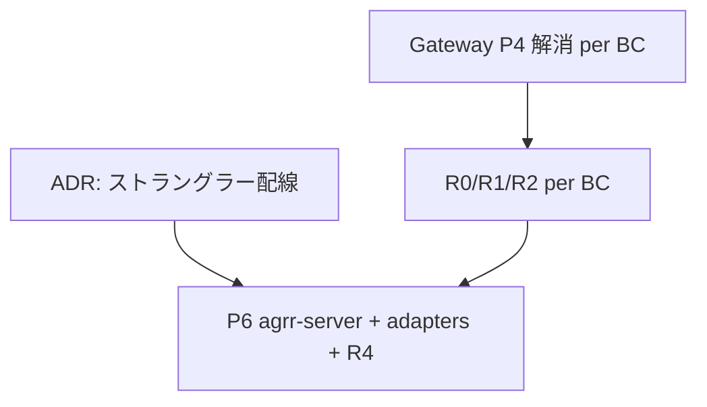

# アプリ RUST 化 — スタック調査ブロッカー回答

> **更新**: 2026-05-29  
> **根拠**: [`PROVISIONAL-STACK.md`](./PROVISIONAL-STACK.md)、本番 primary レプリカ照会、コードベース到達性調査  
> **関連**: [`lib-domain-rust` プログラム](../lib-domain-rust/PROGRAM.md)、[`gateway-domain-logic-migration.md`](../../gateway-domain-logic-migration.md)

## ストレージの前提（調査で確定した運用実態）

| 系統 | 実体 | 本番 |
|------|------|------|
| **マスタ DB** | SQLite `primary` / `cache`（移行期 `cable`） | Litestream → `GCS_BUCKET`（例: `agrr-production-db`）の `production/*.sqlite3` |
| **天気バルク** | GCS 上 `weather_data/{location_id}/{year}.json` | **`WEATHER_DATA_STORAGE=gcs`**（`agrr-adapters-gcs` 相当）。primary に載せない（コールドスタートで DB リストアが肥大化するため） |
| **Angular 静的** | 別 GCS + CDN | 変更なし |
| **ユーザー添付** | — | **未使用**（本番 `active_storage_*` 0 件、API・UI 未配線）。2026-05-29 にコード・テーブル削除済み |

S3 / ActiveStorage は本番 Cloud Run env に無く、運用の中心は **GCS（DB レプリカ + 天気 JSON + フロント）** である。

---

## ブロッカー一覧と回答

### 1. ~~ActiveStorage / 添付（`agrr-adapters-storage`）~~ — **解消（スコープ外）**

| 項目 | 内容 |
|------|------|
| 旧 ADR 論点 | GCS 直アクセス vs ActiveStorage 互換 |
| 調査結果 | `/api/v1/files`・計画添付・本番 DB いずれも **未使用** |
| **回答** | P6 で **`agrr-adapters-storage` は作らない**。要件が出るまで再導入しない |
| 実施 | `file_blob` BC、`FilesController`、ActiveStorage テーブル、計画コピー `copy_attachments` を削除 |

---

### 2. ストラングラー配線 — **未決（唯一のスタック ADR 残）**

| 項目 | 内容 |
|------|------|
| 論点 | 同一 Cloud Run 内プロキシ vs 二サービス + URL map |
| 制約 | OAuth **案 A**（`https://agrr.net/auth/google_oauth2/callback` 維持）→ パブリック URL は現行ホストのまま切替可能 |
| **回答** | P6 着手前に ADR 1 本で決定。推奨は **同一ホスト + パス振分**（LB / URL map で `/api/*`・`/cable`・`/auth/*` を Rust / Rails に振る）。Console の redirect URI は変更不要 |
| P6 ブロック | **はい**（ルート切替のインフラ設計が無いと BC 切替できない） |

---

### 3. Gateway §P4 ドメインロジック — **未解消（ドメイン移行ブロッカー）**

| 項目 | 内容 |
|------|------|
| 根拠 | [`PROGRAM.md`](../lib-domain-rust/PROGRAM.md) ガバナンス |
| 内容 | adapter に残る厚い read snapshot 組立（`field_cultivation`、`cultivation_plan` read 等） |
| **回答** | [`gateway-domain-logic-migration.md`](../../gateway-domain-logic-migration.md) と**同じイテレーション**で Ruby 側を片付けてから、該当 BC の Rust adapter / ルート切替に入る |
| P6 ブロック | **該当 BC ごとに yes**（境界違反のまま `agrr-adapters-sqlite` に写さない） |

---

### 4. P0–P5（`agrr-domain` パリティ）— **未完了**

| 指標 | 値（`TRACKING.yaml` 同期時点） |
|------|-------------------------------|
| `phase: done` | shared のみ（他 BC は test 等） |
| **回答** | P6 の前提。BC 単位で R0/R1/R2 GREEN + TRACKING 更新後にルート切替 |
| P6 ブロック | **はい**（全体） |

---

### 5. P6 実装物未作成 — **未着手**

| 未作成 | 役割 |
|--------|------|
| `crates/agrr-server` | Axum・composition・presenter |
| `agrr-adapters-sqlite` | rusqlite Gateway |
| `agrr-adapters-gcs` | 天気 JSON（本番運用と一致） |
| `agrr-adapters-agrr` | agrr デーモン |
| `test/contract/**` / `crates/agrr-server/tests/contract/**` | R4 契約 |

**回答**: PROVISIONAL-STACK の確定事項に沿って P6 で新設。添付用 adapter は不要（§1）。

---

### 6. 本番 env の天気ストレージ明示 — **要追記（軽微）**

| 項目 | 内容 |
|------|------|
| 現状 | コード既定は `active_record`；本番運用は GCS ファイル |
| **回答** | `env.gcp.example` / Cloud Run に **`WEATHER_DATA_STORAGE=gcs`** を明示する（`GCS_BUCKET` または `GCS_WEATHER_DATA_BUCKET`） |
| P6 ブロック | **いいえ**（ドキュメント・env の整合。実装は既に `WeatherDataGcsHttpGateway` あり） |

---

### 7. P7 refinery — **方針確定・詳細は P7 着手時**

P6 中の migrate 発行は Rails のみ。スキーマ移管手順・ダウンタイムは P7 ADR。**現時点のスタック調査ブロッカーではない。**

---

## P6 着手ゲート（まとめ）

| ゲート | 必須 |
|--------|------|
| ストラングラー LB/プロキシ ADR | ✅ |
| 切替 BC の P4 解消 + R1 パリティ + R4 GREEN | ✅ |
| 単一ライター（BC 単位で Rust **または** Rails） | ✅ |
| ~~添付 / ActiveStorage ADR~~ | ❌ 削除済み・非ゴール |
| `WEATHER_DATA_STORAGE=gcs` 本番明示 | 推奨（ブロッカーではない） |

---

## クリティカルパス（実装順・変更なし）

1. OAuth / セッション  
2. 計画最適化 WebSocket + ジョブチェーン  
3. `cultivation_plan` + agrr daemon  
4. Cloud Scheduler → internal jobs  

いずれも上記ゲート（P4・パリティ・R4・単一ライター）を満たした BC から切替。

---

## 参照

- [`PROVISIONAL-STACK.md`](./PROVISIONAL-STACK.md) — 終着スタック仮決定  
- [`README.md`](./README.md) — 索引  
- [`../lib-domain-rust/TRACKING.md`](../lib-domain-rust/TRACKING.md) — ドメイン進捗
