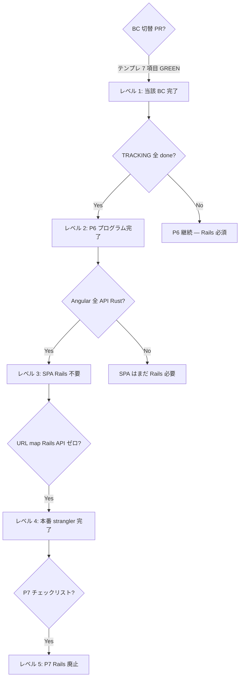

# P6 完了条件（何が「移行完了」か）

> **正**: 本書は「完了」の定義の単一ソース。進捗の列挙は [`TRACKING-P6.yaml`](./TRACKING-P6.yaml)、BC 切替 PR の手順は [`P6-BC-CUTOVER-TEMPLATE.md`](./P6-BC-CUTOVER-TEMPLATE.md)、Rails 廃止は [`P7-EXIT-CHECKLIST.md`](./P7-EXIT-CHECKLIST.md)。

---

## 終着方針（フォールバック禁止）

| 原則 | 意味 |
|------|------|
| **終着** | `agrr-server` + SQLite/Litestream + GCS + Angular CDN。**Rails Cloud Run は廃止** |
| **フォールバック禁止** | 未移行 API を nginx / URL map で Rails に落とさない |
| **未実装** | Rust で実装するか、`501` + `api_not_migrated`（[`fallback.rs`](../../../crates/agrr-server/src/fallback.rs)） |
| **開発** | [`scripts/rust-only-dev-stack.sh`](../../../scripts/rust-only-dev-stack.sh)（`AGRR_RUST_API=1`）が標準 |
| **契約 CI 正** | [`scripts/run-rust-contract-tests.sh`](../../../scripts/run-rust-contract-tests.sh) |

[`ADR-strangler-lb-url-map.md`](./ADR-strangler-lb-url-map.md) の「未移行は Rails 既定」は**移行期の暫定**のみ。終着像は本節と P7 と一致させる。

---

## 用語（混同しやすい点）

| 言い方 | 意味 | Rails 要否（開発） |
|--------|------|-------------------|
| **Rust を起動した** | `agrr-server` が :8080 で応答する | **単体では SPA 不可** |
| **BC 1 件の切替完了** | その BC のルートが Rust + R4 rust GREEN + 単一ライター | 他 BC は **Rails 必須** |
| **P6 プログラム完了** | [`TRACKING-P6.yaml`](./TRACKING-P6.yaml) のクリティカルパス + wave がすべて `phase: done` | **API は Rust のみ**（`AGRR_RUST_API=1` / strangler nginx） |
| **ストラングラー完了（P7 入口）** | 本番 URL map に **Rails 向け API ルールが残っていない** | 開発も **Rust 単体**（[`rust-only-dev-stack.sh`](../../../scripts/rust-only-dev-stack.sh)）で SPA |
| **Rails 廃止（P7 完了）** | [`P7-EXIT-CHECKLIST.md`](./P7-EXIT-CHECKLIST.md) 全項目 | **Rails 不要** |

**「Rust を起動お願い」≠「Rails 移行が終わった」**。移行期の開発は意図的に **Rails + Rust + 振分（nginx / URL map）** である。

---

## レベル 1 — 1 BC（境界づけられたコンテキスト）の切替完了

[`P6-BC-CUTOVER-TEMPLATE.md`](./P6-BC-CUTOVER-TEMPLATE.md) の 1〜7 を **すべて**満たすこと。1 つでも欠ければその BC は **未完了**。

| # | 完了条件 | 観測方法 |
|---|----------|----------|
| 1 | Ruby adapter §P4（該当 read gateway）が domain 方針どおり | [`gateway-domain-logic-migration.md`](../../gateway-domain-logic-migration.md) + レビュー |
| 2 | `agrr-adapters-sqlite` / `gcs` / `agrr` に必要な trait 実装 | `cargo test -p agrr-adapters-*` GREEN |
| 3 | `agrr-server` にルート + edge Presenter + **domain Interactor 委譲**（handler 直 Gateway 禁止） | コードレビュー + `ARCHITECTURE.md` ゲート |
| 4 | **R4 契約** — Rails ランタイム **と** `CONTRACT_RUNTIME=rust` の両方 GREEN | `run-test-rails.sh test/contract/...` + [`scripts/run-rust-contract-tests.sh`](../../../scripts/run-rust-contract-tests.sh)（該当ファイルをスクリプトに含める） |
| 5 | **単一ライター** — 当該 BC が触るテーブルの **write は Rust のみ**（移行期間中、Rails 側 write 経路を無効化またはルート未登録） | テーブル一覧 + コード検索で二重 write なし |
| 6 | **本番** URL map（または dev [`nginx-strangler-host.conf`](../../../docker/nginx-strangler-host.conf)）に **その BC のルートだけ** Rust 向け規則を追加 | `pathRules` / `location` が ADR どおり **狭いパス**（広い `/api/*` 一括禁止） |
| 7 | [`TRACKING-P6.yaml`](./TRACKING-P6.yaml) の当該 BC を `phase: done` に更新 | PR に TRACKING 差分 |

### R4 GREEN の定義（再掲）

- 既存 `test/controllers/api/v1/**`（または channels 等）から **観測可能振る舞いを写した** `test/contract/**` がある。
- **同じアサーション**が `CONTRACT_RUNTIME=rust` かつ **Rails テストと同一 SQLite**（`run-rust-contract-tests.sh`）でも通る。
- 新規シナリオの invent は禁止（[`PROVISIONAL-STACK.md`](./PROVISIONAL-STACK.md) R4 節）。

---

## レベル 2 — P6 プログラム完了（ストラングラー「全 BC 切替」）

[`TRACKING-P6.yaml`](./TRACKING-P6.yaml) の **すべて**のエントリが `phase: done` であること。

### クリティカルパス（必須）

| id | 完了の意味（要約） |
|----|-------------------|
| `auth` | `/auth/*` + `GET /api/v1/auth/me` が Rust。OAuth・セッション・ログアウト含む |
| `websocket_jobs` | `/cable` + 最適化ジョブチェーンが本番同等（stub でない） |
| `cultivation_plan` | 私有計画の **読み書き・ガント・task_schedule・作成・削除** 等、Angular が使う API すべて |
| `internal_jobs` | Scheduler 向け internal API が Rust（実 enqueue・冪等） |

### wave-2〜4

`api_keys`, `farm`, `crop`, `field_cultivation`, `public_plan`, `weather_data` など TRACKING 記載の BC がそれぞれ **レベル 1** を満たす。

### P6 完了時点でもまだ残るもの

- 本番 **Rails Cloud Run** は P7 カットオーバーまで残る場合がある（**API トラフィックは Rust のみ**が完了条件）。
- **`lib/domain`（Ruby）は削除しない**（P7 — [`scripts/p7-code-removal-gate.sh`](../../../scripts/p7-code-removal-gate.sh)）。
- 開発の **Rails 起動は不要**（`AGRR_RUST_API=1` + `rust-only-dev-stack.sh`）。

---

## レベル 3 — Angular SPA が Rails なしで動く（実務上の「もう Rails いらない」）

P6 TRACKING 完了より **厳しい**条件。ローカルで次をすべて満たす:

| # | 条件 |
|---|------|
| A | [`frontend/src/app`](../../../frontend/src/app) が参照する **すべての API パス**が nginx / URL map で **Rust に到達**する（grep で未移行パスが 0） |
| B | ログイン〜セッション〜`auth/me` が Rust のみで完結（dev の `/auth/test/` モックを除く本番経路） |
| C | 計画ワークベンチで必須の `cultivation_plans/:id/data`, `task_schedule`, `POST/DELETE plans` 等が Rust |
| D | マスタ（farms, crops, pests…）と `field_cultivation` 更新・気象 API が Rust |
| E | WebSocket 最適化が Rust `/cable` で本番同等 |
| F | `COVERAGE=false ./scripts/run-rust-contract-tests.sh` が **全** contract を含み GREEN |

**現状（2026-05-29）— dev nginx [`nginx-strangler-host.conf`](../../../docker/nginx-strangler-host.conf) 経由:**

| Angular / API | 行き先（strangler :3000） |
|---------------|---------------------------|
| `GET /api/v1/plans`, `GET /api/v1/plans/:id`, `DELETE /api/v1/plans/:id` | Rust ✅ |
| `GET .../cultivation_plans/:id/data`, `GET .../task_schedule` | Rust ✅ |
| `GET /api/v1/auth/me`, `DELETE /api/v1/auth/logout` | Rust ✅ |
| `POST /undo_deletion` | Rust ✅ |
| `GET/POST` マスタ `/api/v1/masters/*`（farms, crops, pests…） | Rust ✅ |
| `POST /api/v1/public_plans/save_plan` | Rust ✅（wizard 一部 read も Rust） |
| `PATCH .../field_cultivations/:id`、`/cable`、最適化ジョブチェーン | Rust ✅（in-process チェーン + CableHub） |
| `POST` AI（`crops|fertilizes|pests/ai_*`）、`internal/farms/*/weather_*` | Rust ✅ |
| `weather_data`（スケジューラ）、`backdoor`（7 routes） | Rust ✅（internal_jobs チェーン / backdoor は Angular 未使用） |

→ **dev strangler / rust-only で SPA 主要導線は Rust**。レベル 3 は **R4 全 GREEN（`run-rust-contract-tests.sh`）+ Rails 未起動 E2E** で判定。

---

## レベル 4 — 本番ストラングラー完了（P7 の入口）

[`ADR-strangler-lb-url-map.md`](./ADR-strangler-lb-url-map.md) に従い:

| # | 条件 |
|---|------|
| 1 | `agrr.net` の URL map に **Rails 向け `/api/v1/...` フォールバックが不要**（すべて具体 pathRule で Rust） |
| 2 | `/up` 等ヘルスチェックの監視先が Rust に寄せ済み |
| 3 | 本番スモーク: OAuth ログイン、計画作成〜最適化 WS、主要マスタ CRUD |
| 4 | 単一ライターが **全テーブル**で Rust（Litestream 前提） |

この時点で初めて **「Rails を止めたら本番が壊れる」状態から脱却**する。

---

## レベル 5 — Rails 廃止（P7 完了）

[`P7-EXIT-CHECKLIST.md`](./P7-EXIT-CHECKLIST.md) を参照。P6 完了とは別ゲート。

---

## 開発環境の起動と完了条件の対応

| 起動方法 | 用途 | 完了レベルとの関係 |
|----------|------|-------------------|
| `agrr-server` のみ（:8080） | 移行済み API の curl / Rust 契約 | レベル 1 の一部検証のみ |
| `./scripts/e2e-strangler-stack.sh` | Angular + **本番同型振分**（:3000） | レベル 2〜3 の開発標準。**Rails 起動は仕様** |
| `ng serve` + API :3000 | 上記 + フロント | SPA 全体確認（Rails 未完了 BC あり） |
| `./bin/test` | CI 同等（Rails 全件 + rust contract） | レベル 1 の R4（P6 3 ファイルは rust 済） |

### ローカル nginx の注意

- Rails は **:3001**、表 API は **:3000**（strangler）。
- `/up` を :3000 で見ると Host 設定不足で 403 になることがある（Rails 停止ではない）。死活は **`http://127.0.0.1:3001/up`**。

---

## 完了判定フロー（レビュー用）

---

## 関連ドキュメント

| 文書 | 役割 |
|------|------|
| [README.md](./README.md) | 索引 |
| [TRACKING-P6.yaml](./TRACKING-P6.yaml) | BC ごとの `phase` |
| [P6-BC-CUTOVER-TEMPLATE.md](./P6-BC-CUTOVER-TEMPLATE.md) | 1 BC PR チェックリスト |
| [ADR-strangler-lb-url-map.md](./ADR-strangler-lb-url-map.md) | 本番振分 |
| [P7-EXIT-CHECKLIST.md](./P7-EXIT-CHECKLIST.md) | Rails 廃止 |
| [test/contract/README.md](../../../test/contract/README.md) | R4 実行手順 |
