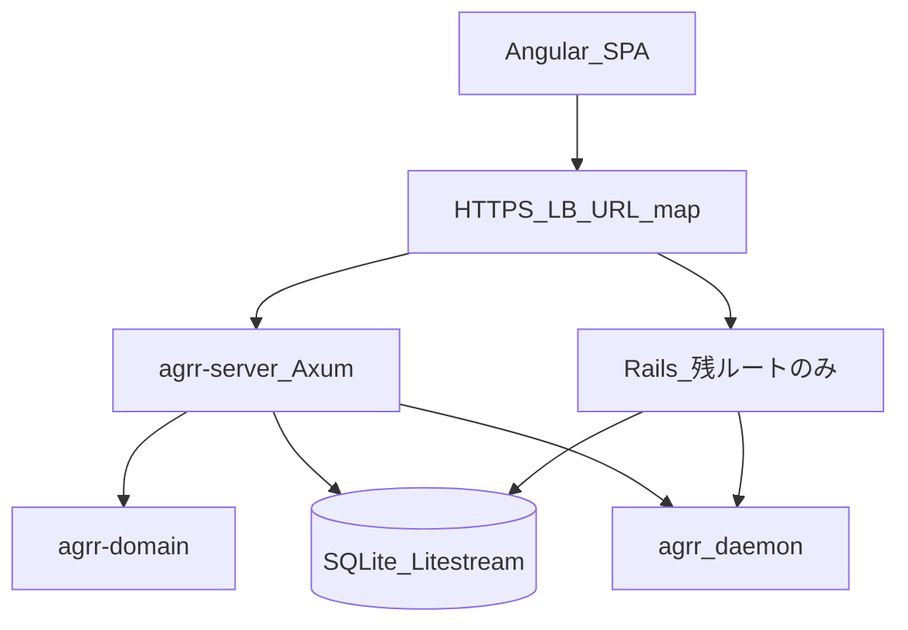

# アプリ RUST 化 — 技術スタック仮決定

> **ステータス**: 仮決定（2026-05-29 更新: 現行 Ruby から写経した**確定事項**を反映。OAuth コールバック URL を案 A で確定）  
> **正**: レイヤ規約・禁止事項は [`ARCHITECTURE.md`](../../../ARCHITECTURE.md) が最上位。本書は**終着ランタイム**と本番運用（ジョブ・DB ファイル・WS 等）の選定メモ。[`ARCHITECTURE.md` — System Overview](../../../ARCHITECTURE.md#system-overview) の技術表は本書と整合する。  
> **関連**: [`lib-domain-rust` プログラム](../lib-domain-rust/README.md)（P0–P5）、本書（P6–P7）、[`ARCHITECTURE.md` — System Overview](../../../ARCHITECTURE.md#system-overview)

## 目的

[`ARCHITECTURE.md`](../../../ARCHITECTURE.md) の「Rails is deprecated / domain → Rust」に沿い、**本番ランタイムを Rust（Axum + `agrr-domain`）へ置き換える**ためのスタックを仮決定する。

- **終着像**: Cloud Run 上の **単一 Rust バイナリ**（Angular SPA は現行どおり GCS + CDN）。
- **移行**: Rails を「維持しながら Rust 化する」前提は置かない。**ストラングラー**（ルート単位で Rust へ切替、Rails は残ルートがゼロになった時点で廃止）。
- **保全の正**: ユーザー可視の振る舞いは **API / WebSocket 契約テスト** と **`agrr-domain` パリティ**（[`TEST-STRATEGY.md`](../lib-domain-rust/TEST-STRATEGY.md)）。

WebSocket ワイヤ・ジョブチェーン・P6 マイグレーション所有・R4 複製元・削除 undo（Angular 化）・P7 **refinery**・ジョブ耐障害（`:async` 受容）・**OAuth コールバック URL**（現行パス維持）・**ストラングラー配線**（二 Cloud Run + URL map で `/api/*`・`/cable`・`/auth/*` を BC 単位で Rust へ）は **本書に確定**。**ユーザー添付は未使用のため P6 対象外**（2026-05-29 削除）。配線 ADR: [`ADR-strangler-lb-url-map.md`](./ADR-strangler-lb-url-map.md)。本番残作業は [`PRODUCTION-CUTOVER-STATUS.md`](./PRODUCTION-CUTOVER-STATUS.md)。

> **PROGRAM との関係**: ドメイン移行の手順・フェーズ（P0–P5、R0–R3）は [`PROGRAM.md`](../lib-domain-rust/PROGRAM.md) と [`TEST-STRATEGY.md`](../lib-domain-rust/TEST-STRATEGY.md) が正。本書の P6 エッジ配線 / P7 Rails 廃止 / R4 契約は終着スタックの目標。

## スコープ（終着スタック）

| 対象 | 終着 | 移行期（ストラングラー） |
|------|------|--------------------------|
| ユースケース判断 | **`agrr-domain`** | BC 単位で Rust 実装 → ルート切替 |
| HTTP JSON API | **Axum** + Tower + Tokio | 未移行ルートのみ Rails が一時応答 |
| Presenter / HTTP 形 | **`agrr-server`** 内の Rust presenter | Rails `*_api_presenter.rb` は廃止対象 |
| Gateway 実装 | **`agrr-adapters-*`**（rusqlite / HTTP / GCS 等） | 該当 BC の Rust adapter 完成まで Rails adapter |
| 認証 | Rust（oauth2 + セッション SQLite） | OAuth 切替前は Rails `/auth/*` が一時応答 |
| WebSocket | **axum WS** + ActionCable **ワイヤ互換**（`/cable`） | 移行期は Rails Solid Cable が一時トランスポート。Angular は変更しない |
| バックグラウンド | **Tokio** 直列チェーン + Scheduler → internal HTTP | 未移行は `ChainedJobRunnerJob` + `:async` が一時実行。**Cloud Tasks は採用しない** |
| Angular SPA | **維持** | 変更なし（API 契約固定） |
| agrr Python デーモン | **維持** | Rust 化は別プログラム |
| SQLite + Litestream | **維持**（**単一ライター**） | 書き込みは Rust / Rails の**片側のみ**（後述） |

ドメイン BC の実装順・パリティは [`PROGRAM.md`](../lib-domain-rust/PROGRAM.md) に従う。

---

## レイヤ別スタック（仮決定）

### ランタイム — 採用

| 項目 | 選定 | 備考 |
|------|------|------|
| HTTP | **Axum** + Tokio + Tower | Actix Web は第二候補 |
| 配備 | **Cloud Run** 単一コンテナ | 現行と同型。マイクロサービス初期分割は却下 |
| 構成ルート | **`agrr-server`** クレート | ルーティング・認可・presenter・**`composition` モジュール**（`build_*` 明示注入。domain 内ロケータ禁止） |

### ドメイン層 — 採用済み

| 項目 | 選定 | 備考 |
|------|------|------|
| クレート | `crates/agrr-domain` | BC 単位 `src/<context>/` |
| エディション | 2021 | ルート `Cargo.toml` |
| ツールチェーン | stable | `rust-toolchain.toml` |
| シリアライズ | serde, serde_json | DTO・HTTP 共用 |
| エラー | thiserror | Ruby `Domain::Shared::Exceptions` 相当 |
| 数値 | rust_decimal | BigDecimal 相当 |
| 日時 | time | TZ は edge 注入（`clock_port` 相当） |
| テスト | R0→R1 パリティ + R4 契約 | [`TEST-STRATEGY.md`](../lib-domain-rust/TEST-STRATEGY.md) |

### アダプター層 — 新規（P6 以降）

| クレート（仮） | 責務 |
|----------------|------|
| `agrr-adapters-sqlite` | rusqlite Gateway（AR 置換） |
| `agrr-adapters-agrr` | agrr デーモン / CLI クライアント |
| `agrr-adapters-gcs` | 天気バルク JSON（`weather_data/` プレフィックス）。本番は `WEATHER_DATA_STORAGE=gcs` |

Gateway trait は **`agrr-domain` 内**、実装は上記 adapter クレート（[`ARCHITECTURE.md`](../lib-domain-rust/ARCHITECTURE.md)）。

### `agrr-server` 配線（確定 — `CompositionRoot` 写経）

Ruby の [`lib/composition_root.rb`](../../../lib/composition_root.rb) と同型とする。

| 項目 | 選定 |
|------|------|
| モジュール | `agrr-server/src/composition.rs`（名称は `composition` — domain に `CompositionRoot` 名は持ち込まない） |
| gateway | メモ化またはハンドラ生成時に **1 リクエスト / 1 ジョブ単位で組み立て**（テスト用 `reset`） |
| interactor | **`build_<use_case>(deps) -> Handler`** — `output_port`・gateway を引数で受け取る |
| ジョブチェーン | `JobChainAsyncDispatcher` 相当を composition から注入（domain 内 enqueue 禁止） |
| 禁止 | `agrr-domain` / `agrr-adapters-*` からの global `default()`・サービスロケータ（[`ARCHITECTURE.md`](../../../ARCHITECTURE.md) 禁止 17 / 20 / 26 相当） |

### 認証・セッション

| 項目 | 選定 |
|------|------|
| OAuth | **oauth2** + Google provider（Rails OmniAuth 相当） |
| セッション | SQLite `sessions` テーブル（既存スキーマ流用を第一案） |
| API キー | `agrr-domain` + sqlite adapter（masters API） |
| Angular | cookie `session_id` 維持（現行 `ApplicationCable::Connection` と同型） |

#### OAuth コールバック URL（確定 — 2026-05-29、案 A）

**方針**: ホスト・パスを **現行 OmniAuth と同一**に維持。Google Console の Authorized redirect URI は切替後も原則変更しない（ストラングラーは LB で `/auth/*` を Rust に振るだけ）。

| 項目 | 選定 |
|------|------|
| 方針名 | **案 A — パス・ホスト維持** |
| Google 開始 | `POST /auth/google_oauth2`（**locale なし**。Angular [`/login`](../../../frontend/src/app/components/auth/login/login.component.ts) のフォーム POST と同型） |
| ログイン入口 | SPA `GET /login?return_to=...`（レガシー `GET /auth/login` は API が SPA へ 302） |
| **本番 redirect URI** | `https://agrr.net/auth/google_oauth2/callback` |
| 本番（補助） | `www.agrr.net` を実際に経由する場合のみ `https://www.agrr.net/auth/google_oauth2/callback` を **追加登録** |
| **開発 redirect URI** | `http://localhost:3000/auth/google_oauth2/callback` |
| OAuth クライアント | **同一 `GOOGLE_CLIENT_ID` / `GOOGLE_CLIENT_SECRET`** を Rust（`agrr-server`）でも使用 |
| コールバック後 | 既存 `sessions` 行 + `session_id` Cookie → `return_to` へリダイレクト（`FRONTEND_URL` / `ALLOWED_HOSTS` 許可リスト。成功時 `_agrr_oauth=1` は現行 `OauthConversionUrlAppender` 相当） |

**移行期（ストラングラー）**:

- パブリック URL が **本番と同一**（`agrr.net` + 上記パス）なら Google Console は **変更不要**。
- Rust / Rails が **別ホスト名**（例: `*.run.app` 直）で並行する間だけ、Console に一時的に 2 本目の redirect URI を追加し、本番切替完了後に削除する。

**却下（本決定で採用しない）**:

| 案 | 理由 |
|----|------|
| locale 付き callback のみ（`/{locale}/auth/google_oauth2/callback`） | OmniAuth 開始は locale なし。Console 複数 URI の運用コストに対し実益が薄い |
| API サブドメイン（`api.agrr.net`） | 本番は SPA と API が同一オリジン（`getApiBaseUrl()` 空）。Cookie / CORS / WS の再設計が必要 |
| 新パス（例 `/oauth/google/callback`） | 移行期の API・ログイン契約変更。本プログラムの原則と矛盾 |

**実装参照（現行）**: [`config/initializers/omniauth.rb`](../../../config/initializers/omniauth.rb)、[`config/routes.rb`](../../../config/routes.rb)（`auth#google_oauth2_callback`）、[`app/controllers/auth_controller.rb`](../../../app/controllers/auth_controller.rb)。

### WebSocket（確定 — 現行 Ruby / Angular 写経）

| 項目 | 選定 |
|------|------|
| クライアント | 変更なし — `actioncable` npm、`ws(s)://<api>/cable`（`OptimizationService`） |
| サーバワイヤ | **ActionCable JSON プロトコル**（`confirm_subscription` / `message` + identifier 等） |
| 終着トランスポート | **axum WebSocket** + **プロセス内 pub/sub**（`stream_for` 相当の購読者集合） |
| 接続認証 | `Cookie: session_id` → `sessions` 行 → `User`（任意）。public 計画は `connection.session_id` も参照 |
| 移行期 Rails | `config/cable.yml` の **Solid Cable**（別 SQLite `cable`）— **契約の一部ではない** |

**チャネル契約**（Angular が購読するもの — 終着でも維持）:

| チャネル | subscribe params | 主な server→client payload |
|----------|------------------|----------------------------|
| `PlansOptimizationChannel` | `cultivation_plan_id` | `CultivationPlanPhaseBroadcastPayloadMapper`（`status`, `progress`, `phase`, `phase_message`, `message`, `message_key`）、`field_added` / `field_removed`、`broadcast_optimization_complete`、完了時 `{ status: "completed", progress: 100 }` |
| `OptimizationChannel` | `cultivation_plan_id` | 同上（public 計画。認可は `plan_type_public?` または session/user） |
| `FarmChannel` | `farm_id` | `id`, `weather_data_status`, `weather_data_progress`, `weather_data_fetched_years`, `weather_data_total_years` |

**スコープ外（P6）**: `PredictionChannel` — `app/javascript/cable_subscription.js` のみ。Angular 経路なし。

**却下**: 終着スタックに **Solid Cable DB** または **Rails ActionCable 実装**を残すこと。新 WS URL / 新クライアントプロトコルへの一括切替。

**実装メモ**: ドメインは `CultivationPlanPhaseBroadcastPort` / `FarmRefreshBroadcastPort` を維持。adapter が `broadcast_to(plan|farm, payload)` 相当を行う（Ruby: `CultivationPlanPhaseBroadcastAdapter`, `FarmRefreshBroadcastAdapter`）。

### バックグラウンド（確定 — 現行 Ruby 写経）

| 項目 | 選定 |
|------|------|
| 最適化チェーン | **`ChainedJobRunnerJob` 相当** — 各ステップはチェーン内で**同期 `perform`**、次ステップのみ非同期 enqueue。HTTP API は **即返却**（チェーン完走を待たない） |
| ランタイム | **Tokio** タスク + プロセス内キュー（現行 `:async` + `puma workers 0` と同型） |
| 定期実行 | **Cloud Scheduler** → `POST /api/v1/internal/jobs/trigger_weather_update` + `SCHEDULER_AUTH_TOKEN`（`recurring.yml` は未使用） |
| HTML のみ | チェーン末尾に `RedirectCompletionJob`（`type: "redirect"`, `redirect_path`）— API 経路では付与しない |

**却下（終着）**: 最適化チェーンの **Cloud Tasks** 化（現行設計に無く、HTTP タイムアウトもチェーン本体に非拘束）。

**耐障害化（確定）**: プロセス再起動による未処理ジョブ消失を **受容**（現行 `:async` と同型。Rust 終着もプロセス内キュー）。**要件が上がったときのみ** Cloud Tasks 等を別 ADR で再検討する。

**現状メモ**: 本番 `active_job.queue_adapter = :async`。**Solid Queue は未使用**。

### 永続化（確定 — 現行 Ruby 写経）

| 項目 | 選定 | 注意 |
|------|------|------|
| DB | **rusqlite**（同期）を中心 | Litestream 前提の **単一ライター** |
| Tokio 上の載せ方 | API / ジョブからは **`spawn_blocking`**。primary 書込は **単一 Mutex**（BC 単位ライター規則と併用） |
| 接続 | プール規模は現行 `RAILS_MAX_THREADS`（既定 **5**）に合わせる。`SQLITE_BUSY_TIMEOUT_MS`（既定 **20000**）相当 |
| ファイル | **primary** / **cache** のみ Rust が触る。`cable` DB は WS プロセス内化に伴い **P7 で廃止** |
| P6 マイグレーション | **`db/migrate` / `db/cache_migrate` は Rails のみ発行** | Rust は読取 + 単一ライター BC の write のみ |
| P7 マイグレーション | **`refinery`** で Rust 移管（P6 中は Rails `db/migrate` / `db/cache_migrate` のみ発行） |
| 検討 | sqlx | 現行に非同期 DB 層なし。優先度低 |

**却下**: ActiveRecord オブジェクトの Rust 直結、Gateway へのドメインロジック再増殖。

### フロントエンド

| 項目 | 選定 |
|------|------|
| SPA | **Angular 21** |
| ホスティング | GCS + Cloud CDN |
| API 契約 | 移行期 **原則変更しない**（DTO フィールド名・パス） |
| **削除 undo** | **Angular 化**（Rails HTML undo テンプレートは P7 前に廃止。Rust server template は採用しない） |

**却下**: Leptos / Yew / フロント WASM 化。

### 外部計算（agrr Python）

| 項目 | 選定 |
|------|------|
| 最適化・気象 | **Python バイナリ / デーモン**（`lib/core/agrr`）を維持 |
| Rust 化 | **非ゴール** — 本プログラムの対象外（別プログラムも立てない） |

### CI / デプロイ

| 項目 | 選定 |
|------|------|
| ドメイン | `run-test-rust-domain.sh` / `rust-domain-test.yml` |
| 契約・統合 | **R4**（下記）+ 移行期 `run-test-rails.sh`（Rails 残存 BC の回帰） |
| 本番（移行完了後） | Cloud Run + **Rust 単体** [`Dockerfile.agrr-server`](../../../Dockerfile.agrr-server)（[`start_agrr_server.sh`](../../../scripts/start_agrr_server.sh) — Litestream + `agrr-migrate`、Rails イメージ廃止） |
| 移行期 | **二 Cloud Run**（`agrr-server` / Rails）+ **グローバル URL map** パス振分（[ADR](./ADR-strangler-lb-url-map.md)）。Rust 起動: [`Dockerfile.agrr-server`](../../../Dockerfile.agrr-server) + [`scripts/start_agrr_server.sh`](../../../scripts/start_agrr_server.sh) |

### R4 契約テスト（確定 — 複製元は既存テスト）

P6 ルート切替のゲート。**新規シナリオを invent しない**。現行の観測可能振る舞いを写す。

| 段階 | 置き場所 | 実行 |
|------|----------|------|
| 移行期 | `test/contract/**`（新設） | `run-test-rails.sh test/contract` |
| Rust 切替後 | `crates/agrr-server/tests/contract/**` | `run-test-rust-domain.sh` 拡張または専用 script（P6 で追加） |
| CI | 既存 `.github/workflows/rails-test.yml` に contract パスを追加（Rust 側は `rust-domain-test.yml` と分離維持） |

**最低限の複製元**（WS + 最適化クリティカルパス）:

| 種別 | ファイル |
|------|----------|
| WS 購読・認可 | `test/channels/optimization_channel_test.rb` |
| public 計画 + session | `test/controllers/api/v1/public_plans/wizard_controller_test.rb` |
| internal Scheduler | `test/controllers/api/v1/internal/jobs_controller_test.rb` |
| ジョブチェーン形状 | `test/adapters/cultivation_plan/private_plan_optimization_job_chain_builder_test.rb` |
| phase broadcast payload | `test/domain/cultivation_plan/interactors/advance_cultivation_plan_phase_interactor_test.rb` |

BC 切替ごとに、対応する `test/controllers/api/v1/**` を R4 スコープへ追加する。

**R4 GREEN** = 切替対象ルートについて、上記相当のアサーションが移行先ランタイムでも通ること。

---

## 移行モデル（ストラングラー）

### 単一ライター（移行期）

| ルール | 内容 |
|--------|------|
| BC 単位 | ある BC の **書き込み**は Rust **または** Rails の一方のみ |
| 切替ゲート | Rust adapter + R1 パリティ + **R4 契約 GREEN** 後にルート切替 |
| 禁止 | 同一テーブルへの Rust / Rails 同時 write |

### クリティカルパス（早期 Rust 化）

保全レビュー上、後回しにしない:

1. OAuth / セッション（API 利用の前提）
2. 計画最適化 **WebSocket** + ジョブチェーン
3. `cultivation_plan` + agrr daemon 連携
4. Cloud Scheduler → internal jobs

---

## フェーズ対応（PROGRAM との対応）

| フェーズ | 名称 | スタック上の成果 |
|----------|------|------------------|
| **P0–P5** | ドメイン（[`PROGRAM.md`](../lib-domain-rust/PROGRAM.md)） | **完了**（2026-05-29: TRACKING 19/19 `phase: done`）— `agrr-domain` + R0/R1/R2 パリティ |
| **P6** | エッジ配線 | `agrr-server` + `agrr-adapters-*`、BC 単位ルート切替開始 |
| **P7** | Rails 廃止 | 残ルートゼロ、`lib/domain` 削除、本番 Rust 単体イメージ |

進捗の正: [`TRACKING.md`](../lib-domain-rust/TRACKING.md)。

---

## 却下・見送り一覧

| 案 | 理由 |
|----|------|
| Rails を移行期の**正**とする第1段階 | ARCHITECTURE の deprecated と矛盾。ストラングラーは**一時**のみ |
| P7 まで HTTP を触らない | OAuth・WS・最適化が Rust 無しでは終着に到達しない |
| ドメイン完成前の API 一括 Big Bang | 契約リスク。BC / ルート群単位の切替 |
| ActiveRecord オブジェクトの Rust 直結 | Gateway boundary 違反 |
| マイクロサービス初期分割 | Litestream 単一ライター運用と不整合 |
| Solid Queue 終着維持 | 本番未使用（`:async`）。Rust ランタイムに不要 |
| Solid Cable **終着**維持 | 終着 WS はプロセス内ブローカ。Solid Cable DB は不要 |
| 最適化チェーンの Cloud Tasks 化 | 現行は post-HTTP 非同期チェーン。不要 |
| Angular WS クライアントの全面差し替え | 契約は ActionCable ワイヤで固定済み |
| agrr Python の Rust 化 | 非ゴール。`lib/core/agrr` は維持 |
| 削除 undo の Rust server template 化 | **Angular 化**で確定 |
| 終着での Cloud Tasks（ジョブキュー） | `:async` 相当の受容を確定。要件化時のみ再 ADR |
| 同一 Cloud Run 内リバースプロキシ（Rails↔Rust） | 障害ドメイン結合・P7 遅延。[ADR](./ADR-strangler-lb-url-map.md) で二サービス + URL map を採用 |

---

## 未確定事項

**P7 着手時に詳細化（方針は確定）**: **refinery** へのスキーマ移管手順・ダウンタイム（P6 中の migrate 発行は Rails のみ）。

**確定済み（スタック ADR）**: ストラングラー配線 — [`ADR-strangler-lb-url-map.md`](./ADR-strangler-lb-url-map.md)（二 Cloud Run + URL map、`/api/*`・`/cable`・`/auth/*` を BC 単位で Rust へ）。

---

## 変更ガバナンス

| 変更内容 | 必要な手続 |
|----------|------------|
| `agrr-domain` 依存追加（serde 以外） | PR + `cargo test` GREEN + ARCHITECTURE ゲート |
| 新規 `agrr-adapters-*` / `agrr-server` クレート | 本書 + [`PROGRAM.md`](../lib-domain-rust/PROGRAM.md) 追記 + R4 契約 |
| ルート切替（Rails → Rust） | TRACKING 更新 + R4 GREEN + 単一ライター確認 |
| API / DTO 契約変更 | Angular + 契約テスト更新（移行期は原則禁止） |
| Rails 本番廃止 | ADR + P7 出口基準 |

---

## 参照

- [`ARCHITECTURE.md`](../../../ARCHITECTURE.md) — レイヤ規約
- [`lib-domain-rust/README.md`](../lib-domain-rust/README.md) — ドメイン移行プログラム索引
- [`lib-domain-rust/ARCHITECTURE.md`](../lib-domain-rust/ARCHITECTURE.md) — クレート構成
- [`lib-domain-rust/PROGRAM.md`](../lib-domain-rust/PROGRAM.md) — フェーズ・ゲート
- [`gateway-domain-logic-migration.md`](../../gateway-domain-logic-migration.md) — adapter 移植時の前提
